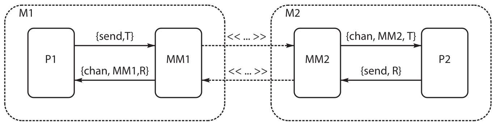

# 一个套接字应用

这个附录专门介绍 [使用 `lib_chan` 控制进程](../part-iii/Ch14-distributed_programming.md#使用-lib_chan-控制进程) 中，提到的 `lib_chan` 这个库的实现。`lib_chan` 的代码实现了 TCP/IP 上的一个完整网络通信层，提供身份验证与 Erlang 项的流传输两种功能。在我们掌握 `lib_chan` 中用到的设计原理后，我们应能按需定制我们自己的通信基础设施，并将其作为 TCP/IP 上的一层。

就其本身而言，`lib_chan` 是个构建分布式系统的有用组件。


为使这个附录自成一体，其中有一些与 [使用`lib_chan` 控制进程](../part-iii/Ch14-distributed_programming.md#使用-lib_chan-控制进程) 中不少重复的材料。


此附录中的代码，是我（作者）迄今为止引入的最复杂代码之一，因此当咱们在初次阅读时无法完全理解时，请无焦虑。当咱们只打算使用 `lib_chan` 这个库，而不关心其工作原理时，那么就阅读第一个小节，并跳过其余内容。


## 一个示例


我们将从一个展示如何使用 `lib_chan` 的简单示例开始。我们将创建一个能够计算阶乘和斐波那契数的简单服务器。我们将以口令保护该服务器。

这个服务器将运行在端口 2233 上。

我们将采取四个步骤，来创建这个服务器。


1. 编写一个配置文件；
2. 编写这个服务器的代码；
3. 启动该服务器；
4. 透过网络访问该服务器。


### 步骤 1：编写配置文件


下面时咱们示例的配置文件。


```erlang
{{#include ../../projects/appendix/src/config1}}
```

这个配置文件有数个如下形式的 `service` 元组：


```erlang
{service, <Name>, password, <P>, mfa, <Mod>, <Func>, <ArgList>}
```

这些参数由原子 `service`、`password` 和 `mfa` 分隔。`mfa` 是 *模组*、*函数*、*参数* 的缩写，表示接下来三个参数应被解释为模组名字、函数名字以及某个函数调用的参数列表。


在咱们的示例中，配置文件指定了一项将在端口 2233 上可用的名为 `math` 的服务。这项服务受密码 `qwerty` 保护。其在名为 `mod_math` 的模组中实现，并将以调用 `mod_math:run/3` 启动。`run/3` 的第三个参数将是 `[]`。


### 编写服务器的代码

这个数学服务器的代码看起来像下面这样：

```erlang
{{#include ../../projects/appendix/src/mod_math.erl}}
```

当某个客户端连接到端口 2233 并请求名为 `math` 的服务时，`lib_auth` 将认证该客户端。当口令正确时，就通过调用函数 `mod_math:run(MM, ArgC, ArgS)`，生成一个处理器进程。其中 `MM` 是 *中间人* 的 PID，`ArgC` 来自客户端，`ArgS` 来自配置文件。


当客户端发送一条消息 `X` 到服务器时，该消息将以一条 `{chan, MM, X}` 消息到达。当客户端死去或连接出错时，服务器将被发送一条 `{chan_closed, MM}` 消息。要发送一条消息 `Y` 到客户端，服务器执行了 `MM ! {send, Y}`，而要关闭信道，他执行了 `MM ! close` 操作。

这个数学服务器很简单；他只会等待一条 `{chan, MM, {factorial, N}}` 消息，随后通过执行 `MM ! {send, fac(N)}` 发送计算结果给客户端。


### 启动服务器


我们会如下启动该服务器：

```console
1> lib_chan:start_server("./config1").
lib_chan starting:"./config1"
ConfigData=[{port,2233},{service,math,password,"qwerty",mfa,mod_math,run,[]}]
true
```

> **译注**：译者采用了 Rebar3 构建工具的文件/目录结构。
>
> ```console
> $ tree -L 2 ~/erlang-book/projects/appendix
> /home/hector/erlang-book/projects/appendix
> ├── application_template.full
> ├── _build
> │   └── default
> ├── config1
> ├── elog4.config
> ├── gen_server_template.full
> ├── Makefile
> ├── rebar.lock
> ├── src
> │   ├── lib_chan_cs.erl
> │   ├── lib_chan.erl
> │   ├── lib_chan_mm.erl
> │   ├── math_server_app.erl
> │   ├── math_server.app.src
> │   ├── math_server.erl
> │   └── mod_math.erl
> └── supervisor_template.full
>
> 4 directories, 14 files
> ```
>
> Rebar3 需要 `src` 目录，以及 `some_name.app.src` 及其对应的 `some_name.erl` 两个文件，即可在目录下执行 `rebar3 compile` 命令，构建目标将位于 `_build/default/lib` 下。
>
> 然后即可执行命令 `erl -boot start_sasl -config elog4 -smp +S 12 -pa _build/default/lib/math_server/ebin` 启动 Erlang shell，并在其下执行上面的命令。


### 透过网络访问服务器


我们可以一台机器上，测试此代码。


```erlang
2> {ok, S} = lib_chan:connect("localhost",2233,math,"qwerty",{yes,go}).
{ok,<0.100.0>}
mod_math: run starting
ArgC = {yes,go} ArgS = []
3> lib_chan:rpc(S, {factorial,20}).
2432902008176640000
4> lib_chan:rpc(S, {fibonacci,15}).
610
5> lib_chan:disconnect(S).
close
mod_math stopping
```

## `lib_chan` 工作原理


`lib_chan` 是使用四个模组中的代码构建的。

- `lib_chan` 充当 “主模组”。程序员需要了解的例程，仅限 `lib_chan` 中导出那些。其他三个模组（将在下文讨论）在 `lib_chan` 实现内部用到；
- `lib_chan_mm` 会编码及解码 Erlang 消息，并管理套接字通信；
- `lib_chan_cs` 会建立该服务器，并管理客户端连接。他的主要任务之一，是限制客户端同时连接的最大数量；
- `lib_chan_auth` 包含着简单挑战/响应式验证的代码。


### `lib_chan`


`lib_chan` 有着如下结构：


```erlang
-module(lib_chan).


start_server(ConfigFile) ->
    %% read configuration file - check syntax
    %% call start_port_server(Port, ConfigData)
    %% where Port is the required Port and ConfigData
    %% contains the configuration data

start_port_server(Port, ConfigData) ->
    lib_chan_cs:start_raw_server(Port,
				fun(Socket) ->
					start_port_instance(Socket, ConfigData) end,
    %% lib_chan_cs manages the connection
    %% when a new connection comes the fun which is an
    %% argument to start_raw_server will be called


start_port_instance(Socket, ConfigData) ->
    %% this is spawned when the client connects
    %% to the server. Here we setup a middle man,
    %% then perform authentication. If everything works call
    %% really_start(MM, ArgC, {Mod, Func, ArgS})
    %% (the last three arguments come from the configuration file


really_start(MM, ArgC, {Mod, Func, ArgS}) ->
    apply(Mod, Func, [MM, ArgC, ArgS]).


connect(Host, Port, Service, Secret, ArgC) ->
    %% client side code
```

### `lib_chan_mm`：中间人

`lib_chan_mm` 实现了一个中间人。他对应用隐藏了套接字通信，将 TCP 套接字上的数据流转换成 Erlang 消息。中间人负责组装消息（其可能已被分片），以及将 Erlang 项编码和解码为可在套接字上发送和接收的字节流。




<a name="fig-8"></a>
**图 8** -- **中间人下的套接字通信**


现在快速浏览一下 [图 8，*中间人下的套接字通信](#fig-8) 的好时机，其展示了我们的中间人架构。当机器 `M1` 上的某个进程 `P1` 想要发送一条消息 `T` 到机器 `M2` 上的进程 `P2`时，他会执行 `MM1 ！{send, T}`。`MM1` 充当 `P2` 的 *代理*。发送到 `MM1` 的任何消息，都会被编码并写入套接字，并被发送到 `MM2`。`MM2` 会解码他在套接字上接收到的任何东西，并将消息 `{chan, MM2, T}` 发送给 `P2`。


在机器 `M1` 上，进程 `MM1` 充当了 `P2` 的代理，而在 `M2` 上，进程 `MM2` 则会充当 `P1` 的代理。

`MM1` 和 `MM2` 是两个中间人进程的 PID。中间人进程的代码，看起来像下面这样：

```erlang
loop(Socket, Pid) ->
    receive
        {tcp, Socket, Bin} ->
            Pid ! {chan, self(), binary_to_term(Bin)},
            loop(Socket, Pid);
        {tcp_closed, Socket} ->
            Pid ! {chan_closed, self()};
        close ->
            gen_tcp:close(Socket);
        {send, T} ->
            gen_tcp:send(Socket, [term_to_binary(T)]),
            loop(Socket, Pid)
    end.
```

这个循环被用作套接字数据世界，与 Erlang 消息传递世界的接口。咱们可在 [`lib_chan_mm`](#lib_chan_mm) 中，找到 `lib_chan_mm` 的完整代码。相比这里给出的代码，完整代码稍微复杂一些，但原理是一样的。唯一的区别在与，我们添加了一些用于跟踪消息的代码，以及一些接口例程。


### `lib_chan_cs`


`lib_chan_cs` 负责建立客户端与服务器的通信。他导出的两个重要例程如下：


- `start_raw_server(Port, Max, Fun, PacketLength)`

    这个例程会在 `Port` 上启动一个监听连接的监听器。最多 `Max` 个同时会话被允许。`Fun` 是一个 1 元函数；当某个连接启动时，`Fun(Socket)` 会被执行。套接字通信会假设一个长度为 `PacketLength` 的数据包。


- `start_raw_client(Host, Port, PacketLength) -> {ok, Socket} | {error, Why}`

    这个例程会尝试连接到某个以 `start_raw_server` 打开的端口。


`lib_chan_cs` 的代码，遵循了 [并行服务器](../part-iv/Ch17-programming_with_sockets.md#parall_server) 中描述的模式，但此外他还会追踪同时打开连接的最大数量。这个小细节虽然在概念上很简单，却增加了二十多行看起来相当奇怪，捕获退出等的代码。像这样的代码一团糟，不过不用担心；他完成了他的工作，并对该模组的用户隐藏了复杂性。

### `lib_chan_auth`


该模组实现了一种简单形式的挑战/响应认证。挑战/响应的认证，基于与服务名名字相关联的共享秘密概念。要演示其工作原理，我们将假定有项名为 `math`，有着共享秘密 `qwerty` 的服务。

当某个客户端打算使用服务 `math` 时，那么该客户端就必须向服务器证明，他们知道共享秘密。这个过程如下进行：

1. 客户端发送一次请求到服务器，表明他想要使用 `math` 服务；

2. 服务器会计算出一个随机字符串 `C` 并将其发送给客户端。这就是 *挑战*。该字符串由 `lib_chan_ auth:make_challenge()` 函数计算得出。我们可以交互式地使用他，看看他做了些什么。

    ```erlang
    1> lib_chan_auth:make_challenge().
    "ynsbrxyuavrknszkretvjvqao"
    ```

3. 客户端收到这个字符串 (`C`) ，并计算出响应 (`R`)，其中 `R = MD5(C ++ Secret)`。`R` 是使用 `lib_chan_auth:make_response` 计算出的。下面是个示例：

    ```erlang
    2> R = lib_chan_auth:make_response(C, "qwerty").
    "58565dbdf3328f7d9b9869a2c47eb699"
    ```

4. 响应会被发回服务器。服务器收到该响应，并通过计算该响应的预期值，检查其是否正确。这是在 `lib_chan_auth:is_response_correct` 中完成的。

    ```erlang
    3> lib_chan_auth:is_response_correct(C, R, "qwerty").
    true
    ```

## `lib_chan` 的代码


现在是代码时间。


### `lib_chan`

```erlang
{{#include ../../projects/appendix/src/lib_chan.erl}}
```

### `lib_chan_cs`

```erlang
{{#include ../../projects/appendix/src/lib_chan_cs.erl}}
```


### `lib_chan_mm`

```erlang
{{#include ../../projects/appendix/src/lib_chan_mm.erl}}
```


### `lib_chan_auth`

```erlang
{{#include ../../projects/appendix/src/lib_chan_auth.erl}}
```

