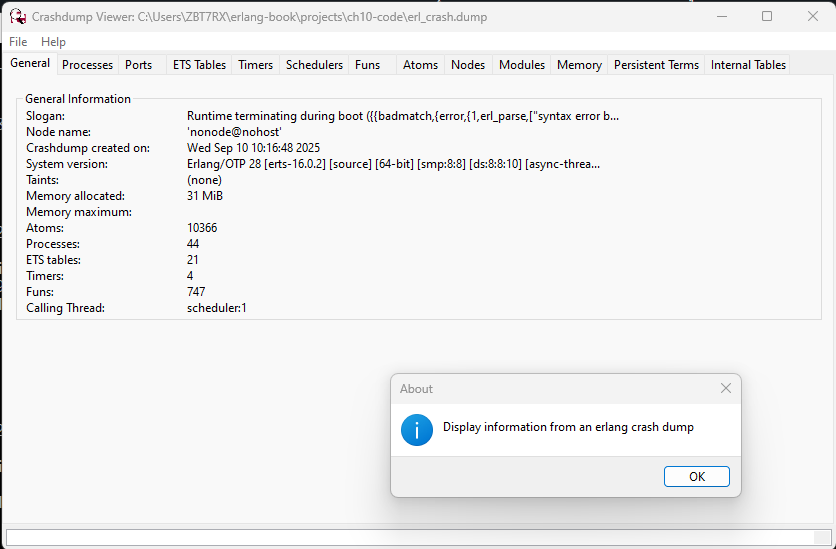

# 编译及运行咱们的程序

在前几章中，我们尚未讲到较多有关编译和运行咱们程序的内容 -- 我们只使用了 Erlang shell。这对于小型示例来说没问题，但当咱们的程序变得愈加复杂时，咱们就会希望自动化这个过程，让生活变得更轻松。这就是 makefile 的用武之地。


实际上有三种不同方法运行咱们的程序。在本章中，我们将介绍这三种方法，以便咱们在任何特定场合，都能选择最佳方法。

有时，事情会出错：makefile 会失败，环境变量会出错，咱们的检索路径也会不正确。我们通过了解出错时该怎么办，帮助咱们解决这些问题。


## 修改开发环境


当咱们开始用 Erlang 编程时，咱们可能会把咱们的所有模组和文件，放在同一目录下，并在这个目录下启动 Erlang。当咱们这样做时，Erlang 的加载器就能顺利找到咱们的代码。然而，当咱们的应用变得愈加复杂时，咱们就会打算将他们分割成易于管理的小代码块，并将代码放在不同目录中。而在咱们要包含其他项目的代码时，这些外部代码将有着他们自己的目录结构。


### 设置加载代码的检索路径


Erlang 的运行时系统，会运用一种代码自动加载机制。为了这种机制正常工作，咱们必须设置一些检索路径，以便找到咱们代码的正确版本。


这种代码加载机制，实际上是以 Erlang 编程的 -- 在 [8.10 节 “动态代码加载”](Ch08-the_rest_of_sequential_erlang.md#动态代码加载) 中，我们曾谈到了这点。代码加载是 “按需” 执行的。


当系统试图调用某个尚未加载模组中的某个函数时，一个异常就会出现，同时系统会尝试找到这个缺失模组的目标代码文件。若缺失模组名为 `myMissingModule`，那么代码加载器将在当前加载路径下的所有目录中，检索名为 `myMissingModule.beam` 的文件。检索会在第一个匹配文件处停止，同时该文件中的目标代码将被加载到系统中。


通过启动 Erlang shell 并执行命令 `code:get_path()`，咱们就可以找到当前加载路径的值。下面是一个示例：


```erlang
1> code:get_path().
[".","c:/Users/ZBT7RX/erlang-otp/lib/kernel-10.3.2/ebin",
 "c:/Users/ZBT7RX/erlang-otp/lib/stdlib-7.0.2/ebin",
 "c:/Users/ZBT7RX/erlang-otp/lib/xmerl-2.1.5/ebin",
 "c:/Users/ZBT7RX/erlang-otp/lib/wx-2.5.1/ebin",
 "c:/Users/ZBT7RX/erlang-otp/lib/tools-4.1.2/ebin",
 "c:/Users/ZBT7RX/erlang-otp/lib/tftp-1.2.3/ebin",
 "c:/Users/ZBT7RX/erlang-otp/lib/syntax_tools-4.0/ebin",
 "c:/Users/ZBT7RX/erlang-otp/lib/ssl-11.3.2/ebin",
 "c:/Users/ZBT7RX/erlang-otp/lib/ssh-5.3.2/ebin",
 "c:/Users/ZBT7RX/erlang-otp/lib/snmp-5.19/ebin",
 "c:/Users/ZBT7RX/erlang-otp/lib/sasl-4.3/ebin",
 "c:/Users/ZBT7RX/erlang-otp/lib/runtime_tools-2.2/ebin",
 "c:/Users/ZBT7RX/erlang-otp/lib/reltool-1.0.2/ebin",
 "c:/Users/ZBT7RX/erlang-otp/lib/public_key-1.18.2/ebin",
 "c:/Users/ZBT7RX/erlang-otp/lib/parsetools-2.7/ebin",
 "c:/Users/ZBT7RX/erlang-otp/lib/os_mon-2.11/ebin",
 "c:/Users/ZBT7RX/erlang-otp/lib/odbc-2.16/ebin",
 "c:/Users/ZBT7RX/erlang-otp/lib/observer-2.18/ebin",
 "c:/Users/ZBT7RX/erlang-otp/lib/mnesia-4.24/ebin",
 "c:/Users/ZBT7RX/erlang-otp/lib/megaco-4.8/ebin",
 "c:/Users/ZBT7RX/erlang-otp/lib/jinterface-1.15",
 "c:/Users/ZBT7RX/erlang-otp/lib/inets-9.4/ebin",
 "c:/Users/ZBT7RX/erlang-otp/lib/ftp-1.2.4/ebin",
 "c:/Users/ZBT7RX/erlang-otp/lib/eunit-2.10/ebin",
 "c:/Users/ZBT7RX/erlang-otp/lib/et-1.7.2/ebin",
 "c:/Users/ZBT7RX/erlang-otp/lib/erts-16.0.2/ebin",
 "c:/Users/ZBT7RX/erlang-otp/lib/erl_interface-5.6/ebin",
 [...]|...]
```

我们用于操作加载路径的两个最常用函数如下：


- `-spec code:add_patha(Dir) -> true | {error, bad_directory}`

    将一个新目录 `Dir`，添加到加载路径的开头。

- `-spec code:add_pathz(Dir) -> true | {error, bad_directory}`

    将一个新目录 `Dir`，添加到加载路径的末尾。


通常情况下，咱们使用那个函数并不重要。唯一需要注意的是，使用 `add_patha` 和 `add_pathz` 会产生不同结果。当咱们怀疑加载了某个不正确模组时，咱们可调用 `code:all_loaded()`（这会返回所有已加载模组的列表）或 `code:clash()`，帮助咱们调查出了什么问题。


`code` 模组中还有用于操作路径的几个别的例程，但除非咱们在完成一些奇怪的系统编程，否则咱们可能永远都用不上他们。


通常做法，是将这些命令放在咱们主目录下，一个名为 `.erlang` 的文件中。


或者，咱们可使用像是下面的命令，启动 Erlang：


```console
$ erl -pa Dir1 -pa Dir2 ... -pz DirK1 -pz DirK2
```

命令开关 `-pa Dir` 会将 `Dir` 添加到代码搜索路径开头，而 `-pz Dir` 则会将该目录添加到代码路径末尾。


### 在系统启动时执行某个命令集


我们看过如何在位于咱们主目录下， 咱们的 `.erlang` 文件中，设置加载路径。事实上，咱们可将任何 Erlang 代码， 放入该文件 -- 当咱们启动 Erlang 时，他会首先读取并运行这个文件中的所有命令。


设想咱们的 `.erlang` 文件如下：

```erlang
io:format("Hi, I'm in your .erlang file~n").
...
```

然后，当我们启动系统时，我们将看到以下输出：


```console
$ erl
Erlang/OTP 28 [erts-16.0.2] [source] [64-bit] [smp:8:8] [ds:8:8:10] [async-threads:1] [jit:ns]

Hi, I'm in your .erlang file
Eshell V16.0.2 (press Ctrl+G to abort, type help(). for help)
1>
```

若在 Erlang 启动时，当前目录下有个名为 `.erlang` 的文件，那么他将优先于咱们主目录下的 `.erlang` 文件。这样，咱们就可以根据 Erlang 于何处被启动，安排 Erlang 以不同方式行事。对于一些专门应用，这非常有用。在这种情况下，在这个启动文件中包含一些打印语句，可能是个好主意；否则，咱们可能会忘记这个本地启动文件，这可能会非常混乱。


*提示*：在某些系统中，咱们主目录在何处并不明确，或者可能不是咱们认为的地方。要找出 Erlang 认为的咱们主目录位置，就要执行下面的命令：


```erlang
1> init:get_argument(home).
{ok,[["/home/joe"]]}
```


由此我们就可以得出，Erlang 认为我（作者）的主目录是 `/home/joe`。


## 运行咱们程序的不同方式


Erlang 程序被存储在模组中。在咱们完成程序编写后，在运行前咱们要先编译他。或者，通过运行一次 `escript`，咱们也可在不编译下，直接运行咱们的程序。


接下来的小节，会展示如何以数种方式编译及运行几个程序。这些程序略有不同，同时我们启动与停止他们的方式也各不相同。


第一个程序 `hello.erl` 只会打印 `"Hello world"`。他不负责启动或停止系统，也不需要访问任何的命令行参数。相比之下，第二个程序 `fac`，则需要访问一些命令行参数。


下面是我们的基本程序。他会写下一个包含着后跟一个换行符（在 Erlang 的 `io` 及 `io_lib` 模组中，`~n` 会被解析作换行），的 `"Hello world"` 字符串。


[`hello.erl`](http://media.pragprog.com/titles/jaerlang2/code/hello.erl)


```erlang
-module(hello).
-export([start/0]).

start() -> io:format("Hello world~n").
```

咱们来以三种方式，编译并运行他。


### 在 Erlang shell 中编译和运行


我们以启动 Erlang shell 开始。

```erlang
$ erl
Erlang/OTP 28 [erts-16.0.2] [source] [64-bit] [smp:8:8] [ds:8:8:10] [async-threads:1] [jit:ns]

Hi, I'm in your .erlang file
Eshell V16.0.2 (press Ctrl+G to abort, type help(). for help)
1> c(hello).
{ok,hello}
2> hello:start().
Hello world
ok
```

> **快速脚本**
>
> 我们通常会想要能在操作系统命令行中，执行某个任意 Erlang 函数。对于快速脚本编写，`-eval` 这个参数非常方便。
>
> 下面是个示例：
>
>```console
>
>erl -eval 'io:format("Memory: ~p~n", [erlang:memory(total)]).' -noshell -s init stop
>Hi, I'm in your .erlang file
>```


### 在命令行提示符下编译和运行


编译某个程序，可直接在命令提示符下完成。当咱们打算编译某段代码却不打算运行他时，这是最简单的方法。这是如下完成的：


```console
$ erlc hello.erl
$ erl -noshell -s hello start -s init stop
Hi, I'm in your .erlang file
Hello world
$
```

*注意*：本章中的所有 shell 命令，都假定了用户已在他们的系统中，安装了合适的 shell，并且可直接在该 shell 中执行 `erl`、`erlc` 等命令。有关如何配置系统的详细信息，与系统有关，并随着时间的推移而变化。最新细节可在 [Erlang 网站](https://www.erlang.org/) 及 [主开发归档中的 Readme 文件](https://github.com/erlang/otp) 中找到。


其中第一行，`erlc hello.erl`，会编译 `hello.erl` 这个文件，产生一个名为 `hello.beam` 的目标代码文件。第二条命令有三个选项。


- `-noshell` 会启动没有交互式 shell 的 Erlang（因此咱们不会看到通常会在咱们启动系统时问好的 Erlang “横幅”）；

- `-s hello start` 会运行函数 `hello:start()`。*注意*：在使用 `-s Mod ...` 这个选项时，其中的 `Mod` 必须已被编译；

- `-s init stop` 在前一条命令执行完毕后，通过运行函数 `init:stop()` 停止系统。


`erl -noshell ...` 这条命令，可以放在 shell 脚本中，所以通常我们会构造的运行我们程序的脚本，会设置好路径（以 `-pa Directory`）再启动程序。


在我们的示例中，我们使用了两个 `-s ...` 命令。在命令行中，我们可以有任意数量的函数。每个 `-s ...` 命令都会一个 `apply` 语句被计算，而再其运行完毕后，下一命令就会被计算。


下面是一个启动 `hello.erl` 的示例：


```bash
#! /usr/bin/env bash

erl -noshell -pa $HOME/erlang-book/projects/ch10-code -s hello start -s init stop
```


*注意*：这个脚本需要指向包含着文件 `hello.beam` 的那个目录的绝对路径。因此，虽然这个脚本在我（作者）的机器上可以运行，但要在你的机器上运行，你必须编辑这个脚本。


要运行这个 shell 脚本，我们要 `chmod` 该文件（只需一次），然后我们就可以运行这个脚本了。


```console
$ bash hello.sh
Hi, I'm in your .erlang file
Hello world
```


### 作为 Escript 运行


使用 `escript`，咱们可直接将咱们的程序，作为脚本运行 -- 无需先编译他们。要作为 `escript` 运行 `hello`，我们要创建以下文件：


[`hello`](http://media.pragprog.com/titles/jaerlang2/code/hello)


```erlang
#! /usr/bin/env escript

main(Args) -> io:format("Hello world~n").
```

该文件必须包含一个函数 `main(Args)`。当从某种操作系统 shell 被调用时，`Args` 将包含一个表示为原子的命令行参数列表。在 Unix 系统上，我们可在无编译下，立即运行这个程序，如下所示：


```console
$ chmod u+x hello
$ ./hello
./hello:3:6: Warning: variable 'Args' is unused
%    3| main(Args) -> io:format("Hello world~n").
%     |      ^

Hello world
```

*注意*：这个文件的文件模式，必须被设置为 “可执行”（在 Unix 系统上，即 `chmod u+x File` 命令） -- 咱们只须执行一次，而不是每次咱们运行该程序时都要设置。


> **开发期间导出函数**
>
> 在开发代码时，不断地在咱们的程序中添加及移除导出声明，以便咱们可在 shell 中运行这些导出函数，可能会有点痛苦。
>
> 特殊声明 `-compile(export_all).` 会指示编译器导出模组中的所有函数。在咱们开发代码时，使用这个语句可让日子好过一些。
>
> 当咱们完成代码开发后，咱们应注释掉这个 `export_all` 声明，并添加那些恰当的导出声明。这样做有两个原因。首先，当以后咱们阅读代码时，咱们就会明白，只有重要函数才是那些导出的函数。所有其他函数都不能从模组外部调用，因此只要这些导出函数的接口保持不变，咱们可随意修改他们。其次，当编译器确切地知道模组中哪些函数被导出时，他就能产生好得多的代码。
>
> 请注意，使用 `-compile(export_all)` 会使以 `dialyzer` 分析代码困难得多。


### 有命令行参数的程序


`"Hello world"` 没有参数。我们来重复那个计算阶乘程序的练习。他只需一个参数。


首先，下面是代码：


[`fac.erl`](http://media.pragprog.com/titles/jaerlang2/code/fac.erl)


```erlang
-module(fac).
-export([fac/1]).

fac(0) -> 1;
fac(N) -> N*fac(N-1).
```


我们可如同下面这样，在 Erlang shell 中编译 `fac.erl` 并运行他：


```erlang
$ erl
Erlang/OTP 28 [erts-16.0.2] [source] [64-bit] [smp:8:8] [ds:8:8:10] [async-threads:1] [jit:ns]

Hi, I'm in your .erlang file
Eshell V16.0.2 (press Ctrl+G to abort, type help(). for help)
1> c(fac).
{ok,fac}
2> fac:fac(25).
15511210043330985984000000
```


当我们想要能在命令行下运行这个程序时，我们将需修改其为接收命令行参数。


[`fac1.erl`](http://media.pragprog.com/titles/jaerlang2/code/fac1.erl)


```erlang
-module(fac1).
-export([main/1]).


main([A]) ->
    I = list_to_integer(atom_to_list(A)),
    F = fac(I),
    io:format("factorial ~w = ~w~n", [I, F]),
    init:stop().


fac(0) -> 1;
fac(N) -> N*fac(N-1).
```


随后我们就可以编译并运行他了。


```console
$ erlc fac1.erl
$ erl -noshell -s fac1 main 25
Hi, I'm in your .erlang file
factorial 25 = 15511210043330985984000000
```

*注意*：那个函数叫做 `main` 这一事实并不重要；他可以叫任何名字。重要的是，这个函数名称，要和命令行上的名称一致。


最后，我们可将其作为一个 escript 运行。


[`factorial`](http://media.pragprog.com/titles/jaerlang2/code/factorial)


```erlang
#! /usr/bin/env escript

main([A]) ->
    I = list_to_integer(A),
    F = fac(I),
    io:format("factorial ~w = ~w~n", [I, F]).


fac(0) -> 1;
fac(N) -> N*fac(N-1).
```

无需编译；只要运行他即可，像这样：


```console
$ ./factorial 25
factorial 25 = 15511210043330985984000000
```

## 以 Makefile 自动化编译


当我（作者）在编写某个大型程序时，我喜欢尽可能自动化。这有两个原因。首先，从长远来看，其节省了打字 -- 在测试和重新测试我的程序期间，一遍又一遍地输入一些同样的原有命令，需要大量键盘输入，我可不想把手指累坏。


其次，我（作者）会经常暂停正在我正在做的事情，转而处理其他项目。在我回到我此前已暂停的某个项目前，可能已有数月之久，而当我回到这个项目时，我通常已经忘记了怎样构建我项目中的代码。`make` 正是解药！


`make` *正是* 我工作的自动化工具 -- 我（作者）用他编译及发布我的 Erlang 代码。我的大多数 [makefile](https://en.wikipedia.org/wiki/Make_(software)) 都相当简单，同时我有个解决了我大部分需求的简单模板。


我（作者）不打算整体解释 makefile。相反，我将展示我发现对编译 Erlang 程序有用的形式。特别是，我们将看看本书中的一些 makefile，这样咱们就能掌握他们并构建咱们自己的一些 makefile。


### 一个 makefile 模板


下面是个我的大部分 makefile 所依据的模板：


[`Makefile.template`](http://media.pragprog.com/titles/jaerlang2/code/Makefile.template)


```makefile
# leave these lines alone
.SUFFIXES: .erl .beam .yrl

.erl.beam:
    erlc -W $<

.yrl.erl:
    erlc -W $<

ERL = erl -boot start_clean


# Here's a list of the erlang modules you want compiling
# If the modules don't fit onto one line add a \ character
# to the end of the line and continue on the next line

# Edit the lines below
MODS = module1 module2 \
    module3 ... special1 ...\
    ...
    moduleN

# The first target in any makefile is the default target.
# If you just type "make" then "make all" is assumed (because
# "all" is the first target in this makefile)

all: compile

compile: ${MODS:%=%.beam} subdirs

## special compilation requirements are added here

special1.beam: special1.erl
    ${ERL} -Dflag1 -W0 special1.erl

## run an application from the makefile

application1: compile
    ${ERL} -pa Dir1 -s application1 start Arg1 Arg2

# the subdirs target compiles any code in
# sub-directories

subdirs:
    cd dir1; $(MAKE)
    cd dir2; $(MAKE)
    ...

# remove all the code

clean:
    rm -rf *.beam erl_crash.dump
    cd dir1; $(MAKE) clean
    cd dir2; $(MAKE) clean
```

这个 makefile 以一些编译 Erlang 模组，及扩展名为 `.yrl` 的文件（这是一些包含着用于 Erlang 解析器生成器程序的解析器定义的文件）的规则开始。Erlang 的解析器生成器，叫做 `yecc`（`yacc` 的 Erlang 版本，是 *yet another compiler compiler* 的缩写；详情参见 [在线教程](https://www.erlang.org/doc/apps/parsetools/yecc.html)）。


重要部分是如下开始的行：


```makefile
MODS = module1 module2
```

这是我打算编译的所有 Erlang 模组的列表。


`MODS` 列表中的任何模组，都将以 Erlang 命令 `erlc Mod.erl` 编译。一些模组可能需要特殊处理（例如这个模板文件中的 `special1` 模组），因此有个处理这种情况的单独规则。

在 makefile 中有数个 *目标*。所谓目标，是个于第一列处字母数字字符串开头，并以冒号（`:`）结束。在这个 makefile 模板中，`all`、`compile` 及 `special1.beam` 都属于目标。要运行这个 makefile，咱们要执行 shell 命令。


```console
$ make [Target]
```


其中参数 `Target` 是可选的。当 `Target` 被省略时，那么文件中的第一个目标就会被假定。在上例中，当命令行上没有指定目标时，目标 `all` 就会被假定。

当我（作者）打算构建我的全部软件并运行 `application1` 时，那么我就会给到 `make application1` 这个命令。当我打算让其成为默认行为，在我只执行 `make` 命令时其会发生时，那么我就要移动那些定义目标 `application1` 的行，使他们成为这个 makefile 中的首个目标。


目标 `clean` 会移除所有已编译的 Erlang 目标代码文件，以及文件 `erl_crash.dump`。这个崩溃转储包含了有助于调试某个应用的信息。详情请参阅 [“Erlang 崩溃了，咱们想要读取崩溃转储”](#Erlang-崩溃了咱们想要读取崩溃转储)。


### 定制 Makefile 模板


我（作者）不喜欢我的软件中出现杂乱无章的内容，所以我通常会从模板 makefile 开始，移除所有与我的应用无关的行。这会得到更简短、更易读的一些 makefiels。或者，咱们也可以有个所有的 makefile 都会包含，并通过其中变量对他进行参数化的通用 makefile。


完成这一过程后，我（作者）将得到一个更简化的 Makefile，类似于下面这样：


```makefile
.SUFFIXES: .erl .beam

.erl.beam:
	erlc -W $<

ERL = erl -boot start_clean

MODS = module1 module2 module3

all: compile
	${ERL} -pa '/home/joe/.../this/dir' -s module1 start

compile: ${MODS:%=%.beam}

clean:
	rm -rf *.beam erl_crash.dump
```


## 出了岔子时


这一小节列出了一些常见问题（及其解决方案）。

### 停止 Erlang


Erlang 有时会很难停止。以下是一些可能原因：

- shell 没有响应；
- `Ctrl+C` 处理程序已被禁用；
- Erlang 是以 `-detached` 开关启动，因此咱们可能不知道他正在运行；
- Erlang 是以 `-heart Cmd` 选项启动。这个选项会导致建立一个监视 Erlang 操作系统进程的操作系统监控进程。当 Erlang 操作系统进程死亡时，`Cmd` 就会被执行。通常情况下，`Cmd` 将简单地重启 Erlang 系统。这就是我们在构造容错节点时，用到的技巧之一 -- 当 Erlang 自身死亡时（这应该永远不会发生），他就会得以重新启动。这里的技巧，是找到心跳进程（在类 Unix 系统上使用 `ps`，在 Windows 系统上使用任务管理器），并在杀死 Erlang 进程前先杀死他；
- 有些方面可能出了大问题，而留给咱们一个脱离了的僵尸 Erlang 进程。


### 未定义的（缺失）代码


当咱们试图运行在某个代码加载器无法找到（由于代码搜索路径错误）模组中的代码时，咱们将遇到 `undef` 错误消息。下面是个示例：


```erlang
1> glurk:oops(1, 23).
** exception error: undefined function glurk:oops/2
```


事实上，并没有叫做 `glurk` 的模组，但这不是问题所在。咱们应关注的是那条错误消息。该错误消息告诉我们，系统试图以两个参数，调用 `glurk` 模组中的函数 `oops`。因此，可能发生了以下四种情况之一。

- 真的没有 `glurk` 这个模组 -- 到处都不有。这可能是因为拼写错误；

- 有个 `glurk` 模组，但其尚未被编译。系统正在代码搜索路径的某处，查找名为 `glurk.beam` 的文件；

- 有个 `glurk` 模组且其已被编译，但包含 `glurk.beam` 的目录，不是代码搜索路径中的目录之一。要解决这个问题，咱们必须修改这个搜索路径；

- 代码加载路径中有数个不同版本的 `glurk`，而我们选择了错误版本。这是一种很少见的错误，但也有可能发生。
  当咱们怀疑这种情况发生时，咱们可运行会报告代码搜索路径中所有重复模组的 `code:clash()` 函数。


> **有人看到我的分号吗？**
>
> 当咱们忘记函数中分句之间的分号，或者用句点代替分号时，咱们就会有麻烦 -- 真正的麻烦。
>
> 当咱们正在 `bar` 模组的第 1234 行处，定义函数 `foo/2`，并用一个句点代替分号，编译器会这样说：
>
>```erlang
>bar.erl:1234 function foo/2 already defined.
>```
>
> 请不要这样做。要确保咱们的函数子句，始终是以分号隔开。


### shell 失去响应

当 shell 不响应命令时，那么有情况可能发生。shell 进程本身可能已经崩溃，或者咱们执行了某个永不终止的命令。咱们甚至可能忘了键入某个结束的引号，或者忘了在咱们命令结尾键入 `dot-carriage-return`。

不管原因为何，都咱们可通过按下 `Ctrl+G`，中断当前 shell，然后按下面的示例继续操作：


```erlang
1> receive foo -> true end.	                                    %% (1)

User switch command (enter 'h' for help)
 --> h	                                                        %% (2)

  c [nn]            - connect to job
  i [nn]            - interrupt job
  k [nn]            - kill job
  j                 - list all jobs
  s [shell]         - start local shell
  r [node [shell]]  - start remote shell
  q                 - quit erlang
  ? | h             - this message
 --> j	                                                        %% (3)

   1* {shell,start,[init]}
 --> s	                                                        %% (4)

 --> j

   1  {shell,start,[init]}
   2* {shell,start,[]}
 --> c 2	                                                    %% (5)

Eshell V16.0.2 (press Ctrl+G to abort, type help(). for help)
1> init:stop().
ok
2> %
```


1. 这里，我们告诉 shell 要接收一条 `foo` 的消息。但由于从未有人向 shell 发送这条信息，这个 shell 就进入了一次无限等待。我们按下了 `Ctrl+G` 进入这个 shell；

2. 系统进入 “shell JCL，Job Control Language” 模式。我们输入了 `h` 获取帮助；

3. 输入 `j` 列出了所有作业。作业 1 标记了个星号，表示他是默认 shell。除非提供了特定参数，所有带可选参数 `[nn]` 的命令，都会使用默认 shell；

4. 输入 `s` 命令启动了个新的 shell，然后又输入一个 `j` 命令。这次我们可以看到有两个分别标记为 1 和 2 的 shell，同时 shell 2 已成为默认 shell；


5. 我们键入了 `c 2`，这将我们连接到那个新启动的 shell 2；之后，我们停止了系统。


正如我们所见，我们可让多个 shell 运行，并通过按下 `Ctrl+G` 及相应命令，在他们之间切换。我们甚至可以 `r` 命令，在某个远端节点上启动 shell。


### 我的 Makefile 没有构建


*Makefile 会出什么岔子*？其实有很多。但这不是一本关于 makefile 的书，所以我（作者）只讨论最常见的一些错误。以下是我最常犯的两个错误：


- *Makefile 中的空白*：Makefile 非常挑剔。虽然咱们看不到，但 makefile 中的每一个缩进行（*前一行* 以 `\` 字符结束的续航除外）都应该以制表符开始。当其中有任何空格时，`make` 就会犯迷糊，而咱们将开始看到错误；

- *缺少 erlang 文件*：当 `MODS` 中声明的模组之一缺失时，咱们将得到一条错误消息。为说明这一点，假设 `MODS` 包含了个名为 `glurk` 的模组，但代码目录中没有名为 `glurk.erl` 的文件。在这种情况下，`make` 将以如下消息失败：

    ```console
    $ make
    make: *** No rule to make target 'glurk.beam', needed by 'compile'.  Stop.
    ```

    或者是，没有缺失的模组，但 makefile 中的模组名拼写错了。


### Erlang 崩溃了，咱们想要读取崩溃转储


当 Erlang 时，他会留下一个名为 `erl_crash.dump` 的文件。这个文件的内容可能会提供到咱们出错的线索。要分析崩溃转储，有个 ~~基于 web~~ （译注：在 Erlang/OTP 28 中，这已是个 GUI 应用） 的崩溃分析器。要启动分析器，请执行以下命令：


```erlang
1> crashdump_viewer:start().
Command is taking a long time, type Ctrl+G, then enter 'i' to interrupt
ok
```


~~然后将咱们的浏览器指向 `http://localhost:8888/`。咱们就可以愉快地浏览错误日志了~~。





## 获取帮助


在 Unix 系统上，我们可如下访问手册页面：


```console
$ erl -man erl
NAME
erl - The Erlang Emulator

DESCRIPTION
The erl program starts the Erlang runtime system.
The exact details (e.g. whether erl is a script
or a program and which other programs it calls) are system-dependent.
...
```


> **译注**：在 Windows 上，`-man` 选项不被支持。
>
>```console
>$ erl -man erl
>-man not supported on Windows
>```

我们还能如下获取到单个模组的帮助信息：


```console
$ erl -man lists
MODULE
lists - List Processing Functions

DESCRIPTION
This module contains functions for list processing.
The functions are organized in two groups:
...
```


*注意*：在 Unix 系统上，手册页默认情况下未被安装。当命令 `erl -man ...` 不起作用时，咱们就需要安装手册页。全部手册页都在一个 [压缩归档](https://www.erlang.org/docs/21/man_index) 中。 这些手册也应解压到 Erlang 安装目录的根目录下（通常为 `/usr/local/lib/erlang`）。


文档还可以作为 HTML 文件集下载。在 Windows 系统中，HTML 文档默认已安装，可通过 “开始” 菜单的 Erlang 部分访问。


## 环境微调


Erlang shell 有许多内置命令。咱们可使用 shell 命令 `help()`，查看所有这些命令。


```erlang
1> help().
** shell internal commands **
b()        -- display all variable bindings
e(N)       -- repeat the expression in query <N>
exit()     -- terminate the shell instance
f()        -- forget all variable bindings
f(X)       -- forget the binding of variable X
ff()       -- forget all locally defined functions
ff(F,A)    -- forget locally defined function named as atom F and arity A
fl()       -- forget all locally defined functions, types and records
h()        -- history
h(Mod)     -- help about module
h(Mod,Func) -- help about function in module
h(Mod,Func,Arity) -- help about function with arity in module
lf()       -- list locally defined functions
lr()       -- list locally defined records
lt()       -- list locally defined types
rd(R,D)    -- define a record
rf()       -- remove all record information
rf(R)      -- remove record information about R
rl()       -- display all record information
rl(R)      -- display record information about R
ls(Dir)    -- list files in directory <Dir>
m()        -- which modules are loaded
m(Mod)     -- information about module <Mod>
memory()   -- memory allocation information
memory(T)  -- memory allocation information of type <T>
mm()       -- list all modified modules
nc(File)   -- compile and load code in <File> on all nodes
ni()       -- information about the networked system
nl(Module) -- load module on all nodes
nregs()    -- information about all registered processes
pid(X,Y,Z) -- convert X,Y,Z to a Pid
pwd()      -- print working directory
q()        -- quit - shorthand for init:stop()
regs()     -- information about registered processes
uptime()   -- print node uptime
xm(M)      -- cross reference check a module
y(File)    -- generate a Yecc parser
** commands in module i (interpreter interface) **
ih()       -- print help for the i module
true
```


若咱们打算定义咱们自己的命令，只需创建一个名为 `user_default` 的模组。下面是个示例：


```erlang
-module(user_default).

-compile(export_all).

hello() -> "Hello Joe how are you?".

away(Time) ->
    io:format("Joe is away and will be back in ~w minutes~n",
              [Time]).
```


一旦这个模组编译完成并置于咱们加载路径中的某处，咱们就可以调用 `user_default` 中的任何函数，而无需给到模组名称。


```erlang
1> hello().
"Hello Joe how are you?"
2> away(10).
Joe is away and will be back in 10 minutes
ok
```


现在我们已完成了基本概念的学习，因此我们可以开始研究并行程序。这才是真正的乐趣所在。


## 练习


1. 请创建一个新的目录，并将本章中的 makefile 模板复制到该目录。编写一个小的 Erlang 程序并将其保存在该目录下。添加一些命令到这个 makefile 及 Erlang 代码，以在咱们输入 `make` 时，自动运行一组单元测试（请参阅 [添加测试到咱们的代码](Ch04-modules_and_functions.md#将测试添加到咱们的代码)）。
