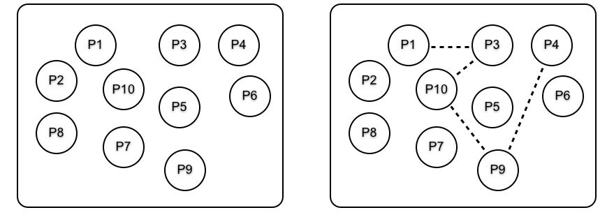
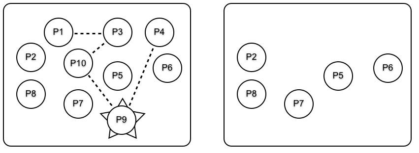
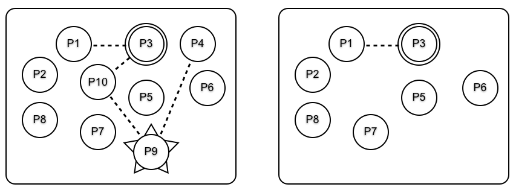

# 并发程序中的错误

处理并发程序中的错误，相比处理顺序程序中的错误，涉及到完全不同的的思维方式。在本章中，我们将以咱们在 [第 6 章 “顺序程序中的错误处理”](../part-ii/Ch06-error_handling_in_sequential_programs.md) 中，了解的原则为基础，将那些思路扩展到并发程序。


我们将探讨错误处理的底层逻辑，以及错误如何在进程间传播，及被其他进程捕获的细节。最后，我们将以一些构成容错软件编程基础的小示例，结束本章。


请设想某个只有一个顺序进程的系统。当这个进程死亡时，我们就可能会陷入大麻烦，因为没有可以帮忙的别的进程。出于这个理由，顺序语言将重点放在失效的预防，及强调 *防御性编程* 上。


在 Erlang 中，我们有咱们可以调遣的大量进程，因此任何单个进程的失效，都不那么重要。通常我们只要编写少量防御性代码，而专注于编写 *纠正式代码*。我们会采取一些检测错误的手段，然后在错误发生后纠正他们。


> *知识点*：

- defensive programming
- corrective code


## 错误处理的哲学


并发 Erlang 程序中的错误处理，基于 *远端的错误检测及处理* 的这一思想。与其在发生错误的进程中处理该错误，我们会让该进程死亡，然后在另一进程中纠正该错误。

当我们要设计某个容错系统时，我们会假设错误会发生，进程会崩溃，机器会失效。我们的工作是在错误发生后，发现他们并尽可能纠正他们。在被错误被修正期间，系统用户不应注意到任何故障，或遭受任何的服务损失。

由于我们专注于治愈而非预防，我们的系统只有很少防御代码；相反，我们有在错误发生后，清理系统的代码。这意味着我们将专注于如何检测错误，如何识别出什么问题，以及如何使系统处于稳定状态。


检测错误及找出某处为何失效，是构建在 Erlang 虚拟机非常底层的功能，也属于 Erlang 这门编程语言的一部分。在标准 OTP 库中，提供了构建可以互相观察，并在检测到错误时采取纠正措施进程组的功能特性，[23.5 小节，*监督树*](#监督树) 中对此进行了描述。本章是关于这门语言在错误检测和恢复的各个方面。

Erlang 构建容错软件的哲学，可概括为两个容易记住的短语：“让别的进程修复错误” 和 “让其崩溃”。


### 让别的进程修复错误


安排了互相监控健康状况的一些进程。当某个进程死亡时，某个别的进程可观察到这一情况，并执行纠正措施。


要让一个进程观察另一进程，我们必须在这两个进程间，建立 *链接* 或 *监控*。当被链接或受监控的进程死亡时，则观察进程会被告知。


观察进程会跨越机器边界透明地运行，因此运行在一台机器上的进程，可以监控某个运行在另一机器上进程的行为。这是编程容错系统的基础。我们无法在一台机器上构造容错系统，因为整台机器可能崩溃，所以我们需要至少两台机器。一台机器执行计算，另一机器观察第一台机器，并在第一台机器崩溃时接管。


这可看作是对顺序代码中错误处理的扩展。毕竟，我们可捕获顺序代码中的异常，并尝试纠正错误（这是 [第 6 章 “顺序程序中的错误处理”](../part-ii/Ch06-error_handling_in_sequential_programs.md) 的主题），但当这样做失败，或整个机器失效时，我们就要让某个别的进程修复错误了。


### 让其崩溃


当咱们来自于像是 C 这样的某门语言时，这就会听起来非常奇怪。在 C 中，我们被教导编写 *防御性代码*。程序应检查其参数，且不要崩溃。在 C 中，这样做有个很好的理由：编写多进程的代码极其困难，同时大多数应用都只有一个进程，因此当这个进程崩溃掉整个应用时，咱们就会有大麻烦。不幸的是，这会导致大量与非错误检查代码交织在一起的错误检查代码。

在 Erlang 中，我们的做法恰恰相反。我们将咱们应用构建为两个部分：一部分解决问题，另一部分则会纠正已发生的错误。


解决问题的部分，会以尽量少的防御代码编写；我们假定函数的全部参数都是正确的，并且程序执行时不会出错。


纠正错误的部分，通常是 *通用的*，因此同样的纠错代码，可用于许多不同的应用。例如，在数据库事务中，当某次事务中途某处发生错误时，我们只需中止该事务，并让系统将数据库恢复到其在该错误前的状态。在某个操作系统中，当某个进程崩溃时，我们会让操作系统关闭所有打开的文件或套接字，并将系统恢复到某种稳定状态。


这种做法能将问题彻底分开。我们编写解决问题的代码，与修复故障的代码，但二者没有交织在一起。这可以大大减少代码量。


### 为何要崩溃掉？


出错时立即崩溃，往往是个极佳的主意；事实上，立即崩溃有诸多优点。

- 我们不必编写防止错误的防御代码；我们只是崩溃；
- 我们不必考虑要做什么；我们只要崩溃，别人将修复错误；
- 我们不会在知道出错后仍执行一些额外计算，使情况变得 *更糟*；
- 当我们标记了某个错误发生的初始位置，我们就能获得非常好的错误诊断。通常在某个错误发生后，继续运行会导致更多错误，并使调试变得更加困难；
- 在编写错误恢复代码时，我们无需关心某处为何崩溃，我们只需专注于事后清理；
- 这简化了系统架构，因此我们可以把应用与错误恢复，视为两个独立问题，而不是一个交错的问题。


那便是这种哲学。现在，我们来开始深入研究细节。


> **让别人修复错误**
>
> 让别人修复某个错误，而不是咱们自己动手，这是个好思路，也是对专业化的鼓励。当我（作者）需要动手术时，我会去找医生，而不会尝试自己给自己开刀。
>
> 当我（作者）的车里的某个小零件出了问题时，车的控制电脑会尝试修复。当修复失败，出了大问题时，我就得把车拿去修理厂，其他人会修好车。
>
> 如果某个 Erlang 进程中的一些小东西出了问题，我（作者）可以尝试以 `catch` 或 `try` 语句修复。但当这样做失败了，出了大问题时，我最好直接崩溃掉，并让别的某个进程来修复错误。


## 错误处理的语义


在这一小节，咱们将学习有关进程间错误处理的语义。咱们将看到一些，咱们在本章稍后会遇到的新术语。掌握错误处理的最佳方法，是快速阅读这些定义，然后跳至一节，获取这些观念的更直观的理解。当咱们需要这样做时，咱们可随时参考这一小节。


- *进程*

    有两种类型的进程：*普通进程* 和 *系统进程*。`spawn` 创建的是普通进程。通过执行 `process_flag(trap_exit, true)` 这个 BIF，某个普通进程可成为一个系统进程。

- *链接*

    进程可以被链接起来。当两个进程 `A` 和 `B` 被链接在一起，且 `A` 因故终止时，一个错误信号将被发送给 `B`，反之亦然。

- *链接集*


    进程 `P` 的链接集，是与 `P` 有链接的进程集合。

- *监视器*


    监视器与链接类似，但监视器是单向的。当进程 `A` 监控着进程 `B`，而 `B` 因故终止时，一条 “宕机” 消息将被发送给 `A`, 反之则不会。

- *消息与错误信号*

    进程经由交换 *消息* 或 *错误信号* 协作。消息是使用 `send` 原语发送的。当某个进程崩溃，或某个进程终止时，错误信号将自动发送。错误信号被发送到该终止进程的链接集。


- *错误信号的接收*

    当某个系统进程收到一个错误信号时，该信号会被转换成 `{'EXIT', Pid, Why}` 格式的消息。`Pid` 是那个终止进程的标识，`Why` 是终止的原因（有时称为 *退出原因*）。当进程不带错误地终止时，那么 `Why` 将是 `normal` 这个原子；否则，`Why` 会描述错误。

    普通进程收到一个错误信号时，在退出原因不是 `normal` 时他将终止。当普通进程终止时，他还会向其链接集，广播一个退出信号。


- *显式错误信号*


    执行 `exit(Why)` 的进程将终止（当此代码不在 `catch` 或 `try` 原语的范围内执行时），并向其链接集广播一个带有 `Why` 原因的退出信号。

    进程可以通过执行 `exit(Pid, Why)`，发送一个 “假的” 错误信号。在这种情形下，`Pid` 进程将收到一个带有 `Why` 原因的退出信号。调用 `exit/2` 的进程不会死掉（这是有意的）。

- *不可捕获的推出信号*


    当某个系统进程收到一个 *`kill` 信号* 时，他会终止。`kill` 信号是经由调用 `exit(Pid, kill)` 生成的。该信号会绕过正常错误信号处理机制，并不会被转换成一条消息。退出的 `kill` 信号应保留给那些在使用任何其他错误处理机制下，都拒绝死掉的流氓进程。


这些定义看起来可能很复杂，但要编写容错代码，通常并不需要详细了解这些机制的工作原理。Erlang 系统的默认行为，已试图在错误处理方面，做 “正确的事”。


接下来的小节，会使用一系列图表，说明这些错误机制的工作原理。


## 创建链接


设想我们有一组互不相关的进程；如下图左侧所示。链接以一些虚线表示。





要创建链接，我们就要调用 `link(Pid)` 这个原语，其会创建一个调用进程和 `Pid` 进程间的链接。因此，当进程 `P1` 调用 `link(P3)` 时，`P1` 和 `P3` 间的一个链接就会创建出来。


`P1` 调用 `link(P3)`，`P3` 调用 `link(P10)`，以此类推后，我们就会到达图中右侧所示的情形。请注意，`P1` 的链接集中，有一个元素（`P3`），`P3` 的链接集中有两个元素（`P1` 和 `P10`），以此类推。


## 全部一起死掉的进程组


通常，咱们会打算创建一些全部一起死掉的进程组。对于论证某个系统的行为，这是一项非常有用的定数。当一些进程合作以解决某个问题，而某处出了问题时，有时我们能够恢复，但当我们无法恢复时，我们就会打算停止我们正在做的一切。这有点像事务的概念：要么这些进程完成他们应该做的事情，要么他们全部被杀死。


设想我们有一些链接的进程，而其中他们中的某个死掉了。例如，请看下图中的 `P9`。图的左侧显示了在 `P9` 死掉前，这些进程是如何链接的。右图显示 `P9` 崩溃后，及全部错误信号都已处理后，仍存活的那些进程。





当 `P9` 死掉时，一个 *错误信号* 会发送给进程 `P4` 和 `P10`。`P4` 和 `P10` 也会死掉，因为他们不属于系统进程，同时错误信号会发送到他们所链接的全部进程。最终，错误信号会传播到所有链接的进程，同时整个链接进程组就会死掉。

现在，当进程 `P1`、`P3`、`P4`、`P9` 或 `P10` 中的任何一个死亡时，他们全都会死掉。


## 设置防火墙


有时，我们不希望全部链接进程都死掉，而是会想要停止错误在系统中的传播。下图说明了这点；其中 `P3` 前的所有链接进程会死掉：





要达到这个目的，设想 `P3` 执行了 `process_flag(trap_exit,true)`，而成为一个系统进程（意味着他可以捕获退出信号）。这以图中右侧的双圆边框显示了出来。`P9` 崩溃后，错误的传播停止于 `P3` 处，因此 `P1` 和 `P3` 并未死掉。这在该图右侧显示了。


`P3` 发挥了 *防火墙* 作用，阻止了错误传播到系统中的其他进程。


## 监视器


监控器与链接类似，但有几处显著差异。


- 监视器是单向的。当进程 `A` 监控了 `B`，而 `B` 死掉时，那么 `A` 将被发送一条退出消息，反之则不会（回顾链接是双向的，所以当 `A` 和 `B` 是链接的时，那么任何一个进程的死亡，都会导致另一进程被通知）；

- 当某个被监控进程死掉时，一条 “宕机” 消息，而不是退出信号，将被发送给监控进程。这意味着要处理错误，监控进程不必成为系统进程。


监控器用在咱们需要非对称的错误处理时；链接用在咱们需要对称的错误处理时。监视器通常被服务器用于监控客户端的行为。


下一小节会解释操作链接和监视器的那些 BIF 的语义。


## 错误处理原语


操作链接和监控器，及捕捉和发送退出信号的原语如下：

- `-spec spawn_link(Fun) -> Pid`
- `-spec spawn_link(Mod, Fun, Args) -> Pid`

    这个原语会像 `spawn(Fun)` 或 `spawn(Mod,Func,Args)` 那样行事，并在父进程和子进程间建立一个链接。


- `-spec spawn_monitor(Fun) -> {Pid, Ref}`
- `-spec spawn_monitor(Mod, Func, Args) -> {Pid, Ref}`

    这个原语与 `spawn_link` 相似，但他会创建一个监视器而非链接。`Pid` 是新创建进程的进程标识符，`Ref` 是该进程的引用。当该进程因 `Why` 原因死掉时，则一条 `{'DOWN',Ref,process,Pid,Why}` 消息会被发送给父进程。


- `-spec process_flag(trap_exit, true)`

    这个原语会把当前进程变成了一个系统进程。系统进程属于可接收和处理错误信号的进程。


- `-spec link(Pid) -> true`

    这个原语会创建一个到进程 `Pid` 的链接。链接是对称的。当进程 `A` 执行了 `link(B)`，那么他将被链接到 `B`。其净效应与在 `B` 执行了 `link(A)` 时一样。


    当进程 `Pid` 不存在时，则一个 `noproc` 退出异常会被抛出。

    当 `A` 已链接到 `B`，并且执行了 `link(B)`（*反之亦然*）时，则该调用会被忽略。


- `-spec unlink(Pid) -> true`


    这个原语会移除当前进程与进程 `Pid` 间的任何链接。


- `-spec erlang:monitor(process, Item) -> Ref`

    这个原语将建立一个监视器。其中 `Item` 是某个进程的 `Pid` 或注册名字。


- `-spec demonitor(Ref) -> true`

    这个原语会移除有着引用 `Ref` 的某个监视器。


- `-spec exit(Why) -> none()`

    这个原语会引发当前进程以原因 `Why` 终止。当执行这个语句的子句，不在某个 `catch` 语句范围内时，那么当前进程将以参数 `Why`，刚播一个退出信号到所有当前链接的进程。他还将广播一个 `DOWN` 消息，到所有监视他的进程。


- `-spec exit(Pid, Why) -> true`

    这个原语会以原因 `Why`，发送一个退出信号到进程 `Pid`。执行这个 BIF 的进程本身不会死掉。这可用于 “假的” 退出信号。


我们可运用这些原语，建立相互监控的进程网络，而这样的进程网络，提供了构建容错软件的基础。


## 编程容错


在这一小节中，咱们将学习几种可用于构造容错代码的简单技术。这并非构造容错系统的全部，但却是个故事的开局。


### 在某个进程死掉时执行一个动作


函数 `on_exit(Pid,Fun)` 会监视进程 `Pid`，并在该进程以 `Why` 原因退出时，执行 `Fun(Why)`。


[`lib_misc.erl`](http://media.pragprog.com/titles/jaerlang2/code/lib_misc.erl)


```erlang
{{#include ../../projects/ch13-code/lib_misc.erl:120:126}}
```


`monitor(process, Pid)` （第 3 行）创建了个到 `Pid` 创建的监视器。当该进程死亡时，一条 `DOWN` 消息会被收到，并调用 `Fun(Why)`（第 5 行）。


要测试这个函数，我们将定义一个等待一条消息 `X`，然后执行 `list_to_atom(X)` 的函数 `F`。


```erlang
1> F = fun() ->
   receive
   X -> list_to_atom(X)
   end
   end.
#Fun<erl_eval.43.113135111>
```


我们将生成下面这个进程：


```erlang
2> Pid = spawn(F).
<0.86.0>
```

同时我们将建立一个监控他的 `on_exit` 处理器。


```erlang
3> lib_misc:on_exit(Pid, fun(Why) ->
   io:format(" ~p died with: ~p~n", [Pid, Why])
   end).
<0.88.0>
```

当我们将一个原子发送给 `Pid` 时，该进程就会死掉（因为他试图执行在某个非列表上执行 `list_to_atom`），同时 `on_exit` 这个处理程序将被调用。


```erlang
4> Pid ! hello.
 <0.86.0> died with: {badarg,
                         [{erlang,list_to_atom,
                              [hello],
                              [{error_info,#{module => erl_erts_errors}}]}]}
=ERROR REPORT==== 19-Sep-2025::10:56:44.975000 ===
Error in process <0.86.0> with exit value:
{badarg,[{erlang,list_to_atom,
                 [hello],
                 [{error_info,#{module => erl_erts_errors}}]}]}

hello
5>
```


当然，进程死掉时调用的函数，可以执行他偏好的任何计算：他可忽略这个错误、记录这个错误，或重启应用。取舍在程序员那里。


> **生成进程和链接进程为什么必须是原子操作**
>
> 从前 Erlang 有两个原语：`spawn` 和 `link`，而 `spawn_link(Mod, Func, Args)` 曾被定义为下面这样：

```erlang
spawn_link(Mod, Func, Args) -> 
    Pid = spawn(Mod, Func, Args),
    link(Pid)
    end.
```

> 然后一个不起眼的错误就出现了。在其中那个链接语句被调用前，生成的进程就已死掉，因此那个进程就死掉了，但没有错误信号产生。这个 bug 花了很长时间才发现。为解决这个问题，`spawn_link` 作为一个原子操作被加入。在涉及并发时，即使是看起来简单的程序，也会很棘手。

### 构造会全部一起死掉的进程集


设想我们打算创建几个用于解决某个问题的工作进程。他们会执行函数 `F1`、`F2` 等。当有进程死掉时，我们就要他们全部死掉。我们可通过调用 `start([F1,F2, ...])` 做到这点。


```erlang
start(Fs) ->
    spawn(fun() -> 
        [spawn_link(F) || F <- Fs],
        receive
            after infinity -> true
        end
    end).
```

`start(Fs)` 会生成一个进程，该进程又会生成并链接那些工作进程，并等待无限长时间。当任何一个工作进程死掉时，他们都会死掉。


当我们想要知道这些进程是否都已死掉时，我们可将一个 `on_exit` 处理器，添加到这个启动进程。


```erlang
Pid = start([F1, F2, ...]),
on_exit(Pid, fun(Why) -> 
                ... the code here runs if any worker
                ... process dies
             end)
```


### 构造一个永生的进程


我们将构造一个保持存活的进程，以结束这一章。这个想法是要构造一个始终存活的注册进程 -- 当他因任何原因死亡时，他都将立即重启。


我们可使用 `on_exit`，编程这一想法。


[`lib_misc.erl`](http://media.pragprog.com/titles/jaerlang2/code/lib_misc.erl)


```erlang
{{#include ../../projects/ch13-code/lib_misc.erl:130:132}}
```


这会构造一个名为 `Name`，执行 `spawn(Fun)` 的注册进程。当该进程因任何原因死掉时，他都会被重启。


在 `on_exit` 和 `keep_alive` 中，有个相当微妙的错误。当我们仔细观察下面两行代码时：


```erlang
Pid = register(...),
on_exit(Pid, fun(X) -> ..),
```

我们会看到，存在该进程在这两条语句 *之间* 空隙中死掉的可能性。当该进程在 `on_exit` 执行前就已死亡，那么链接将不会被创建，`on_exit` 这个进程将不会如咱们预期的那样工作。当两个程序同时对同一个 `Name` 值，执行 `keep_alive` 时，这种情况就会发生。这被称为 *竞赛条件* -- 两部分代码（这一部分）以及 `on_exit` 中执行链接操作的代码小节在相互竞赛。当这里出了问题时，咱们程序就会以非预期方式运行。

> *知识点*：

- racing condition

我（作者）不会在这里解决这个问题 -- 我会让你自己思考如何做到这一点。当咱们把 `spawn`、`spawn_monitor`、`register` 等 Erlang 原语结合在一起时，咱们就必须仔细考虑竞赛条件的可能，并以竞赛条件不会发生的方式，编写咱们的代码。


现在，咱们已经了解了的错误处理的全部。顺序代码中无法捕获的错误，会从这些错误发生的进程中流出，沿着链接流到其他可被编程处理这些错误的进程。我们所描述的所有机制（链接进程等），都会跨越机器边界透明运行。


跨越机器边界，将我们带到分布式编程。Erlang 进程可 *在网络中的其他物理机上*，产生新的进程，从而让编写分布式程序十分容易。分布式编程，是下一章的主题。


## 练习


1. 请编写一个以类似 `spawn(Mod,Func,Args)` 方式行事的函数 `my_spawn(Mod, Func, Args)`，但有一个不同。当所生成的进程死掉时，一条消息说明该进程死亡原因，及该进程死亡前存活时间的消息会被打印出来；


2. 请使用本章早先给出的 `on_exit` 函数，解答上一练习；


3. 请编写一个以类似 `spawn(Mod,Func,Args)` 方式行事的函数 `my_spawn(Mod, Func, Args, Time)`，但有一点不同。当生成的进程存活时间超过 `Time` 秒时，则其会被杀死；

4. 请编写一个会创建出，一个每五秒写出 `"I'm still running"` 的注册进程的函数。并编写一个监控该进程，并在其死亡时重新启动的函数。启动这个全局进程和监控进程。杀死那个全局进程，并检查他是否已由监控进程重启；

5. 请编写一个启动并监控多个工作进程的函数。当任何一个工作进程非正常死亡时，就要重启他；

6. 编写一个启动并监控多个工作进程的函数。当任何一个工作进程非正常死亡时，杀死所有工作进程并重新启动他们。
