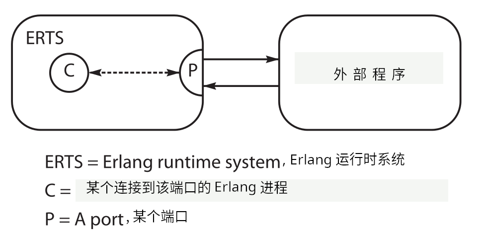
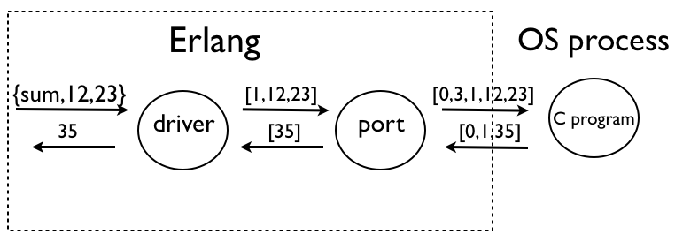

# 接口技术

系统的构建，经常涉及将以不同编程语言编写的应用，与咱们的系统连接起来。我们可能将 C 用于提高效率，或编写底层的硬件驱动，抑或我们可能打算集成某个以 Java、Ruby 或其他编程语言编写的库。我们可以数种方式，将一些外语程序与 Erlang 连接起来。


- 通过在某个外部操作系统进程中，在 Erlang 虚拟机 *外部* 运行程序。这是一种 *安全的* 方法。当外部语言的代码不正确时，也不会导致 Erlang 系统崩溃。Erlang 通过称为一种称作 *端口* 的设备，控制外部进程，并经由面向字节的通信信道，与外部进程通信。Erlang 负责启动及停止外部程序，并可监控他们，当其崩溃时重启他们。这些外部进程，被称为 *端口进程*，因为其是通过某个 Erlang 端口控制的；

- 在 Erlang 中运行某个操作系统命令，并捕获结果；

- 在 Erlang 虚拟机 *内部* 运行其他语言的代码。这涉及将外部代码，与 Erlang 虚拟机的代码链接起来。这是一种 *不安全的* 方法。其他语言代码中的错误，可能会导致 Erlang 系统崩溃。虽然这种方法不安全，但却很有用，因为相比使用外部进程，他更有效率。

    将其他语言代码链接进到 Erlang 内核，只能用于 C 等生成原生对象代码的那些语言，而不能用于 Java 等有其自己虚拟机的那些语言。

在本章中，我们将学习使用端口和操作系统命令，连接 Erlang。此外，还有一些使用链接驱动、原生实现函数（NIFs）及 C 节点等高级接口技术。这些高级技术未在本书中涉及，但在本章末尾，我们将简要介绍这些技术，并提供一些参考资料。

> *知识点*：
>
> - linked-in drivers
>
> - natively implemented functions, NIFs
>
> - C-nodes


## Erlang 如何与外部程序通信


Erlang 通过名为 *端口* 的对象，与外部程序通信。当我们将一条消息发送给某个端口时，该消息将被发送到与该端口相连的外部程序。而来自外部程序的消息，将呈现为来自端口的 Erlang 消息。


就程序员而言，端口的行事方式，与 Erlang 进程无异。咱们可将消息发送给他，咱们可将其注册（就像进程一样），等等。当外部程序崩溃时，那么一个退出信号，将发送到所连接的进程，而当连接的进程死亡时，则对应外部程序也会被杀死。


请注意使用端口与外部进程通信，与使用套接字与外部程序通信的区别。当咱们使用端口时，端口将以 Erlang 进程方式行事，因此咱们可以链接到他，从远端的分布式 Erlang 节点发送消息给他等等。而当咱们使用套接字时，其将不会以进程方式行事。


创建了端口的进程，称为该端口的 *连接进程*。连接进程具有显著意义：所有发送到该端口的消息，都必须以连接进程的 PID 标记，同时所有来自外部程序的消息，都会发送到这个连接进程。


我们可以在下图中，看到连接进程（C）、端口（P）与外部操作系统进程间的关系：




要创建一个端口，我们就要调用 `open_port`，其是如下指定的：


```erlang
-spec open_port(PortName, [Opt]) -> Port
```

其中 `PortName` 为如下选项之一：

- `{spawn, Command}`

    会启动一个外部程序。`Command` 是某个外部程序的名字。除非找到一个名称为 `Command` 的链接驱动，否则 `Command` 会运行于 Erlang 工作区之外。


- `{fd, In, Out}`

    允许 Erlang 进程访问当前由 Erlang 打开的任何文件描述符。其中文件描述符 `In` 可用于标准输入，而文件描述符 `Out` 则可用于标准输出。


`Opt` 为以下选项之一：

- `{packet, N}`

    数据包前面有 `N`（1、2 或 4）字节的长度计数。

- `stream`

    发送以不带数据包长度发出。应用务必要知道，如何处理这些数据包。

- `{line, Max}`

    按行投送信息。当行超过 `Max` 字节数时，则其会被分拆为 `Max` 字节。

- `{cd, Dir}`

    只对 `{spawn, Command}` 这个选项有效。外部程序会在 `Dir` 下启动。


- `{env, Env}`

    只对 `{spawn, Command}` 这个选项有效。外部程序的环境，由列表 `Env` 中的环境变量扩展。`Env` 是个 `{VarName, Value}` 对的列表，其中 `VarName` 和 `Value` 均为字符串。


这并非 `open_port` 的参数完整列表。咱们可以在 `erlang` 模组的手册页中，找到这些参数的详细信息。

以下消息可被发送给某个端口；请注意，在所有这些消息中，`PidC` 都是所连接进程的 PID。


- `Port ! {PidC, {command, Data}}`

    向该端口发送 `Data` （一个 I/O 清单）。


- `Port ! {PidC, {connect, Pid1}}`

    将连接进程的 PID，从 `PidC` 改为 `Pid1`。

- `Port ! {PidC, close}`

    关闭该端口。


通过写下如下代码，连接进程就可以接收来自外部程序的消息：


```erlang
receive
    {Port, {data, Data}} ->
        ... Data comes from the external process ...
```


在后面的小节中，我们将把 Erlang 与一个简单 C 程序对接。这个 C 程序有意较短，以专注于我们如何完成对接的细节。


## 使用端口对接外部 C 程序


我们将以一些简单 C 代码开始。`example1.c` 包含着两个函数。第一个函数计算两个整数之和，第二个计算其参数的二倍。

[`ports/example1.c`](http://media.pragprog.com/titles/jaerlang2/code/ports/example1.c)

```c
{{#include ../../projects/ch15-code/example1.c}}
```

我们的最终目标，是在 Erlang 中调用这些例程。我们希望能以如下方式调用他们：


```erlang
X1 = example1:sum(12,23),
Y1 = example1:twice(10),
```


从用户角度看，`example1` 就是个 Erlang 模组，因此到这个 C 程序的接口的所有细节，都应隐藏在 `example1` 这个模组内部。


要实现这点，我们需要将诸如 `sum(12,23)` 与 `twice(10)` 等函数调用，转换为我们通过端口的方法，发送给外部程序的字节序列。端口将一个长度计数，添加到这个字节序列，并将得到的结果发送给外部程序。当外部程序回复时，端口会收到该回复，并将结果发送给该端口的连接进程。


我们使用的协议非常简单。


- 所有数据包都以 2 字节的长度编码 (`Len`) 开始，然后是 `Len` 个字节的数据。当我们以参数 `{packet,2}` 打开某个端口时，这个头部是由端口自动添加的；

- 我们将调用 `sum(N, M)`，编码为字节序列 `[1,N,M]`；

- 我们将调用 `twice(N)` 编码为字节序列 `[2,N]`；

- 参数和返回值，均被假定为单个字节长。


外部的 C 程序和 Erlang 程序，都必须遵循这一协议。下图说明了在我们调用 `example1:sum(12,23)` 后，所发生的事情。他显示了端口是如何连接到外部 C 程序的。




发生的事情如下：

1. 驱动会将 `sum(12,23)` 这个函数调用，编码为字节序列 `[1,12,23]`，并将 `{self(), {command, [1,12,23]}}` 这个消息，发送到端口；

2. 端口驱动会将一个 2 字节的长度头部，添加到该消息，而把字节序列 `0,3,1,12,13` 发送给外部程序；

3. 外部程序会从标准输入，读取这五个字节，调用那个求和函数，然后将字节序列 `0,1,35` 写入标准输出；

    其中前两个字节包含着数据包的长度。随后便是结果 `35`，其为 1 字节长。

4. 端口驱动会移除那个长度的头部，并将一条 `{Port, {data, [35]}}` 消息发送给连接进程；

5. 连接进程会解码出这条消息，并将结果返回给调用程序。

现在，我们必须编写出遵循这一协议，位于接口两侧的程序。


### C 程序


C 程序有三个文件。

- `example1.c`：包含着我们要调用的函数（早先我们已见到这个文件）；
- `example1_driver.c`：管理字节流协议，以及调用 `example1.c` 中的例程；
- `erl_comm.c`：具有一些读写内存缓冲区的例程；


**`example1_driver.c`**


这段代码有个读取标准输入中命令、调用应用例程，并将结果写入标准输出的循环。请注意，当咱们打算调试这个程序时，咱们可写入 `stderr`；代码中有条注释掉的 `fprintf` 语句，展示了怎样做到这点。


[`ports/example1_driver.c`](http://media.pragprog.com/titles/jaerlang2/code/ports/example1_driver.c)


```c
{{#include ../../projects/ch15-code/example1_driver.c}}
```


**`erl_comm.c`**


最后，下面是读写和写入标准输入和输出中数据的代码。这段代码被编写为允许可能的数据碎片。

[`ports/erl_comm.c`](http://media.pragprog.com/titles/jaerlang2/code/ports/erl_comm.c)


```c
{{#include ../../projects/ch15-code/erl_comm.c}}
```

这段代码专门用于处理有着 2 字节长头部的数据，因此他要与给到端口驱动程序的 `{packet, 2}` 选项匹配。


### Erlang 程序


端口的 Erlang 侧，是由以下程序驱动的：


[`ports/example1.erl`](http://media.pragprog.com/titles/jaerlang2/code/ports/example1.erl)

```erlang
{{#include ../../projects/ch15-code/example1.erl}}
```

这段代码遵循了一种相当标准的模式。在 `start/0` 中，我们创建了一个名为 `example1` 的注册进程（服务器）。`call_port/1` 实现了对服务器的远程过程调用。`twice/1` 和 `sum/2` 属于必须导出，且会发起对服务器远程过程调用的接口例程。在 `loop/1` 中，我们编码了到外部程序的请求，并处理来自这个外部程序的返回值。


这就完成了这些程序。现在我们只需一个 makefile 构建出这些程序。


### 编译并连接这个端口程序

这个 makefile 会编译及连接本章中讲到的这个端口驱动与链接驱动程序，以及所有有关 Erlang 代码。这个 makefile 只在 Mac OS X Mountain Lion 上测试过，其他操作系统将需要修改。他还包含了个小的测试程序，其会在每次重建代码时运行。


[`ports/Makefile.mac`](http://media.pragprog.com/titles/jaerlang2/code/ports/Makefile.mac)


```Makefile
{{#include ../../projects/ch15-code/Makefile}}
```

> **译注**：相比原文的 `Makefile.mac`，这里为适应在 Linux 系统上的编译，做了如下改动。
>
> - 移除了 `-arch`、`-bundle` 及 `-flat_namespace` 参数。这些参数是专用于 MacOS 的选项参数；
>
> - 将 `-undefined suppress` 命令行开关，修改为 `-Wl,undefined,suppress`，因为原来的写法已不受新版 GCC 支持；
>
> - 增加 `-shared` 命令行开关，否则会报如下错误。
>
> ```console
> gcc -I /usr/lib/erlang/usr/include/ \
>             -o example1_drv.so -fPIC -Wl,-undefined,suppress \
>             example1.c example1_lid.c
> /usr/bin/ld: /usr/lib/gcc/x86_64-pc-linux-gnu/15.2.1/../../../../lib/Scrt1.o: in function `_start':
> (.text+0x1b): undefined reference to `main'
> /usr/bin/ld: /tmp/ccs0nqFy.o: in function `example_drv_start':
> example1_lid.c:(.text+0x16): undefined reference to `driver_alloc'
> /usr/bin/ld: /tmp/ccs0nqFy.o: in function `example_drv_stop':
> example1_lid.c:(.text+0x43): undefined reference to `driver_free'
> /usr/bin/ld: /tmp/ccs0nqFy.o: in function `example_drv_output':
> example1_lid.c:(.text+0xe5): undefined reference to `driver_output'
> collect2: 错误：ld 返回 1
> make: *** [Makefile:13：example1_drv.so] 错误 1
> ```
>
>   参考：[How to compile an Erlang driver?](https://stackoverflow.com/a/19305649/12288760)


### 运行程序

现在我们可运行这个程序。


```erlang
1> example1:start().
true
2> example1:sum(45, 32).
77
3> example1:twice(20).
40
```


这就完成了我们的第一个示例端口程序。这个程序实现的端口协议，是 Erlang 与外界通信的主要方式。

在进入下一主题前，请注意以下几点：

- 这个示例程序没有试图统一 Erlang 和 C 对整数为何的概念。我们只假定了 Erlang 和 C 中的整数是单个字节，而忽略了精度及符号的所有问题。在某个实际应用中，我们就必须仔细考虑相关参数的确切类型与精度。事实上，这可能相当困难，因为 Erlang 乐于管理任意大小的整数，而 C 等语言则对整数精度等，有固定概念；

- 在没有首先启动负责接口的驱动前，我们无法直接运行那些 Erlang 函数（也就是说，在咱们可运行该程序之前，某个程序必须要执行 `example1:start()`）。我们会希望能在系统启动时，自动执行这个操作。这完全可行，但需要一些有关系统如何启动和停止的知识。我们将在 [23.7 节 “应用程序”](./Ch23-making_a_system_with_otp.md#应用程序) 中讨论这个问题。


## 在 Erlang 中调用 Shell 脚本


设想我们打算从 Erlang 中调用某个 shell 脚本。为此，我们可使用库函数 `os:cmd(Str)`。他会运行 `Str` 字符串中的命令，并捕获结果。下面是个使用 `ip add show dev lo` 命令的示例：


```erlang
1> os:cmd("ip add show dev lo").
"1: lo: <LOOPBACK,UP,LOWER_UP> mtu 65536 qdisc noqueue state UNKNOWN group default qlen 1000\n    link/loopback 00:00:00:00:00:00 brd 00:00:00:00:00:00\n    inet 127.0.0.1/8 scope host lo\n       valid_lft forever preferred_lft forever\n    inet6 ::1/128 scope host noprefixroute \n       valid_lft forever preferred_lft forever\n"
```


结果需要解析，提取出我们感兴趣的信息。


## 高级接口技术

除前面讨论到的技术外，还有一些其他可用于将 Erlang 与外部程序对接的技术。


接下来介绍的技术正不断改进，而且随着时间推移，其变化速度往往比 Erlang 本身更快。因为这一原因，他们在这里未被详细介绍。有关描述已移至在线归档，以便他们更快地得以更新。


 - *链入的驱动*

    这些程序遵守与前面讨论的端口驱动同样协议。唯一不同的是，驱动代码是链接到 Erlang 内核，而因此是在 Erlang 的操作系统主进程中运行。要构造链入的驱动，必须要添加初始化驱动的少量代码，然后这个驱动必须要被编译，并链接到 Erlang 的虚拟机。

    [Port Drivers](https://www.erlang.org/doc/system/c_portdriver.html) 有着链入式驱动的最新示例，以及如何对不同操作系统编译他们。

    > **译注**：原文提到的 [erlang/linked_in_drivers](git://github.com/erlang/linked_in_drivers.git) 已在 GitHub 上找不到，应是合并到了新版本的 Erlang/OTP 发布中。

- *原生实现函数*

    NIF 即 *原生实现函数*。他们是一些以 C（或某些会编译到原生代码的语言） 编写的函数，并会被链接进到 Erlang 虚拟机中。原生实现函数会直接将参数传递到 Erlang 进程栈和堆上，并可直接访问全部 Erlang 内部数据结构。

    有关 NIFs 的示例及最新信息，可在 [`erl_nif`](https://www.erlang.org/doc/apps/erts/erl_nif.html)。

    > **译注**： 原文所之的代码仓库 [erlang/nifs](git://github.com/erlang/nifs.git) 已找不到，应是已被合并到新的 Erlang/OTP 发布中。

- *C 节点*

    所谓 C 节点，是以 C 实现、遵守 Erlang 分布式协议的一些节点。“真正的” 分布式 Erlang 节点，可以某个 C 节点对话，并将认为这个 C 节点是个 Erlang 节点（前提是他不会试图在 C 节点上做任何花哨的事，比如发送 Erlang 代码给他执行）。

    C 节点在 https://www.erlang.org/doc/system/tutorial.html 处的互操作性教程中有介绍。


那么，现在我们清楚了如何将 Erlang 与外部世界对接。在接下来的几章中，我们将了解如何从 Erlang 内部，访问文件和套接字。


## 练习


1. 请下载前面给出的端口驱动代码，并在咱们的系统上测试；

2. 请前往 [Port Drivers](https://www.erlang.org/doc/system/c_portdriver.html)。下载链入驱动的代码，并在咱们的系统上测试。其最棘手的部分，是找出编译和链接该代码的正确命令。当咱们在这个练习上失败时，请在 Erlang 邮件列表中寻求帮助；

3. 请尝试咱们是否能找到一条发现咱们计算机有着什么样 CPU 的操作系统命令。当咱们能找到这样的命令，就编写个返回咱们 CPU 型号的函数，使用函数 `os:cmd/1`，调用这条操作系统命令。
