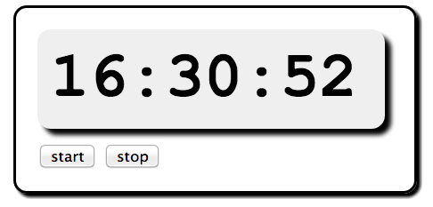

# 使用 Websockets 和 Erlang 浏览网页

在本章中，我们将了解如何构建浏览器中的应用，并把使用消息传递的概念，扩展到 Erlang 以外。这样，我们就能轻松构建分布式应用，并将他们与 web 浏览器集成。Erlang 把 web 浏览器，当作只是另一个 Erlang 进程，这样就简化了我们的编程模型，将一切都置于同一概念框架下。

我们将把网络浏览器当作一个 Erlang 进程。当我们打算让浏览器做些什么时，我们将发送给他一条消息；当浏览器内发生了我们需要处理的事情时，浏览器将发送给我们一条消息。所有这些都要归功于 *websockets*。Websockets 是 HTML5 标准的一部分，是一种可用于在浏览器与外部程序间，传递消息的双向异步套接字。在我们的情形下，外部程序便是 Erlang 的运行时系统。

为实现 Erlang 运行时系统与 websocket 的交互，我们要运行一个名为 `cowboy` 的简单 Erlang web 服务器，来管理套接字与 websocket 协议。有关如何安装 `cowboy` 的详细信息，请参阅 [第 25 章 *第三方程序*](../part-v/Ch25-third_party_programs.md)。为简化操作，我们假设 Erlang 与浏览器之间的所有消息，都是 JSON 消息。

在应用的 Erlang 侧，这些信息表现为 Erlang 映射（参见 [5.3 小节，*映射：关联的键值存储*](../part-ii/Ch05-records_and_maps.md#映射关联的键值存储)），而在浏览器中，这些消息则表现为 JavaScript 对象。

在本章的剩下部分，我们将讨论六个示例程序，包括运行在浏览器中的代码，以及运行在服务器中的代码。最后，我们将讨论客户端-服务器协议，并了解从 Erlang 到浏览器的消息，是如何处理的。

要运行这些示例，我们需要三样东西：运行在浏览器中的代码、运行在 Erlang 服务器中的代码，以及一个理解 websockets 协议的 Erlang 服务器。我们不会在这里讨论所有代码；我们将讨论分别运行在浏览器和服务器中的代码，但不会讨论服务器本身的代码。所有示例可在 [joearms/ezwebframe](https://github.com/joearms/ezwebframe) 上找到。这些示例中的浏览器代码，仅在 Chrome 浏览器中进行了测试。

*注意*：这里给出的代码是 `joearms/ezwebframe` 代码库中代码的简化版本。这里的代码是使用映射编写的。而代码库中的代码，与 Erlang 发行版保持同步，并将反映 Erlang R17 版本（预计在 2013 年末，但地图将在正式发布前出现在 GitHub 的分支中）中，引入映射时 Erlang 的全部变化。

要自己运行这些代码，咱们需要下载代码，并按照安装说明操作。就我们而言，这些代码中有趣的部分，是那些运行在浏览器中的部分，以及在那些运行在服务器中的部分。

所有示例都使用了从 Erlang 控制浏览器的一种简单技术。当 Erlang 希望浏览器做些什么时，他只要发送给浏览器一条消息，告诉浏览器要做什么。当用户想做些什么时，他们就点击浏览器中的按钮或其他控件，然后一条消息就会被发送给 Erlang。第一个示例详细展示了这种方法的工作原理。

## 创建一个数字时钟

下图显示了这个运行在浏览器中的时钟。浏览器窗口的所有无关细节，如菜单、工具栏及滚动条等，都未被显示，这样我们就可以专注于代码。

