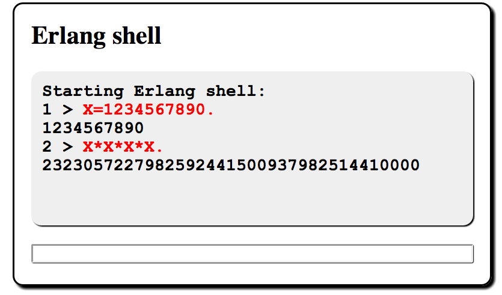

# 使用 Websockets 和 Erlang 浏览网页

在本章中，我们将了解如何构建浏览器中的应用，并把使用消息传递的概念，扩展到 Erlang 以外。这样，我们就能轻松构建分布式应用，并将他们与 web 浏览器集成。Erlang 把 web 浏览器，当作只是另一个 Erlang 进程，这样就简化了我们的编程模型，将一切都置于同一概念框架下。

我们将把网络浏览器当作一个 Erlang 进程。当我们打算让浏览器做些什么时，我们将发送给他一条消息；当浏览器内发生了我们需要处理的事情时，浏览器将发送给我们一条消息。所有这些都要归功于 *websockets*。Websockets 是 HTML5 标准的一部分，是一种可用于在浏览器与外部程序间，传递消息的双向异步套接字。在我们的情形下，外部程序便是 Erlang 的运行时系统。


为实现 Erlang 运行时系统与 websocket 的交互，我们要运行一个名为 `cowboy` 的简单 Erlang web 服务器，来管理套接字与 websocket 协议。有关如何安装 `cowboy` 的详细信息，请参阅 [第 25 章 *第三方程序*](../part-v/Ch25-third_party_programs.md)。为简化操作，我们假设 Erlang 与浏览器之间的所有消息，都是 JSON 消息。


在应用的 Erlang 侧，这些信息表现为 Erlang 映射（参见 [5.3 小节，*映射：关联的键值存储*](../part-ii/Ch05-records_and_maps.md#映射关联的键值存储)），而在浏览器中，这些消息则表现为 JavaScript 对象。


在本章的剩下部分，我们将讨论六个示例程序，包括运行在浏览器中的代码，以及运行在服务器中的代码。最后，我们将讨论客户端-服务器协议，并了解从 Erlang 到浏览器的消息，是如何处理的。


要运行这些示例，我们需要三样东西：运行在浏览器中的代码、运行在 Erlang 服务器中的代码，以及一个理解 websockets 协议的 Erlang 服务器。我们不会在这里讨论所有代码；我们将讨论分别运行在浏览器和服务器中的代码，但不会讨论服务器本身的代码。所有示例可在 [joearms/ezwebframe](https://github.com/joearms/ezwebframe) 上找到。这些示例中的浏览器代码，仅在 Chrome 浏览器中进行了测试。

*注意*：这里给出的代码是 `joearms/ezwebframe` 代码库中代码的简化版本。这里的代码是使用映射编写的。而代码库中的代码，与 Erlang 发行版保持同步，并将反映 Erlang R17 版本（预计在 2013 年末，但地图将在正式发布前出现在 GitHub 的分支中）中，引入映射时 Erlang 的全部变化。


要自己运行这些代码，咱们需要下载代码，并按照安装说明操作。就我们而言，这些代码中有趣的部分，是那些运行在浏览器中的部分，以及在那些运行在服务器中的部分。


所有示例都使用了从 Erlang 控制浏览器的一种简单技术。当 Erlang 希望浏览器做些什么时，他只要发送给浏览器一条消息，告诉浏览器要做什么。当用户想做些什么时，他们就点击浏览器中的按钮或其他控件，然后一条消息就会被发送给 Erlang。第一个示例详细展示了这种方法的工作原理。


## 创建一个数字时钟

下图显示了这个运行在浏览器中的时钟。浏览器窗口的所有无关细节，如菜单、工具栏及滚动条等，都未被显示，这样我们就可以专注于代码。


这个应用的重要部分在于显示。显示包含着一个每秒更新的时间。从 Erlang 的角度来看，整个浏览器是个进程；因此，要将时钟更新为前面显示的值，Erlang 发送给了浏览器以下消息：


```erlang
Browser ! #{ cmd => fill_div, id => clock, txt => <<"16:30:52">> }
```

在浏览器内，我们已加载了个其中有小段如下 HTML 代码的 HTML 页面：


```html
<div id='clock'>
    ...
</div>
```


当浏览器收到一条 `fill_div` 消息后，他便将其转换为 JavaScript 的 `fill_div({cmd:'fill_div',id:'clock',txt:'16:30:52'})` 命令，其随后就会所要求的字符串，填充这个 div 的内容。


请注意，这条包含着一个框架的 Erlang 消息，是如何被转换为一条会在浏览器中执行的等价 JavaScript 函数调用。扩展 ERalng 系统非常简单。咱们只须编写个对应于需要处理的 Erlang 消息的 JavaScript 小函数即可。

要完成这中图景，我们需要添加启动与停止时钟的代码。将所有内容放在一起，那么 HTML 代码看起来如下：


```html
{{#include ../../projects/ch18-code/clock1.html}}
```

首先，我们加载了两个 JavaScript 库及一个样式表。`clock1.css` 用于设置时钟的显示样式。

其次，还有一些创建显示内容的 HTML。最后，我们有一小段在页面加载时运行的 JavaScript。


*注意*：在我们的全部示例中，我们都假定对 jQuery 有一定了解。jQuery ([jquery.com](http://jquery.com) 是个简化浏览器中对象操作的相当流行的 JavaScript 库。


`websock.js` 有着打开 websocket，及将浏览器 DOM 中对象，连接到 Erlang 所需的全部代码。他会完成以下事情：


1. 将点击处理器，添加到页面中所有类为 `live_button` 的按钮。在这些按钮被点击时，点击处理器会发送消息给 Erlang；

2. 尝试启动一个到 `http://localhost:2233` 的 websocket 连接。在服务器侧，在一个新生成的进程中函数 `clock1:start(Browser)` 将被调用。所有这些都是经由调用 JavaScript 的函数 `connect("localhost", 2233, "clock1")` 实现的。2233 这个编号没有特定含义；任何 1023 以上的未使用端口号都可以。


现在，下面是 Erlang 代码：


```erlang
{{#include ../../projects/ch18-code/clock1.erl}}
```

Erlang 代码在 `start(Browser)` 处开始执行；`Browser` 是个代表浏览器的进程。这是第一个有趣的代码行：


```erlang
{{#include ../../projects/ch18-code/clock1.erl:5}}
```

这会更新显示。我（作者）重复这行是为强调。我的编辑让我把他去掉。但没有。对我来说，这是非常漂亮的代码。为让浏览器做某事，我们发送给他一条信息。*就像 Erlang 一样*。我们已经驾驭了浏览器。他看起来就像个 Erlang 进程。哇哦。

初始化完成后，`clock1` 会调用 `running/1`。当一条 `{clicked => <<"stop">>}` 消息收到时，我们就会调用 `idle(Browser)`。否则，在一秒的超时后，我们会向浏览器发送一条命令，告诉他更新时钟并调用 `running/1` 自己。

`idle/1` 会等待一条 `start` 信息，然后调用 `running/1`。


## 基本交互


我们的下个示例，有个用于显示数据的可滚动文本框及一个输入框。当咱们在输入框中输入文本并按下回车键时，一条消息就会发送到浏览器。浏览器以一条更新显示内容的消息响应。


这个示例的 HTML 代码如下：


```html
{{#include ../../projects/ch18-code/interact1.html}}
```

同时下面是 Erlang 代码：


```erlang
{{#include ../../projects/ch18-code/interact1.erl}}
```

这个示例的工作方式与时钟示例类似。每次用户在输入框中按下回车键时，输入框就会向浏览器发送一条包含输入文本的消息。管理该视窗的 Erlang 进程会收到该消息，并会将一条更新显示内容的消息，发送回浏览器。


## 浏览器中的 Erlang shell


我们可以使用接口模式中的代码，构造一个运行在浏览器中的 Erlang shell。





由于其与交互示例中的代码类似，我们将不展示所有代码。这些是该代码的相关部分：


```erlang
{{#include ../../projects/ch18-code/shell1.erl:4:18}}
```


最棘手部分，是在解析与计算输入字符串的代码中完成的。


```erlang
{{#include ../../projects/ch18-code/shell1.erl:20:33}}
```

现在，我们就有了个运行在浏览器中的 Erlang shell。诚然，这只是个非常基本的 shell，但他演示了构建更复杂 shell 的所有必要技术。


## 创建一个聊天小部件

在本章的下一小节，我们将开发一个 IRC 控制程序。这个程序需要一个聊天小部件：


创建这个小部件的代码如下：

```html
{{#include ../../projects/ch18-code/chat1.html}}
```


这段代码与前面那些示例中的代码大致相似。唯一区别的是那个 "Join" 按钮的使用。当我们点击 "Join" 按钮时，我们是要在浏览器中执行一个本地操作，而不是发送一条消息到控制器。使用 JQuery 时，此操作的代码如下：


```javascript
{{#include ../../projects/ch18-code/chat1.html:23:27}}
```

这段代码将一个事件处理程序，挂接到这个 "Join" 按钮上。在这个 "Join" 按钮被点击时，我们会读取昵称这个输入字段，将一条 `join` 消息发送给 Erlang，并清除输入框。


Erlang 侧的东西同样简单。我们必须响应两条信息：当用户点击 "Join" 时发送的 `join`信息；以及当用户点击这个小部件底部输入框中的回车时，发送的 `tell` 消息。


要测试这个小部件，我们可以使用以下代码：

```erlang
{{#include ../../projects/ch18-code/chat1.erl}}
```


这不是将控制这个 IRC 应用的真正代码，而只是一个测试替身。当一条 `join` 消息收到时，滚动区域会被更新，同时用户 div 中的用户列表也会更改。而当一套 `tell` 消息收到时，则只有滚动区域会被更改。


## IRC Lite

上一小节的聊天小部件，可很容易扩展成一个更逼真的聊天程序。为此，我们将把这个聊天小部件的代码修改如下：


```html
{{#include ../../projects/ch18-code/chat2.html}}
```

这段代码有两个主要 div，分别叫做 `idle` 和 `running`。其中一个隐藏，另一个显示。当用户点击 "Join" 按钮时，就会构造一个到 IRC 服务器的加入聊天请求。当用户名未被使用时，服务器将回复一条欢迎消息，同时聊天处理程序会隐藏 `idle` div 并显示 `running` div。相应的 Erlang 代码如下：


```erlang
{{#include ../../projects/ch18-code/chat2.erl}}
```


处于运行状态下时，这个聊天控制器可以接收四条消息之一。两条信息来自浏览器；当用户在聊天输入框中，输入某个消息时，控制器会收到一条 `tell` 信息，而当用户点击 "Leave" 按钮时，控制器会收到一条 `leave` 消息。这些消息会被转发到 IRC 服务器，而在 `leave` 信息情形下，则会有更多信息发送到浏览器，以隐藏 `running` 那个 div，并显示 `idle` 这个 div，这样我们就回到了开始时的状态。


另外两条信息来自 IRC 服务器，告诉控制器更新滚动区域或用户列表。

IRC 控制器的代码非常简单。

```erlang
{{#include ../../projects/ch18-code/irc.erl}}
```

这段代码无需过多解释。当 IRC 服务器收到一条 `join` 信息，且用户名未被占用时，他会向所有已连接用户广播一份新用户列表，并广播一条加入消息到所有已连接用户的滚动区域。当收到一条 `leave` 消息时，他会从当前用户列表移除该用户，并广播有关这一事件的信息到全部连接用户。


要在某个分布式系统中运行这个应用，就要有台机器托管这个 IRC 服务器。所有其他机器都需要知道运行服务器机器的 IP 地址或主机名。例如，当运行 IRC 服务器的机器 IP 地址为 `AAA.BBB.CCC.DDD` 时，那么所有机器都应以 URL `http://AAA.BBB.CCC.DDD:2233/chat2.html`（端口 2233 是默认端口号）请求页面。


## 浏览器中的图形


到目前为止，我们所见到的只是浏览器中的文本。只要我们能将图形对象推送到浏览器，那么一个全新世界就会出现。这其实很简单，因为我们可以使用内置在现代浏览器中的可缩放矢量图形 (SVG) 格式。


下面就是我们要做的。我们将在浏览器中创建一个下方有个按钮的 SVG 画布。在该按钮被点击后，一条信息将发送到 Erlang。Erlang 会回复一条告诉浏览器添加一个矩形到该 SVG 画布的命令。前面的截图显示了在点击绘制矩形按钮五次后的这个小部件。完成这一功能的 Erlang 代码如下：


```erlang
{{#include ../../projects/ch18-code/svg1.erl}}
```


这段 Erlang 代码发送两条信息到浏览器：`[{cmd,add_canvas},...]` 和 `[{cmd,add_svg_thing},...]`。因此，在加载到浏览器的 JavaScript 中，我们必须提供这两条命令的定义。


```javascript
{{#include ../../projects/ch18-code/svg1.html}}
```

这两个函数是咱们开始使用 SVG 图形所需的全部。请注意，当我们发送一条绘制矩形的命令到浏览器时，该命令中包含了很多参数。像 `rx` 和 `ry` 等属性，会用于构造矩形的圆角。这些属性的完整列表，可以在 [W3C 规范](https://www.w3.org/TR/SVG/) 中找到。


## 关于浏览器服务器协议


浏览器服务器协议非常简单。他利用了通过 websocket 发送的 JSON 消息。这对 Erlang 和 JavaScript 都非常适合，并使浏览器与 Erlang 的互操作变得非常简单。


### 自 Erlang 发送消息到浏览器


要更改浏览器中的某些内容，我们就要从 Erlang 发送一条消息到浏览器。设想在浏览器中我们有个声明如下的 div：


```html
<div id="id123"></div>
```

要将这个 div 的内容，更改为字符串 `abc`，那么 Erlang 就会将以下 JSON 消息，发送到连接到浏览器的 websocket 上：


```erlang
[{cmd:'fill_div', id:'id123', txt:'abc'}]
```


在浏览器收到 websocket 上的一条消息时，即被激活的 `websocket.js` 中的代码，是一个名为 `onMessage` 的回调例程。其由以下代码建立：

```javascript
{{#include ../../projects/ch18-code/websock.js:30:37}}
```


该回调被定义为如下：


```javascript
{{#include ../../projects/ch18-code/websock.js:15:18}}

{{#include ../../projects/ch18-code/websock.js:43:54}}
```


`do_cmds(objs)` 期望收到如下格式的一个命令列表：


```erlang
[{cmd:command1, ...:..., ...:...},
 {cmd:command2, ...:..., ...:...},
 ...
 {cmd:commandN, ...:..., ...:...}]
```

该列表中的每条命令，都是个 JavaScript 对象，其 *必须* 包含一个名为 `cmd` 的键。对于该列表中的每个对象 `x`，系统都会检查是否存在一个名为 `x.cmd` 的函数，当存在时，其就会调用 `x.cmd(x)`。因此，`{cmd:'fill_div', id:'id123', txt:'abc'}` 会造成以下函数：

```javascript
fill_div({cmd:'fill_div', id:'id123', txt:'abc'})
```

被调用。这种编码和执行命令的方法易于扩展，因此我们可将更多必要命令，添加到该接口。


### 自浏览器到 Erlang 的消息


在浏览器中，当我们点击某个按钮时，我们会执行如下命令：

```javascript
send_json({'clicked':txt}))；
```

`send_json(x)` 将参数 `x` 编码为一个 JSON 项，并将其写到 websocket 上。该消息会被 `websocket.erl` 接收，其间其会被转换为一个帧，并被发送给管理这个 websocket 的控制进程。


我们已经看到如何将消息传递的这一概念，扩展到 Erlang 之外，以及如何使用消息传递，直接控制某个浏览器。从 Erlang 程序员的角度，现在的世界是个井然有序的空间，其中一切都响应着 Erlang 消息。我们有的并非在 Erlang 内部一种做事方式，在 Erlang 外部是另一种方式。这为我们的程序，增添了一种秩序感和统一性，使复杂的世界变得简单。当然，web 浏览器是个非常复杂的对象。但是，通过让他以可预测的方式响应少量消息，我们便可以轻松控制这种复杂性，并利用他构建出强大的应用。

在本章中，我们让 web 浏览器看起来像个 Erlang 进程。我们可将消息发送给浏览器，让他做些事情，而当一些事情在浏览器中发生时，我们也会收到发送的消息。在 Erlang 中，我们使用映射表示消息，其又会被编码为 JSON 消息，并以 JavaScript 对象形式出现在浏览器中。Erlang 和 JavaScript 的消息表示法之间的小概念差距，简化了编程过程，因为我们不必为改变表示法的细节而分心。


现在我们将换个话题。接下来的两章与存储大量数据有关。其中前一章详细介绍了两个底层存储模块 `ets` 和 `dets`。后一章详细介绍了使用 `ets` 和 `dets` 实现的 Erlang 数据库 `mnesia`。


## 练习

1. `shell1.erl` 中启动的进程非常原始。当其崩溃时，web 应用就会锁定，而无法运行。请添加错误恢复到该应用。请增加转发原有命令的特性；

2. 请阅读 `websockets.js` 中的代码，准确跟踪当咱们在浏览器中，点击某个实时按钮时会发生什么。沿着代码从 JavaScript 到 websocket，再从 websocket 到 Erlang 。当咱们点击某个按钮时，咱们是咱们收到的消息，是如何发现 Erlang 控制过程的？

3. IRC lite 程序是一个功能完备的聊天程序。请尝试运行他并检查是否工作。咱们可能会发现他会因为防火墙等阻止了对服务器的访问而无法工作。当是这种情况，请调查这一原因，看看咱们能否打开防火墙。请尝试找到某种真正 IRC 协议的规范，咱们会发现他要比这里的版本长得多。为什么会这样呢？请以某种用户身份验证系统，扩展这个 IRC 系统；

4. 这个 IRC 程序使用了中心化服务器。咱们能改变他，消除中心化服务器，而使用对等网络吗？将 SVG 图形添加到聊天客户端，或使用 HTML5 中音频接口，收发声音又如何呢？
