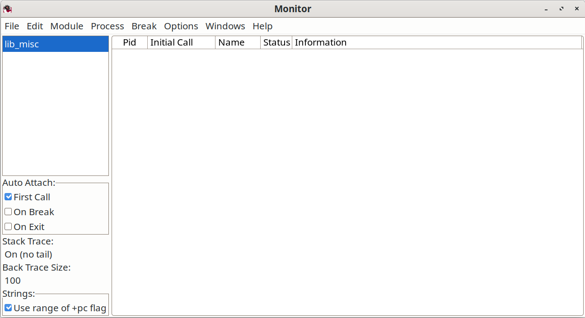

# 性能分析、调试与栈追踪

在这一章中，我们将介绍一些咱们可用来优化咱们程序、找出 bug 及避免错误的技术。

- *性能分析*

    我们会使用性能分析，进行性能调优，找出咱们程序中的热点所在。我（作者）认为要猜测出程序的瓶颈所在几乎是不可能的。最好的方法是先编写出咱们的程序，然后确认他们正确无误，并最后 *测量*，以找出时间的用在了哪里。当然，当程序足够快时，我们省去最后一步；

- *覆盖率分析*

    我们会运用覆盖率分析，计算咱们程序中每行代码被执行的次数。被执行次数为零的代码行，可能表示某个错误，咱们可将其删除的死代码。找出那些被执行很多次的行，可能会帮助咱们优化咱们的程序；

- *交叉引用*

    我们可使用交叉引用，找出我们是否有任何缺失代码，并找出谁调用了什么。当我们试图调用某个不存在的函数时，那么交叉引用分析就将发现这点。这主要对那些有着数十个模组的大型程序，非常有用；

- *编译器诊断*

    这个小节会介绍编译器诊断；

- *运行时错误消息*

    运行时系统会产生许多不同的错误消息。我们将解释一些最常见错误消息表示什么；

- *调试技术*

    调试被分作了两个小节。首先，我们将学习一些简单技术；其次，我们将学习 Erlang 的调试器；

- *追踪*

    使用进程追踪，我们可检查运行系统的行为。Erlang 有着我们可以用来远程观察任何进程行为的先进追踪设施。我们可以观察进程间的消息传递，以及找出某个进程中正在执行哪些函数，以及进程何时被调度等等；

- *测试框架*

    有数种用于 Erlang 程序自动测试的测试框架。我们将看到这些框架的一个快速概览，并了解获取他们的方式。


## Erlang 代码的性能分析工具

标准 Erlang 发行版附带了三个性能分析工具。

- `cprof` 会计算每个函数被调用的次数。这是个轻量级的性能分析器。在某个现场系统上运行该工具，会增加 5% 到 10% 的系统负载；

- `fprof` 会显示调用及被调用函数的时间。输出是到某个文件。这适合实验室或模拟系统中的大型系统性能。他会给系统增加显著负载；

- `eprof` 会测量 Erlang 程序中时间的使用情况。他是 `fprof` 的前身，适合小规模的性能分析。


下面是咱们运行 `cprof` 的方式；我们将用他对 [17.6 小节 *SHOUTcast 服务器*](Ch17-programming_with_sockets.md#shoutcast-服务器) 中，咱们编写的代码进行性能分析：


```erlang
1> cprof:start().           %% start the profiler
9655
2> shout:start().           %% run the application
<0.88.0>
3> cprof:pause().           %% pause the profiler
9940
4> cprof:analyse(shout).    %% analyse function calls
{shout,8,
       [{{shout,start_parallel_server,1},1},
        {{shout,start,0},1},
        {{shout,songs_loop,1},1},
        {{shout,songs,0},1},
        {{shout,par_connect,2},1},
        {{shout,'-start_parallel_server/1-fun-1-',2},1},
        {{shout,'-start_parallel_server/1-fun-0-',0},1},
        {{shout,'-start/0-fun-0-',0},1}]}
5> cprof:stop().            %% stop the profiler
9940
```


此外，`cprof:analyse()` 会分析已收集统计信息的所有模组。

`cprof` 的更多详细信息，[可在线上找到](https://www.erlang.org/doc/apps/tools/cprof.html)。

[`fprof`](https://www.erlang.org/doc/apps/tools/fprof.html) 和 [`eprof`](https://www.erlang.org/doc/apps/tools/eprof.html) 与 `cprof` 大致相似。详情请查阅线上文档。


## 测试代码覆盖率

当我们在测试咱们的代码时，除要看出哪些代码行执行较多外，看出哪些代码行从未执行通常也很不错。从未执行的代码行，是错误的潜在来源，因此找出这些代码行的位置，就相当棒。要完成这点，我们就要用到程序覆盖率分析器。


下面是个示例：


```erlang
1> cover:start().           %% start the coverage analyser
{ok,<0.87.0>}
2> cover:compile(shout).    %% compile shout.erl for coverage
{ok,shout}
3> shout:start().           %% run the program
<0.96.0>
Playing:<<"title: track018 performer: .. ">>
4> %% let the program run for a bit
4> cover:analyse_to_file(shout).    %% analyse the results
{ok,"shout.COVER.out"}              %% this is the results file
```

此操作的结果，被打印到一个文件。


```console
...
        |  send_file(S, Header, OffSet, Stop, Socket, SoFar) ->
        |      %% OffSet = first byte to play
        |      %% Stop   = The last byte we can play
     0..|      Need = ?CHUNKSIZE - byte_size(SoFar),
     0..|      Last = OffSet + Need,
     0..|      if
        |  	Last >= Stop ->
        |  	    %% not enough data so read as much as possible and return
     0..|  	    Max = Stop - OffSet,
     0..|  	    {ok, Bin} = file:pread(S, OffSet, Max),
     0..|  	    list_to_binary([SoFar, Bin]);
        |  	true ->
     0..|  	    {ok, Bin} = file:pread(S, OffSet, Need),
     0..|  	    write_data(Socket, SoFar, Bin, Header),
     0..|  	    send_file(S, bump(Header),
        |  		      OffSet + Need,  Stop, Socket, <<>>)
        |      end.
...
```

在该文件的左侧，我们会看到每条语句已被执行的次数。标有零的那些行尤其有趣。因为这些代码从未被执行过，所以我们不能说我们的程序是正确的。


> **所有测试方法中最好的是？**
>
> 对咱们代码进行覆盖率分析，回答了这个问题：哪些代码行从未被执行？在我们清楚了哪些代码行从未被执行后，我们就可以设计强制这些代码行执行的测试用例。
>
> 这样做是找出咱们程序中一些意想不到及隐蔽 bugs 的可靠方法。每个从未执行过的代码行，都可能包含着一个错误。强制这些代码行执行，是我（作者）所知测试程序的最佳方法。
>
> 我（作者）就曾对最初的 Erlang JAM <sup>a</sup> 编译器，完成过这种测试。我想我们在两年中，获得了三份 bug 报告。在此之后，就再也没有报告过 bug 了。
>
> <sup>a</sup>：Joe's Abstract Machine, 首个 Erlang 编译器。

设计一些造成全部覆盖率计数都大于零的测试用例，是一种系统地找出咱们程序中隐藏错误的宝贵方法。


## 生成交叉引用


在我们开发某个程序时，对咱们的代码运行偶尔的交叉引用检查是个好主意。当有遗漏的函数时，咱们就将在运行咱们的程序前，而不是之后发现他们。


使用 `xref` 模组，我们便可生成交叉引用。只有当咱们的代码在 `debug_info` 开关设置下编译时，`xref` 才工作。

我（作者）无法向咱们展示 `xref` 对本书附带代码的输出，因为这些代码的开发已经完成，且没有任何遗漏函数。


作为代替，我（作者）将向咱们展示，当我（作者）对我的一个业余项目中的代码，运行交叉引用检查时发生的情况。


`vsg` 是个我（作者）或许有一天会发布的简单图形程序。我们将对我（作者）正在其下开发这个程序的 `vsg` 目录下的代码进行分析。


```console
$ cd /home/joe/2007/vsg-1.6
$ rm *.beam
$ erlc +debug_info *.erl
$ erl
1> xref:d('.').
[{deprecated,[]},
{undefined,[{{new,win1,0},{wish_manager,on_destroy,2}},
{{vsg,alpha_tag,0},{wish_manager,new_index,0}},
{{vsg,call,1},{wish,cmd,1}},
{{vsg,cast,1},{wish,cast,1}},
{{vsg,mkWindow,7},{wish,start,0}},
{{vsg,new_tag,0},{wish_manager,new_index,0}},
{{vsg,new_win_name,0},{wish_manager,new_index,0}},
{{vsg,on_click,2},{wish_manager,bind_event,2}},
{{vsg,on_move,2},{wish_manager,bind_event,2}},
{{vsg,on_move,2},{wish_manager,bind_tag,2}},
{{vsg,on_move,2},{wish_manager,new_index,0}}]},
{unused,[{vsg,new_tag,0},
{vsg_indicator_box,theValue,1},
{vsg_indicator_box,theValue,1}]}]
```

其中 `xref:d('.')` 对当前目录下，所有以那个调试标记（`+debug_info`）编译的代码，执行了一次交叉引用分析。他生成了废弃、未定义及未使用函数的一些列表。

与大多数工具一样，`xref` 有着大量选项，因此，当咱们打算使用这个程序所拥有的一些更为强大特性时，阅读 [手册](https://www.erlang.org/doc/apps/tools/xref_chapter.html) 是必要的。


## 编译器诊断

在我们编译某个程序时，当我们的源代码语法不正确时，编译器会提供给我们有用的错误消息。大多数错误消息是不言自明的：当我们漏掉了个括号、逗号或关键字时，编译器将给出一条带有问题语句文件名及行号的错误消息。下面是我们可能看到的一些错误。


### 头部不匹配

当组成某个函数定义的子句，没有同样名字与元数时，我们将得到以下报错：


```erlang
foo(1,2) ->
    a;
foo(2,3,1) ->
    b.
```

```erlang
1> c(bad).
bad.erl:5:1: head mismatch: function foo with arities 2 and 3 is regarded as two distinct functions. Is the number of arguments incorrect or is the semicolon in foo/2 unwanted?
%    5| foo(2,3,1) ->
%     | ^

error
```


### 未绑定的变量


下面是一些包含着非绑定变量的代码：


```erlang
foo(A, B) ->
    bar(A, dothis(X), B),
    baz(Y, X).
```

```erlang
1> c(bad).
bad.erl:4:5: function bar/3 undefined
%    4|     bar(A, dothis(X), B),
%     |     ^

bad.erl:4:12: function dothis/1 undefined
%    4|     bar(A, dothis(X), B),
%     |            ^

bad.erl:4:19: variable 'X' is unbound
%    4|     bar(A, dothis(X), B),
%     |                   ^

bad.erl:5:5: function baz/2 undefined
%    5|     baz(Y, X).
%     |     ^

bad.erl:5:9: variable 'Y' is unbound
%    5|     baz(Y, X).
%     |         ^

bad.erl:3:1: Warning: function foo/2 is unused
%    3| foo(A, B) ->
%     | ^

error
```

这意味着在第 2 行中，变量 `X` 没有值。实际上，错误并不在第 2 行上，但是在第 2 行处检测到的，该行正是那个未绑定变量 `X` 的第一次出现（在第 3 行上 `X` 也被使用了，但编译器只报告了错误出现的第一行）。


### 未终止字符串


当我们忘记了某个字符串或原子中的最后引号时，我们将得到以下错误消息：


```erlang
unterminated string starting with "..."
```


有时，找到缺失引号可能非常棘手。当咱们收到这条消息，又确实无法看到缺失引号在何处时，那么较要尝试把一个引号，放在咱们认为问题可能所在的地方，然后重新编译该程序。这样做可能产生出一个，将帮助咱们找出该错误的更精确诊断。


## 不安全的变量

当我们编译下面的代码时：


```erlang
foo() ->
    case bar() of
        1 ->
            X = 1,
            Y = 2;
        2 ->
            X = 3
    end,
    b(X).
```

我们将得到以下告警：

```erlang
1> c(bad).
...
bad.erl:8:13: Warning: variable 'Y' is unused
%    8|             Y = 2;
%     |             ^
...
```

这只是个告警，因为 `Y` 定义过但未使用。当我们现在把这个程序，改成下面这样：

```erlang
foo() ->
    case bar() of
        1 ->
            X = 1,
            Y = 2;
        2 ->
            X = 3
    end,
    b(X, Y).
```

我们将得到如下报错：

```erlang
2> c(bad).
...
bad.erl:14:10: variable 'Y' unsafe in 'case' (line 7, column 5)
%   14|     b(X, Y).
%     |          ^
...
```

编译器会认为这个程序，可能采取其中 `case` 表达式的第二个分支（在这种情况下，变量 `Y` 将是未定义的），因此他产生了一条 “unsafe variable” 的错误消息。


### 遮蔽变量

遮蔽变量是一些会把先前定义的变量值隐藏起来的变量，这样咱们就不能使用那些先前定义变量的值。下面是个例子：


```erlang
foo(X, L) ->
    lists:map(fun(X) -> 2*X end, L).
```


```erlang
...
bad.erl:3:5: Warning: variable 'X' is unused
%    3| foo(X, L) ->
%     |     ^

bad.erl:4:19: Warning: variable 'X' shadowed in 'fun'
%    4|     lists:map(fun(X) -> 2*X end, L).
%     |                   ^

...
```

这里，编译器担心我们可能在咱们的程序中犯了个错。在那个 fun 内我们计算 `2*X`，但我们说的是哪个 `X` 呢：是这个 fun 的参数 `X`，还是 `foo` 的参数 `X`？


当这种情况发生时，最好的办法是重命名其中一个 `X`，使告警消失。我们可将这段代码重写如下：

```erlang
foo(X, L) ->
    lists:map(fun(Z) -> 2*Z end, L).
```

现在当我们打算在那个 fun 定义中使用 `X` 时，就没有问题了。


## 运行时诊断

当某个 Erlang 进程崩溃时，我们可能会收到一条错误消息。要看到该错误消息，某个别的进程必须要监视这个崩溃进程，并在被监视进程死掉时，打印一条错误消息。当我们只是以 `spawn` 创建某个进程，然后该进程死亡时，我们就不会收到任何错误消息。当我们打算要看到所有错误信息时，最好的办法就是使用 `spawn_link`。


### 栈追踪


每次某个链接到 shell 的进程崩溃时，一个栈跟踪都将被打印。为查看栈跟踪中有什么内容，我们将编写个带有故意出错的简单函数，并在 shell 中调用该函数。


```erlang
{{#include ../../projects/ch21-code/lib_misc.erl:185:191}}
```

```erlang
1> lib_misc:deliberate_error("file.erl").
** exception error: no match of right hand side value {error,badarg}
     in function  lib_misc:bad_function/2 (lib_misc.erl:190)
     in call from lib_misc:deliberate_error/1 (lib_misc.erl:186)
```

当我们调用 `lib_misc:deliberate_error("file.erl")` 时，一个报错出现了，同时系统打印了一条后跟一个堆栈跟踪的报错消息。该错误消息如下：

```erlang
** exception error: no match of right hand side value {error,badarg}
```

这来自下面这行：

```erlang
{{#include ../../projects/ch21-code/lib_misc.erl:190}}
```

调用 `file:open/2` 返回了 `{error, badarg}`。这是因为 `{abc,123}` 不是 `file:open` 的一个有效输入值。当我们尝试将返回值与 `{ok, Bin}` 匹配时，我们就会得到一个 `badmatch` 的错误，而运行时系统就会打印 `** exception error... {error, badarg}`。

错误信息之后是个栈跟踪。栈跟踪会以该错误发生处的函数名字开始。随后是个函数名字清单，以及当前函数完成时，将返回到函数的模组名字和行号。因此，错误发生在 `lib_misc:bad_function/2`，其将返回到 `lib_misc:deliberate_error/1`，以此类推。


请注意，只有栈跟踪中的那些顶部条目，才是真正感兴趣的。当对错误函数的调用序列，涉及某个尾调用时，那么该调用将不在栈跟踪中。例如，当我们将函数 `deliberate_error1` 定义为下面这样时：


```erlang
{{#include ../../projects/ch21-code/lib_misc.erl:194:195}}
```

那么当我们调用这个函数，并得到一个错误时，函数 `deliberate_error1` 就将不出现在栈追踪里。


```erlang
2> lib_misc:deliberate_error1("bad.erl").
** exception error: no match of right hand side value {error,badarg}
     in function  lib_misc:bad_function/2 (lib_misc.erl:191)
```

到 `deliberate_error1` 的调用不在跟踪中，是因为 `bad_function` 是作为 `deliberate_error1` 中的最后一条语句被调用的，当他完成时将不返回到 `deliberate_error1`，而会返回 `deliberate_error1` 的调用者。


（这是一种 *最后调用* 优化的结果；当某个函数中最后被执行的是个函数调用时，那么该调用实际上会被一次跳转取代。在没有这项优化下，我们用来编码消息接收循环的 *无限循环* 编程方式，就会不工作。然而，由于这项优化，在调用栈上的那个调用函数，实际上就被那个被调用函数取代了，而因此在栈跟踪中成为不可见。）


## 调试技巧

调试 Erlang 非常容易。这可能会惊讶到咱们，但这正是采用单赋值变量的结果。由于 Erlang 没有指针，没有可变状态（ETS 数据表和进程字典除外），找出出错的地方就很少成为问题。一旦我们发现某个变量有着不正确的值，找出问题发生的时间和地点就会相对容易。


我（作者）发现调试器，是我编写 C 程序时非常有用的工具，因为我可以让他监视变量，并在变量的值发生变化时告诉我。这点通常很重要，因为 C 中的内存，可通过指针间接改变。要明白某块内存的修改来自 *何处* 可能很难。在 Erlang 中，我（作者）不觉得同样需要个调试器，因为我们不能经由指针，修改状态。

Erlang 程序员会使用各种调试程序的技巧。到目前为止，最常见技术就是仅仅添加一些打印语句到不正确的程序。当咱们感兴趣的数据结构变得非常庞大时，这种技巧就会失效，在这种情况下，他们可被转储到某个文件，用于随后的检查。


有些人会使用错误日志，保存错误消息，别的人则会将错误日志写入文件。这样做行不通时，我们可使用 Erlang 的调试器，或追踪程序的执行。我们来分别看看这两种技巧。


### `io:format` 的调试

添加一些打印语句到程序，是最最常见的调试形式。咱们只要在咱们程序中的一些关键位置处，添加一些打印咱们感兴趣变量值的 `io:format(...)` 语句。


在调试一些并行程序时，在向另一进程发送信息 *前*，及咱们收到消息 *后*，立即打印消息，通常是个好主意。


当我（作者）在编写某个并发程序时，我几乎总是这样开始编写接收循环：

```erlang
loop(...) ->
    receive
        Any ->
            io:format("*** warning unexpected message: ~p~n", [Any]),
            loop(...)
    end.
```

然后，在我将一些模式添加到这个接收循环时，当我的进程收到任何他不理解的消息时，我就会收到打印的告警消息。我（作者）还会使用 `spawn_link` 代替 `spawn`，确保当我的进程异常退出时，错误消息会被打印。


我（作者）经常会用到一个宏 `NYI`（not yet implemented，尚未实现的），我将其定义为如下：


```erlang
{{#include ../../projects/ch21-code/lib_misc.erl:198:201}}
```

那么我可能如下使用这个宏：

```erlang
{{#include ../../projects/ch21-code/lib_misc.erl:203:204}}
```

函数 `glurk` 的主体尚未编写，因此当我调用 `glurk` 时，程序会崩溃。

```erlang
> lib_misc:glurk(1, 2).
*** NYI lib_misc 204 {glurk,1,2}
** exception exit: nyi
     in function  lib_misc:glurk/2 (lib_misc.erl:204)
```

程序会退出同时一条错误消息显示出来，因此我（作者）知道其是实现我的函数之时。

### 转储到文件

当我们感兴趣的数据结构很大，那么我们可使用 `dump/2` 等函数，将其写入某个文件。


```erlang
{{#include ../../projects/ch21-code/lib_misc.erl:147:152}}
```

这个函数会打印一条告警消息，提醒我们已创建一个新文件。然后，他会添加一个 `.tmp` 文件扩展到文件名（这样我们就可在以后轻松删除所有临时文件）。然后，他会将我们感兴趣的项，漂亮地打印到一个文件。在稍后阶段我们可用某种文本编辑器，检查这个文件。在检查大型数据结构时，这种技巧简单而尤其有用。


### 使用错误记录器


我们可使用错误日志记录器，并创建一个带有调试输出的文本文件。为此，我们要创建个如下的配置文件：


```erlang
{{#include ../../projects/ch21-code/elog5.config}}
```

然后我们已下面的命令启动 Erlang：


```console
erl -config elog5.config
```

经由调用 `error_logger` 模组中例程创建的任何错误消息，以及在 shell 下打印的任何错误消息，都将最终存入配置文件中所指定的那个文件。


## Erlang 的调试器

标准 Erlang 发行版包含了个调试器。除了告诉咱们如何启动这个调试器，并提供文档指向外，我（作者）不会在这里多说什么。在启动后，使用这个调试器非常简单。咱们可检查变量、单步运行代码、设置断点等等。

由于我们将经常打算调试多个进程，该调试器还可生成自身的副本，从而我们可以有多个调试窗口，每个咱们正在调试的进程都有个调试窗口。


唯一棘手的事情，是启动这个调试器。


```erlang
1> %% recompile lib_misc so we can debug it
   c(lib_misc, [debug_info]).
{ok,lib_misc}
2> im().    %% A window will pop up. Ignore it for now
<0.97.0>
3> ii(lib_misc).
{module,lib_misc}
4> iaa([init]).
true
5> lib_misc:
...
```

运行这写命令，会打开 [图 1，*调试器初始窗口*](#figure-1) 中显示的视窗。


在调试器中，咱们可设置断点、检查变量等。


所有不带模组前缀的命令（`ii/1`、`iaa/1` 等），都是模组 `i` 中导出的。这便是调试器/解释器的接口模组。这些可在 shell 下，无需给出模组前缀即可访问。


我们调用以让调试器运行的函数，完成以下事情：


- `im()`

    会启动一个新的图形监视器。这是调试器的主窗口。他显示了调试器正监控的所有进程状态；



- `ii(Mod)`

    解析模组 `Mod` 中的代码；

- `iaa([init])`

    在任何执行所解析出代码的进程启动时，将调试器附着到该进程。


要了解有关调试的更多信息，请尝试这些资源：

- [Debugger](https://www.erlang.org/docs/24/apps/debugger/debugger.pdf)

    调试器参考手册是对调试器的介绍，带有屏幕截图、API 文档等。他是调试器正式用户的必读资料；

- [Debugger/Interpreter Interface](https://www.erlang.org/doc/apps/debugger/i.html)

    这里咱们可找到 shell 下可用的一些调试器命令。


## 追踪消息与进程执行

咱们可以一种特殊方式，在无需编译代码下追踪某个进程。追踪某个进程（或多个进程），提供了一种了解咱们系统行为方式的强大方法，而可用于在无需修改代码下，测试复杂系统。在嵌入式系统中，或咱们无法修改被测代码的场合，这尤其有用。

在底层，我们可通过调用一些 Erlang 的 BIFs，设置一个跟踪。使用这些 BIFs 设置一些复杂跟踪会比较困难，因此多个库就被设计出来使这项任务更为容易。


我们将以用于追踪的那些底层 Erlang BIFs，并看看如何设置一个简单的跟踪器；然后我们将看看可提供到这些跟踪 BIFs 的高层接口的一些库。


对于底层的追踪，有两个 BIFs 特别重要。`erlang:trace/3` 基本上是说：“我打算监控这个进程，所以当有趣的事情发生时，请给发送给我一条消息。” 而 `erlang:trace_pattern` 则定义了什么是 “有趣的” 事情。


- `erlang:trace(PidSpec, How, FlagList)`

    这会启动一次跟踪。其中 `PidSpec` 告诉系统要跟踪什么。`How` 是个可打开或关闭跟踪的布尔值。`FlagList` 规定了要跟踪的内容（例如，我们可跟踪全部函数调用、所有发送的消息、垃圾回收与何时发生等等）。

    一旦我们已调用 `erlang:trace/3`，那么在跟踪的事件发生时，调用这个 BIF 的进程即会被发送跟踪消息。跟踪事件本身，是由调用 `erlang:trace_pattern/3` 决定的；


- `erlang:trace_pattern(MFA, MatchSpec, FlagList)`

    这个 BIF 用于设置 *跟踪模式*。当该模式匹配时，所请求的操作就会被执行。这里的 `MFA` 是个 `{Module, Function, Args}` 元组，表示跟踪模式所适用的代码。`MatchSpec` 是个每次输入 `MFA` 所指定函数时，都会测试的模式，而 `FlagList` 则说明了在跟踪条件满足时，要执行的操作。


编写 `MatchSpec` 的匹配规范较为复杂，且并不能真正加深我们对跟踪的理解。幸运的是，[一些库](https://www.erlang.org/doc/apps/stdlib/ms_transform.html) 让这一步变得更为容易了。


使用前面的两个 BIFs，我们可编写一个简单的跟踪器。`trace_module(Mod, Fun)` 会在模组 `Mod` 上建立跟踪，然后执行 `Fun()`。我们打算跟踪 `Mod` 模组中的所有函数调用与返回值。


```erlang
{{#include ../../projects/ch21-code/tracer_test.erl:5:49}}
```

现在我们如下定义一个测试用例：


```erlang
{{#include ../../projects/ch21-code/tracer_test.erl:52:57}}
```


然后我们就可以追踪咱们的代码。


```erlang
1> c(tracer_test).
{ok,tracer_test}
2> tracer_test:test2().
<0.92.0>
Call: {tracer_test,'-trace_module1/2-fun-0-',
                   [#Fun<tracer_test.2.47654391>,<0.92.0>]}
Call: {tracer_test,do_trace,[<0.92.0>,#Fun<tracer_test.2.47654391>]}
Call: {tracer_test,'-test2/0-fun-0-',[]}
Call: {tracer_test,fib,[4]}
Call: {tracer_test,fib,[3]}
Call: {tracer_test,fib,[2]}
Call: {tracer_test,fib,[1]}
Return From: {tracer_test,fib,1} => 1
Call: {tracer_test,fib,[0]}
Return From: {tracer_test,fib,1} => 1
Return From: {tracer_test,fib,1} => 2
Call: {tracer_test,fib,[1]}
Return From: {tracer_test,fib,1} => 1
Return From: {tracer_test,fib,1} => 3
Call: {tracer_test,fib,[2]}
Call: {tracer_test,fib,[1]}
Return From: {tracer_test,fib,1} => 1
Call: {tracer_test,fib,[0]}
Return From: {tracer_test,fib,1} => 1
Return From: {tracer_test,fib,1} => 2
Return From: {tracer_test,fib,1} => 5
Return From: {tracer_test,'-test2/0-fun-0-',0} => 5
Return From: {tracer_test,do_trace,2} => 5
Return From: {tracer_test,'-trace_module1/2-fun-0-',2} => 5
Other = {trace,<0.94.0>,exit,normal}
```

跟踪器的输出可以非常精细，并对了解程序的动态行为非常有价值。阅读代码会给到我们系统的一种静态图景。而观察信息流，则会给到我们系统动态行为的一种视图。


### 使用追踪库


我们可使用库模组 `dbg` 执行与上面相同的跟踪。这样做就隐藏了两个底层 Erlang BIFs 的全部细节。


```erlang
{{#include ../../projects/ch21-code/tracer_test.erl:59:64}}
```

运行这个测试用例，我们会得到以下输出：


```erlang
1> tracer_test:test1().
(<0.85.0>) call tracer_test:fib(4)
(<0.85.0>) call tracer_test:fib(3)
(<0.85.0>) call tracer_test:fib(2)
(<0.85.0>) call tracer_test:fib(1)
(<0.85.0>) returned from tracer_test:fib/1 -> 1
(<0.85.0>) call tracer_test:fib(0)
(<0.85.0>) returned from tracer_test:fib/1 -> 1
(<0.85.0>) returned from tracer_test:fib/1 -> 2
(<0.85.0>) call tracer_test:fib(1)
(<0.85.0>) returned from tracer_test:fib/1 -> 1
(<0.85.0>) returned from tracer_test:fib/1 -> 3
(<0.85.0>) call tracer_test:fib(2)
(<0.85.0>) call tracer_test:fib(1)
(<0.85.0>) returned from tracer_test:fib/1 -> 1
(<0.85.0>) call tracer_test:fib(0)
(<0.85.0>) returned from tracer_test:fib/1 -> 1
(<0.85.0>) returned from tracer_test:fib/1 -> 2
(<0.85.0>) returned from tracer_test:fib/1 -> 5
5
```


这达到了与上一小节的同样目的，但是以库代码而不是使用那两个跟踪的 BIFs。要实现精细控制，咱们可能会想要使用两个跟踪 BIFs，编写咱们自己定制跟踪代码。而对于一些快速实验，库代码就足够了。

要了解有关跟踪的更多信息，咱们需要阅读以下模组的三个手册页面：

- [`dbg`](https://www.erlang.org/docs/22/man/dbg) 提供了到两个 Erlang 跟踪 BIFs 的简化接口；
- [`ttb`](https://www.erlang.org/docs/19/man/ttb) 是另一个到跟踪 BIFs 的接口。他比 `dbg` 更为高级；
- [`ms_transform`](https://www.erlang.org/doc/apps/stdlib/ms_transform.html) 构造了跟踪软件中使用的匹配规范。


### 测试 Erlang 代码的一些框架

对于一些复杂项目，咱们将想要建立某种测试框架，并将其集成到咱们的构建系统。以下是两种咱们或许想要调研的框架：

- *通用测试框架*

    通用测试框架，the Common Test Framework, CTF，是 Erlang/OTP 发行版的一部分。他提供了一套自动化测试的完整工具。通用测试框架被用于测试 Erlang 发行版本身，以及许多爱立信的产品；

- *基于属性的测试*

    基于属性的测试，property-based testing，是种找出咱们代码中难以发现错误的相对较新，非常好的技术。与其编写测试用例，我们只要以谓词逻辑的形式，描述系统的一些属性即可。测试工具会随机生成一些与系统属性一致的测试用例，并检查这些属性是否被违反。

    目前有两种测试 Erlang 程序的基于属性测试工具：由 [一家名为 Quviq 的瑞典公司](https://www.quviq.com/) 提供的商业程序 QuickCheck，和受 QuickCheck 启发而开发的 [`proper`](https://github.com/proper-testing/proper)。


祝贺，现在咱们了解了顺序和并发程序编程、文件与套接字、数据存储及数据库，以及咱们程序的调试和测试。


在下一章中，我们会改变思路。我们将讨论开放电信平台，Open Telecom Platform, OTP。这是个反映了 Erlang 历史的奇怪名字。OTP 是个应用框架，或者说是一套编程模式，简化了容错的分布式系统代码的编写。他已在大量应用中被实战测试过，因此他给咱们自己的项目，提供了一个良好起点。


## 练习

1. 创建个新的目录，并将标准库模组 `dict.erl` 复制到该目录下。将一个错误添加到 `dict.erl`，从而当某个特定代码行被执行时其将崩溃。请编译这个模组；


2. 现在我们有个损坏的 `dict` 模组，但我们可能还不 *知道* 他是损坏的，所以我们需要引发一个错误。请编写个以各种方式调用 `dict` 的简单测试模组，看看咱们能否让 `dict` 崩溃；

3. 请使用覆盖率分析器，检查 `dict` 中每行代码的执行次数。将更多测试用例，添加到咱们的测试模组，检查咱们是否覆盖了 `dict` 中的所有代码行。目标是确保 `dict` 中的每行代码都会被执行。一旦咱们知道哪行代码未被执行，要逆向找出测试用例中，哪写代码行会导致某个特定代码行被执行，通常就是个轻松任务了；

    请继续这样做，直到崩溃掉程序为止。这种情况迟早会发生，因为当每个行代码行都被覆盖到时，咱们就将触发了错误；


4. 现在我们有了个错误。要假装咱们不知道该错误位于何处。请使用本章中的技巧，找出这个错误。

    当咱们不知道错误位于何处时，这个练习效果会更好。让咱们的一位朋友破坏咱们的几个模组。在这些模组上运行尝试引发错误的覆盖率测试。一旦咱们引发错误，请使用调试技术，找出错误所在。
Use the coverage analyzer to check how many times each line in dict has been executed. Add more test cases to your test module, checking to see that you are covering all the lines of code in dict. The goal is to make sure that every line of code in dict is executed. Once you know which lines are not being executed, it’s often an easy task to work backward and figure out which lines of code in the test cases would cause a particular line of code to be executed.
