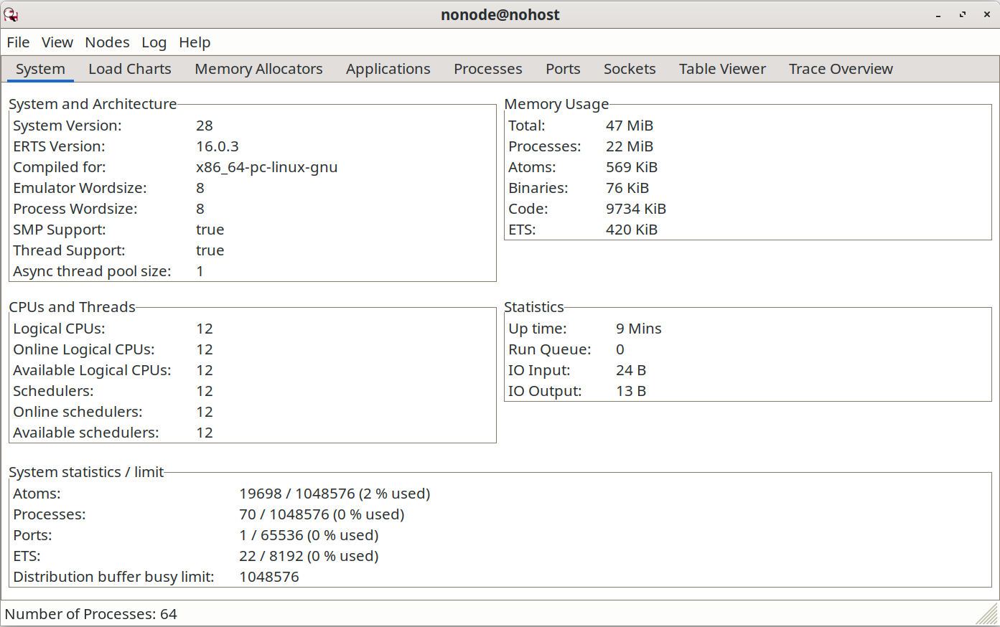

# 使用 OTP 构造系统

在这一章中，我们将要构造一个可作为一家基于 web 的公司后端的系统。咱们的公司有两个产品销售：质数和面积。客户可以在我们这儿购买一个质数，我们也将提供计算某个几何对象面积的服务。我（作者）认为我们的公司潜力巨大。

我们将建立两个服务器：一个生成质数，另一个计算面积。要完成这点，我们将使用我们曾在 [22.2 小节 *`gen_server` 入门*](Ch22-introducing_otp.md#gen_server-入门) 中讨论的 `gen_server` 框架。

在我们构建这个系统时，我们必须要考虑错误。即使我们已全面测试了我们的软件，我们可能也未曾捕捉到所有 bugs。我们将假设咱们的一个服务器有着会崩溃掉服务器的致命错误。事实上，我们将引入一个将导致服务器崩溃的 *故意错误* 到咱们的一个服务器中。

当该服务器崩溃时，我们将需要某种检测其已崩溃并重启他的机制。为此，我们将运用 *监控树* 的概念。我们将创建一个监控我们服务器，并在服务器崩溃时重启他们的监控器进程。


当然，当某个服务器崩溃时，我们将希望知道其崩溃的原因，从而我们可在稍后解决该问题。为记录所有错误，我们将使用 OTP 的错误记录器。我们将展示怎样配置这个错误日志记录器，以及如何从错误日志生成错误报告。

当我们计算质数，特别是大质数时，咱们的 CPU 可能会过热。为了防止这种情况，我们将需要打开大功率风扇。要这样做，我们将需要考虑 *警报*。我们将使用 OTP 的事件处理框架，生成及处理警报。


所有这些话题（创建服务器、监控服务器、错误记录及检测警报），都是任何生产系统中，都必须解决的几个典型问题。因此，尽管我们的公司可能有相当不确定的未来，但我们可以在许多系统中，重用这里的架构。事实上，这种架构在数家商业成功的公司里 *确实* 使用着。


最后，当一切都工作了时，我们将把我们所有的代码，打包成一个 OTP *应用*。这是一种将与某个特定问题相关的所有内容，进行分组的专门方式，以便其可由 OTP 系统自身启动、停止与管理。

由于不同领域间存在许多循环依赖，因此这些材料的呈现顺序会略显棘手。错误日志只是事件管理的一个特例。警报则只是一些事件，同时错误日志记录器又是个受监控的进程，而进程监控器又可以调用错误日志记录器。

我（作者）将在此尝试强行采取某种顺序，并以某种有意义顺序，呈现这些主题。我们将完成以下事情：

1. 我们来看看通用事件处理器中，用到的一些概念；
2. 我们将看到错误日志记录器的工作原理；
3. 我们将增加警报管理功能；
4. 我们将编写两个应用服务器；
5. 我们将构造一棵监管树，并将服务器添加到其上；
6. 我们将把所有内容打包成一个应用。


## 通用事件处理

所谓 *事件*，是指发生的事情 -- 程序员认为，有人应该对此做点什么的某种值得注意的事情。

当我们编程时，而某件值得注意的事情发生了，我们就要将一条 `event` 消息，发送到某个注册进程，就像这样：

```erlang
RegProcName ! {event, E}
```

其中 `E` 便是那个事件（任何的 Erlang 项）。`RegProcName` 是某个注册进程的名字。

我们不清楚（也不关心）我们发送了这条消息后会发生什么。我们已经完成了我们的工作，告诉了别人某事已发生。


现在我们来把注意力，转向接收事件消息的进程。这便是所谓的 *事件处理器*。最简单的事件处理器，是个 “什么都不做” 的处理器。当他收到 `{event, X}` 消息时，他对该事件什么都不做；他只将其丢弃。


下面是我们在某个通用事件处理器上的首次尝试：


```erlang
{{#include ../../projects/ch23-code/event_handler.erl}}
```

这个事件处理器 API 如下：

- `event_handler:make(Name)`

    构造一个名为 `Name`（一个原子）的 “什么都不做” 的事件处理器。这会提供一个往其发送事件之处；


- `event_handler:event(Name, X)`

    将事件 `X` 发送到名为 `Name` 的事件处理器；


- `event_handler:add_handler(Name, Fun)`

    将一个处理器 `Fun` 添加到叫做 `Name` 的事件处理器。现在，当某个事件 `X` 发生时，这个事件处理器将执行 `Fun(X)`。


现在，我们将创建一个事件处理器，并产生一个错误。

```erlang
1> event_handler:make(errors).
true
2> event_handler:event(errors, hi).
{event,hi}
```

没有特别的事情发生，因为我们尚未将某个回调模组，安装在这个事件处理器中。

要让事件处理器执行某个操作，我们必须编写一个回调模组，并将其安装在事件处理器中。下面是一个事件处理器回调模组的代码：


```erlang
{{#include ../../projects/ch23-code/motor_controller.erl}}
```

一旦这个程序已被编译，其就可被安装。

```erlang
3> c(motor_controller).
{ok,motor_controller}
4> motor_controller:add_event_handler().
{add,#Fun<motor_controller.0.3498618>}
```

现在当我们将事件发送到处理器时，他们由 `motor_controller:controller/1` 这个函数处理。


```erlang
5> event_handler:event(errors, cool).
motor_controller ignored event: cool
{event,cool}
6> event_handler:event(errors, too_hot).
Turn off the motor
{event,too_hot}
```

这个练习有双重意义。首先，我们提供了要将事件发往的（事件处理器）名字；这便是那个名为 `errors` 的注册进程。然后，我们定义了将事件发送到这个注册进程的协议。但我们并未指定在消息到达时，会发生什么。事实上，所发生的只是我们执行 `no_Op(X)`。随后在稍后阶段，我们安装了个自定义事件处理器。此操作在本质上解耦了事件生成与事件处理，进而我们可在稍后阶段，在不影响事件生成下，决定咱们打算要如何处理事件。

需要注意的关键，是事件处理器提供了一种，我们可在其中安装自定义处理器的基础设施。

错误日志记录器这一基础设施，就遵循事件处理器这种模式。我们可将不同处理器，安装在错误记录器中，让其完成不同的事情。警报处理的基础设施，同样遵循了这种模式。


## 错误日志记录器

> **译注**：自 Erlang/OTP 21.0 引入新的 [日志 API](https://www.erlang.org/doc/apps/kernel/logger_chapter) 后，本节描述的 SASL 错误日志概念已被弃用。
>
> 旧的 SASL 错误日志记录行为，可通过将内核的配置参数 `logger_sasl_compatible` 设为 `true`，而重新启用。
>
> 参考：[SASL Error Logging](https://www.erlang.org/doc/apps/sasl/error_logging.html)


OTP 系统带有一个可定制的错误日志记录器。我们可从三个角度，讨论这个错误日志记录器。

- 从 *程序员视角*，会关注那些他们为记录错误，而在代码中调用的一些函数；
- 从 *配置角度*， 关注的是错误日志记录器存储其数据的位置及方式；
- 从 *报告角度*，关注的是错误发生后的分析。

我们将依次讨论这些方面。

> **“改变主意”下的极其延后绑定**
>
> **Very Late Binding with "Change Your Mind"**
>
> 设想我们编写对程序员隐藏了 `event_handler:event` 例程的函数。比方说我们写了下面这个：
>
> ```erlang
> too_hot() ->
>     event_handler:event(errors, too_hot).
> ```
>
> 然后我们告诉程序员，当出现问题时，就在代码中调用 `lib_misc:too_hot()`。在大多数编程语言中，对函数 `too_hot` 的调用，将是静态地，或被动态链接到调用这个函数代码。而一旦其被链接，那么他将依据代码，执行某项固定作业。当我们稍后改变了主意，决定了我们打算完成其他事情时，我们就没有改变系统行为的简单办法了。
>
> Erlang 的事件处理方式完全不同。他允许我们将事件产生与事件处理解耦。仅仅通过发送一个新的处理器函数到事件处理器，我们就可以随时更改事件处理。其中没有静态链接的代码，同时事件处理器可在需要时更改。
>
> 运用这种机制，我们可以构建 *与时俱进*，无需停止即可升级代码的系统。
>
> *注意*：这不是 “延迟绑定” -- 而是 “极其延迟绑定，进而咱们可在稍后改变主意”。
>
> **译注**：关于延迟绑定，又叫后期绑定或动态绑定，是一种函数或方法调用在运行时，而不是编译时被解析出的编程机制。
>
> 参考：[Wikipedia: Late binding](https://en.wikipedia.org/wiki/Late_binding)


### 记录错误


就程序员而言，错误日志记录器的 API 非常简单。下面是该 API 的一个简单子集：

- `-spec error_logger:error_msg(String) -> ok`

    发送一条错误消息到错误日志记录器。

    ```erlang
    > error_logger:error_msg("An error has occured\n").
    =ERROR REPORT==== 23-Oct-2025::14:29:12.400578 ===
    An error has occured

    ok
    ```

- `-spec error_logger:error_msg(Format, Data) -> ok`

    发送一条错误消息到错误日志记录器。其中参数与 `io:format(Format, Data)` 相同。

    ```erlang
    2> error_logger:error_msg("~s, an error has occured\n", ["Joe"]).
    =ERROR REPORT==== 23-Oct-2025::14:31:25.390561 ===
    Joe, an error has occured

    ok
    ```

- `-spec error_logger:error_report(Report) -> ok`

    发送一条标准错误报告，到错误日志记录器。

    - `-type Report = [{Tag, Data} | term() | string() ].`
    - `-type Tag = term().`
    - `-type Data = term().`

    ```erlang
    4> error_logger:error_report([{tag1, data1},a_term,{tag2,data}]).
    =ERROR REPORT==== 23-Oct-2025::14:35:38.744734 ===
        tag1: data1
        a_term
        tag2: data
    ok
    ```


这只是可用 API 的一个子集。详细讨论这一 API 并不特别有趣。反正在咱们的程序中，我只将使用 `error_msg`。全部细节位于 [`error_logger` 的手册页面](https://www.erlang.org/docs/19/man/error_logger)。


### 配置错误日志记录器

我们可以多种方式，配置错误日志记录器。我们可以在 Erlang shell 下，查看所有报错（这是在我们未做任何特殊设置时的默认设置）。我们可以所有报告于 shell 下的错误，写入单一的格式化文本文件。最后，我们可创建一个 *滚动日志*。咱们可把滚动日志，当作一个包含着由错误日志记录器所产生消息的大型循环缓冲区。当新信息到来时，他们会被追加到日志末尾，当日志充满时，日志中最早的那些条目会被删除。


滚动日志非常有用。咱们要确定日志应占用多少个文件，以及每个单独日志文件的大小，而系统就会在一个大型循环缓冲区下，负责删除旧日志文件并创建出新文件。咱们可将日志设置为保存最近几天操作记录的大小，对于大多数目的这通常就足够了。


**标准错误日志记录器**

当我们启动 Erlang 时，我们可以给系统一个 *启动参数*。

- `$ erl -boot start_clean`

    这会创建一个适合程序开发的环境。只提供简单的错误日志记录。(不带引导参数的 `erl` 命令，即等同于 `erl -boot start_clean`）；

- `$ erl -boot start_sasl`

    这会创建一个适合运行生产系统的环境。系统架构支持库，System Architecture Support Libraries, SASL，会负责错误日志记录、过载保护等等。

日志文件的配置，最好在配置文件中完成，因为无人能记住日志记录器的所有参数。在一下小节中，我们将介绍默认系统的工作方式，然后介绍四种会改变错误日志记录器工作方式的特定配置。

**无配置下的 SASL**

下面是在无配置文件下，我们启动 SASL 时发生的情况：


```erlang
$ erl -boot start_sasl
Erlang/OTP 28 [erts-16.0.3] [source] [64-bit] [smp:12:12] [ds:12:12:10] [async-threads:1] [jit:ns]

Eshell V16.0.3 (press Ctrl+G to abort, type help(). for help)
1>
```

> **译注**：译者在 Erlang/OTP 28 下以 `start_sasl` 参数启动 Erlang shell 时，已没有显示原著中的 `=PROGRESS REPORT===...` 输出。

现在，我们将调用 `error_logger` 中的一个例程，报告一个错误。


```erlang
1> error_logger:error_msg("This is an error\n").
=ERROR REPORT==== 24-Oct-2025::14:04:58.495506 ===
This is an error

ok
```

请注意这个错误被报告在 Erlang shell 下。错误于何处报告，取决于错误日志记录器的配置。


**控制哪些会被记录**

错误日志记录器，会生成数种类型的报告。

- *监控器报告*

    Supervisor reports. 每当某个 OTP 监控程序启动或停止某个受监控进程时，就会发出这类报告（我们将在 [23.5 小节 *监控树*](#监控树) 中讨论监控器）；

- *进程报告*

    每当某个 OTP 监控器启动或停止时，就会发出这类报告；

- *崩溃报告*

    当某个由一项 OTP 行为启动的进程，以除 `normal` 或 `shutdown` 外别的退出原因终止时，就会发出这类报告。


这三个报告都是自动生成的，无需程序员务必执行任何操作。


此外，我们可显式调用 `error_logger` 模组中的例程，生成三种类型的日志报告。这些日志报告让我们记录错误、告警及信息性消息。这三个术语并无语义上的意义；他们只是被程序员用于表示错误日志中，条目性质的一些标签。


稍后，析错误日志被分析时，我们可使用这些标签，帮助我们决定要调查哪个日志条目。在我们配置错误日志记录器时，我们可选择只保存错误，而丢弃所有其他类型的条目。现在，我们将编写配置文件 `elog1.config`，来配置错误日志记录器。


```erlang
{{#include ../../projects/ch23-code/elog1.config}}
```

当我们以这个配置文件启动系统，我们就将只收到错误报告，而不会收到进程报告等。所有这些错误报告，都只会在 shell 下。


```erlang
$ erl -boot start_sasl -config elog1
Erlang/OTP 28 [erts-16.0.3] [source] [64-bit] [smp:12:12] [ds:12:12:10] [async-threads:1] [jit:ns]

Eshell V16.0.3 (press Ctrl+G to abort, type help(). for help)
1> error_logger:error_msg("This is an error\n").
=ERROR REPORT==== 24-Oct-2025::15:40:01.439357 ===
This is an error

ok
```

**文本文件与 Shell**


下一个配置文件，会在 shell 下列出错误报告，而所有进程报告都会保存在一个文件中。

```erlang
{{#include ../../projects/ch23-code/elog2.config}}
```

要测试这个配置文件，我们要启动 Erlang，生成一条错误信息，然后查看这个日志文件。


```erlang
$ erl -boot start_sasl -config elog2
Erlang/OTP 28 [erts-16.0.3] [source] [64-bit] [smp:12:12] [ds:12:12:10] [async-threads:1] [jit:ns]

Eshell V16.0.3 (press Ctrl+G to abort, type help(). for help)
1> error_logger:error_msg("This is an error\n").
=ERROR REPORT==== 24-Oct-2025::15:45:50.436715 ===
This is an error

ok
```

现在当我们查看 `/home/hector/error_logs/THELOG` 时，我们将发现其如这样开始：


```log
=PROGRESS REPORT==== 24-Oct-2025::16:30:26.839997 ===
    supervisor: {local,sasl_safe_sup}
    started: [{pid,<0.91.0>},
              {id,alarm_handler},
              {mfargs,{alarm_handler,start_link,[]}},
              {restart_type,permanent},
              {significant,false},
              {shutdown,2000},
              {child_type,worker}]
...
```

这只会列出进程报告，不然他们就会出现在 shell 下。进程报告属于一些重大事件，诸如启动与停止应用。但由 `error_logger:error_msg/1` 报告的错误，就不会保存在日志中。为此，我们必须配置某个滚动日志。

**滚动日志与 Shell**


下面的配置文件，会给到我们shell 输出，以及在某个滚动日志文件中写入的，所有内容的一份拷贝。


```erlang
{{#include ../../projects/ch23-code/elog3.config}}
```


```erlang
$ erl -boot start_sasl -config elog3
Erlang/OTP 28 [erts-16.0.3] [source] [64-bit] [smp:12:12] [ds:12:12:10] [async-threads:1] [jit:ns]

Eshell V16.0.3 (press Ctrl+G to abort, type help(). for help)
1> error_logger:error_msg("This is a error\n").
=ERROR REPORT==== 24-Oct-2025::16:45:21.992913 ===
This is a error

ok
```

日志有着 10MB 的最大大小，并会在达到 10MB 时，日志会缠绕或 “滚动”。正如咱们能想到的，这是一种非常有用的配置。

当我们运行系统时，所有错误都会进到一个滚动错误日志。本章稍后我们将了解，如何提取该日志中的错误。

> **译注**：此时我们执行命令 `ll /home/hector/error_logs`，会看到该目录下多了两个文件。如下所示。
>
> ```console
> $ ll /home/hector/error_logs
> 总计 12K
> -rw-r--r-- 1 hector hector 1.4K 10月24日 16:45 1
> -rw-r--r-- 1 hector hector    1 10月24日 16:44 index
> -rw-r--r-- 1 hector hector 1.2K 10月24日 16:30 THELOG
> ```
>
> 其中 `1` 是个二进制文件，`index` 暂时没有内容。

**生产环境**

在生产环境下，我们真的会只对错误感兴趣，而对进程或信息报告不感兴趣，因此我们要让错误日志记录器只报告错误。在没有这一设置下，系统可能会被信息与进程报告所淹没。


```erlang
{{#include ../../projects/ch23-code/elog4.config}}
```

运行这个配置文件，会得到与前一示例类似的输出。不同的是，只有错误才会在错误日志中报告。

### 分析错误

读取错误日志，是 `rb` 这个模组的职责。他有着极为简单的接口。


```erlang
$ erl -boot start_sasl -config elog3
...
1> rb:help().

Report Browser Tool - usage
===========================
rb:start()         - start the rb_server with default options
rb:start(Options)  - where Options is a list of:
      {start_log, FileName}
         - default: standard_io
      {max, MaxNoOfReports}
         - MaxNoOfReports should be an integer or 'all'
         - default: all
...
... many lines omitted ...
...
2> rb:start([{max,20}]).
rb: reading report...done.
rb: reading report...done.
rb: reading report...done.
rb: reading report...done.
{ok,<0.96.0>}
```

首先，我们必须以正确的配置文件启动 Erlang，以便错误日志可被定位到；然后我们通过告诉报告浏览器，要读取多少日志条目（在本例中为最后 20 条），启动他。现在，我们将列出这个日志中的条目。


```erlang
3> rb:list().
  No                Type   Process       Date     Time
  ==                ====   =======       ====     ====
  18            progress  <0.83.0> 2025-10-24 16:44:56
  17            progress  <0.83.0> 2025-10-24 16:44:56
  16            progress  <0.83.0> 2025-10-24 16:44:56
  15            progress  <0.70.0> 2025-10-24 16:44:56
  14               error  <0.71.0> 2025-10-24 16:45:21
  13            progress  <0.83.0> 2025-10-24 16:56:09
  12            progress  <0.83.0> 2025-10-24 16:56:09
  11            progress  <0.83.0> 2025-10-24 16:56:09
  10            progress  <0.70.0> 2025-10-24 16:56:09
   9         warning_msg  <0.71.0> 2025-10-24 16:56:26
   8            progress  <0.83.0> 2025-10-27 09:10:30
   7            progress  <0.83.0> 2025-10-27 09:10:30
   6            progress  <0.83.0> 2025-10-27 09:10:30
   5            progress  <0.70.0> 2025-10-27 09:10:30
   4            progress  <0.83.0> 2025-10-27 09:14:40
   3            progress  <0.83.0> 2025-10-27 09:14:40
   2            progress  <0.83.0> 2025-10-27 09:14:40
   1            progress  <0.70.0> 2025-10-27 09:14:40
ok
```

由调用 `error_logger:error_msg/1` 产生的错误日志条目消息，最终作为条目编号为 14 出现在日志中。我们可如下检查这个条目：


```erlang
4> rb:show(14).

ERROR REPORT  <0.94.0>                                      2025-10-24 16:45:21
===============================================================================

This is a error
ok
```

要隔离出某个特定报错，我们可使用诸如将找出所有与正则表达式 RegExp，匹配报告的 `rb:grep(RegExp)` 等命令。我（作者）不愿深入讨论如何分析错误日志的细节。最好的办法是花一些时间与 `rb` 交互，看看他能做些什么。请注意，咱们永远无需真正删除某个错误报告，因为滚动机制将最终删除旧的错误日志。

若咱们打算保留所有错误日志，我们就必须要定期轮询错误日志，并移除感兴趣的信息。

## 警报管理


在我们编写咱们的应用时，我们只需要一个警报 -- 当 CPU 开始融化时我们将发出他，因为我们正计算某个巨大质数（请记住，我们正构造一家销售质数的公司）。这次我们将使用真正的 OTP 警报处理器（而不是我们本章开头看到的简单的那个）。


这个警报处理器是 OTP `gen_event` 行为的一个回调模组。下面是这段代码：


```erlang
{{#include ../../projects/ch23-code/my_alarm_handler.erl}}
```

这段代码与我们早先在 [*调用服务器*](Ch22-introducing_otp.md#调用服务器) 中曾看到过的 `gen_server` 回调代码非常相似。其中的有趣例程是 `handle_event(Event,State)`。这个例程应返回 `{ok, NewState}`。`Event` 是个 `{EventType, EventArg}` 形式的元组，其中 `EventType` 为 `set_event` 或 `clear_event`，而 `EventArg` 是个用户提供的参数。稍后我们将看到这些事件是如何产生的。

现在我们便可尽情玩耍。我们将启动系统、生成警报、安装警报处理器、生成新警报等等。


```erlang
1> alarm_handler:set_alarm(tooHot).
ok
=INFO REPORT==== 27-Oct-2025::10:17:44.805081 ===
    alarm_handler: {set,tooHot}
2> gen_event:swap_handler(alarm_handler,
   {alarm_handler, swap},
   {my_alarm_handler, xyz}).
*** my_alarm_handler init: {xyz,{alarm_handler,[tooHot]}}
ok
3> alarm_handler:set_alarm(tooHot).
=ERROR REPORT==== 27-Oct-2025::10:18:34.446221 ===
*** Tell the Engineer to turn on the fan

ok
4> alarm_handler:clear_alarm(tooHot).
=ERROR REPORT==== 27-Oct-2025::10:18:51.348601 ===
*** Danger over. Turn off the fan

ok
```

以下即为所发生的事情：

1. 我们以 `-boot start_sasl` 启动了 Erlang。当我们这样做时，我们会得到一个标准警报处理器。当我们设置或清除某个警报时，什么也不会发生。这与我们早先曾讨论过的 “什么也不做” 事件处理器类似；

2. 当我们设置了一条警报时（第 1 行），我们只会获取到一个信息报告。没有该警报的特别处理；

3. 我们安装了个自定义的警报处理器（第 2 行）。`my_alarm_handler` 的参数 （`xyz`） 没有无特定意义；语法要求此处要有个值，但由于我们未用到这个值，进而我们只用 `xyz` 这个原子，当该参数被打印出时，我们就可以识别到他。

    `*** my_alarm_handler_init: ...` 这个打印输出，来自我们的回调模组；

4. 我们设置并清除了一个 `tooHot` 的警报（第 3 与 4 行）。这是由我们的自定义警报处理器处理的。通过阅读 shell 打印输出，我们即可验证这点。


### 阅读日志

我们来回到错误日志记录器，看看发生了什么。


```erlang
1> rb:start([max,20]).
rb: reading report...done.
rb: reading report...done.
rb: reading report...done.
rb: reading report...done.
rb: reading report...done.
rb: reading report...done.
rb: reading report...done.
{ok,<0.96.0>}
2> rb:list().
  No                Type   Process       Date     Time
  ==                ====   =======       ====     ====
...
   7         info_report  <0.83.0> 2025-10-27 10:17:44
   6               error  <0.83.0> 2025-10-27 10:18:34
   5               error  <0.83.0> 2025-10-27 10:18:51
   4            progress  <0.83.0> 2025-10-27 10:31:55
   3            progress  <0.83.0> 2025-10-27 10:31:55
   2            progress  <0.83.0> 2025-10-27 10:31:55
   1            progress  <0.70.0> 2025-10-27 10:31:55
ok
3> rb:show(5).

ERROR REPORT  <0.89.0>                                      2025-10-27 10:18:51
===============================================================================

*** Danger over. Turn off the fan
ok
4> rb:show(6).

ERROR REPORT  <0.89.0>                                      2025-10-27 10:18:34
===============================================================================

*** Tell the Engineer to turn on the fan
ok
```


那么，我们便可看到，错误日志记录机制工作了。


在实践中，我们会确保错误日志足够几天或几周的运行。每几天（或几周），我们就会检查错误日志，并调查所有报错。

*注意*：`rb` 模组有着选取特定错误类型，并将这些错误提取到某个文件中的一些函数。因此，分析错误日志的过程，可以是完全自动化的。


## 应用服务器


我们的应用有两个服务器：质数服务器，与面积服务器。


### 质数服务器


下面是这个质数服务器。他是使用 `gen_server` 行为（参见 [22.2 小节 *`gen_server` 入门*](Ch22-introducing_otp.md#gen_server-入门)） 编写。请注意，他包含了我们在上一小节中，开发的警报处理器。


```erlang
{{#include ../../projects/ch23-code/prime_server.erl}}
```

### 面积服务器

现在是这个面积服务器。这也是以 `gen_server` 这个行为编写。请注意，以这种方式编写某个服务器，会非常快。在我（作者）编写这个示例时，我剪切并粘贴了质数服务器中的代码，并将其转换为了一个面积服务器。这一过程只花了几分钟。


这个面积服务器，不是世上最出色的程序，他包含一个故意错误（咱们能找到吗？）。我（作者）的并不高明计划，是要让服务器崩溃，然后由监控器进程重新启动。更重要的是，我们将获取到错误日志中这一切的报告。


```erlang
{{#include ../../projects/ch23-code/area_server.erl}}
```

现在我们已编写咱们的应用代码，以一个小错误完成。现在，我们必须建立一种，检测及纠正任何可能在运行时出现错误的监控结构。

## 监控树


所谓监控树，是一棵进程树。树中的上层进程（监控器），会监控树中的下层进程（工作进程），并在下层进程失败时重启他们。有两种类型的监控树。咱们可在下图中看到他们：


- *一对一监控树*

    在 "一对一" 监控下，当某个工作进程失效时，他会被监控器重启；

- *一对全体监控树*

    在一对全体监控下，当有任何工作进程死掉时，那么全部工作进程都会被杀死（通过调用相应回调模组中的 `terminate/2` 函数）。然后全体工作进程会被重启。


监控器是使用 OTP 的 *监控器* 行为创建的。这个行为是以指定了监控器策略，与启动监控树中各个工作进程方式的某个回调模组参数化的。监控树则是以下面这种形式的函数指定：


```erlang
init(...) ->
    {ok, {
          {RestartStrategy, MaxRestarts, Time},
          [Worker1, Worker2, ...]
         }}.
```

这里的 `RestartStrategy` 为原子 `one_for_one` 或 `one_for_all` 之一。`MaxRestarts` 与 `Time` 指定了某种 “重启频率”。当某个监控器在 `Time` 秒内，执行超过 `MaxRestarts` 次数时，那么这个监控器将终止所有工作进程，然后终止自身。这是要尝试停止在某个进程崩溃、被重启，然后又以同样原因崩溃，周而复始，无休止地循环的情形。

`Worker1`、`Worker2` 等，属于描述如何启动各个工作进程的一些元组。我们将马上看到这些元组看起来的样子。

现在，我们回到咱们的公司，建立一棵监控树。


我们需要做的头一件事情，是为咱们的公司取个名字。咱们就叫 `sellaprime` 吧。`sellaprime` 这个监控器的工作，是确保质数和面积两个服务器，始终在运行。要达到着一个目的，我们将编写另一个回调模组，这次是 `gen_supervisor` 的。下面是这个回调模组：

```erlang
{{#include ../../projects/ch23-code/sellaprime_supervisor.erl}}
```


这段最重要部分，是由 `init/1` 返回的数据结构。

```erlang
{{#include ../../projects/ch23-code/sellaprime_supervisor.erl:22:34}}
```

这一数据结构，定义了一种监控策略。早先我们曾谈到监控策略与重启频率。现在只剩下面积服务器和质数服务器的启动规范了。


`Worker` 规范是如下形式的一些元组：

```erlang
{Tag, {Mod, Func, ArgList},
       Restart,
       Shutdown,
       Type,
       [Mod1]}
```

这些参数意义如下：

- `Tag`

    这是个我们稍后（在必要时）可用来引用这个工作进程的原子标签；

- `{Mod,Func,ArgList}`

    这个参数定义了监控器将用来启动工作进程的函数。其会被用作 `apply(Mod, Fun, ArgList)` 的参数；

- `Restart = permanent | transient | temporary`

    某个 `permanent` 进程，将总是被重启。而 `transient` 进程只会在其以非正常退出值终止时，被重启。`temporary` 进程则绝不会被重启；

- `Shutdown`

    这是关闭时间。这是某个工作所允许用在终止过程的最长时间。当其用时长于这个时间时，他将被杀死；(别的值也可行，请参阅 [`supervisor` 手册页面](https://www.erlang.org/doc/apps/stdlib/supervisor.html)。）

- `Type = worker | supervisor`

    这个参数是被监控进程的类型。我们可通过在工作进程处，添加一些监控进程，构建处一棵监控进程树；

- `[Mod1]`

    当子进程为某个监控器，或 `gen_server` 行为的回调模组时，这便是那个回调模组的名字。(别的值也可行，请参阅 [`supervisor` 手册页面](https://www.erlang.org/doc/apps/stdlib/supervisor.html)。）

这些参数看起来，比他们实际情况更可怕。实际上，咱们可剪切并粘贴前面面积服务器代码中的值，然后插入咱们模组的名字。这样做就将满足大多数目的。


## 启动系统

现在我们已准备好进入黄金时代。我们来成立咱们的公司吧。出发。我们就要看看，谁会想要买第一个质数！

咱们来启动系统。


```erlang
1> sellaprime_supervisor:start_in_shell_for_testing().
*** my_alarm_handler init: {xyz,{alarm_handler,[]}}
area_server starting
prime_server starting
true
```

现在构造一次有效查询。


```erlang
2> area_server:area({square,10}).
100
```


现在构造一次无效查询。

```erlang
3> area_server:area({rectangle,10,20}).
area_server stopping
=ERROR REPORT==== 27-Oct-2025::15:20:33.837892 ===
** Generic server area_server terminating
** Last message in was {area,{rectangle,10,20}}
** When Server state == 1
** Reason for termination ==
** {function_clause,[{area_server,compute_area,
                                  [{rectangle,10,20}],
                                  [{file,"area_server.erl"},{line,36}]},
                     {area_server,handle_call,3,
                                  [{file,"area_server.erl"},{line,24}]},
                     {gen_server,try_handle_call,4,
                                 [{file,"gen_server.erl"},{line,2470}]},
                     {gen_server,handle_msg,3,
                                 [{file,"gen_server.erl"},{line,2499}]},
                     {proc_lib,init_p_do_apply,3,
                               [{file,"proc_lib.erl"},{line,333}]}]}
** Client <0.94.0> stacktrace
** [{gen,do_call,4,[{file,"gen.erl"},{line,262}]},
    {gen_server,call,2,[{file,"gen_server.erl"},{line,1217}]},
    {erl_eval,do_apply,7,[{file,"erl_eval.erl"},{line,924}]},
    {shell,exprs,7,[{file,"shell.erl"},{line,937}]},
    {shell,eval_exprs,7,[{file,"shell.erl"},{line,893}]},
    {shell,eval_loop,4,[{file,"shell.erl"},{line,878}]}]

area_server starting
** exception exit: {{function_clause,[{area_server,compute_area,
                                                   [{rectangle,10,20}],
                                                   [{file,"area_server.erl"},{line,36}]},
                                      {area_server,handle_call,3,
                                                   [{file,"area_server.erl"},{line,24}]},
                                      {gen_server,try_handle_call,4,
                                                  [{file,"gen_server.erl"},{line,2470}]},
                                      {gen_server,handle_msg,3,
                                                  [{file,"gen_server.erl"},{line,2499}]},
                                      {proc_lib,init_p_do_apply,3,
                                                [{file,"proc_lib.erl"},{line,333}]}]},
                    {gen_server,call,[area_server,{area,{rectangle,10,20}}]}}
     in function  gen_server:call/2 (gen_server.erl:1221)
```

哎呀 -- 面积服务器崩溃了；我们遇到那个故意的错误。这次崩溃被监控器侦测到了，同时面积服务器被监控器重启。所有这一切都被错误日志记录器记录，且我们会得到该错误的打印输出。快速查看一下错误消息，就会发现什么出了问题。程序在尝试计算 `area_server:compute_area({rectangle,10,20})` 后崩溃。这在 `function_clause` 错误消息第一行处给出。错误消息格式为 `{Mod,Func,[Args]}`。当咱们往后看几页，到面积计算定义之处（在 `compute_area/1` 中），咱们应能找到那个错误。

这次崩溃后，一切都回到正常，正如其原本那样。这次我们来构造一次有效请求。


```erlang
4> area_server:area({square,25}).
625
```

我们又开始运行了。现在我们来生成一个小的质数。


```erlang
6> prime_server:new_prime(20).
Generating a 20 digit prime ....................
18282691556762757563
```

然后我们来生成一个大质数。

```erlang
6> prime_server:new_prime(120).
Generating a 120 digit prime =ERROR REPORT==== 27-Oct-2025::15:53:10.372308 ===
*** Tell the Engineer to turn on the fan

................................................................................................................................................................
=ERROR REPORT==== 27-Oct-2025::15:53:10.437621 ===
*** Danger over. Turn off the fan

564343921378122283839578947352265967832836673905694227681455496377102362668959473046746879629569802226504185167806181419
```

现在我们有了个工作的系统。当服务器崩溃时，他会被自动重启，同时错误日志中将有关于这个错误的信息。我们来看看错误日志。


```erlang
1> rb:start([{max,20}]).
rb: reading report...done.
rb: reading report...done.
{ok,<0.96.0>}
2> rb:list().
  No                Type       Process       Date     Time
  ==                ====       =======       ====     ====
  20               error      <0.83.0> 2025-10-27 15:40:20
  19               error      <0.71.0> 2025-10-27 15:40:20
  18        crash_report  prime_server 2025-10-27 15:40:20
  17   supervisor_report      <0.71.0> 2025-10-27 15:40:20
  16            progress      <0.71.0> 2025-10-27 15:40:20
  15               error      <0.71.0> 2025-10-27 15:44:57
  14        crash_report   area_server 2025-10-27 15:44:57
  13   supervisor_report      <0.71.0> 2025-10-27 15:44:57
  12            progress      <0.71.0> 2025-10-27 15:44:57
  11               error      <0.83.0> 2025-10-27 15:45:27
  10               error      <0.71.0> 2025-10-27 15:45:27
   9        crash_report  prime_server 2025-10-27 15:45:27
   8   supervisor_report      <0.71.0> 2025-10-27 15:45:27
   7            progress      <0.71.0> 2025-10-27 15:45:27
   6               error      <0.83.0> 2025-10-27 15:53:10
   5               error      <0.83.0> 2025-10-27 15:53:10
   4            progress      <0.83.0> 2025-10-27 15:55:40
   3            progress      <0.83.0> 2025-10-27 15:55:40
   2            progress      <0.83.0> 2025-10-27 15:55:40
   1            progress      <0.70.0> 2025-10-27 15:55:40
ok
```

这里某个地方出错了。我们有份面积服务器的崩溃报告。要找出发生了什么，我们可查看这份错误报告。


```erlang
3> rb:show(14).

CRASH REPORT  <0.101.0>                                     2025-10-27 15:44:57
===============================================================================
Crashing process
   initial_call                              {area_server,init,['Argument__1']}
   pid                                                                <0.101.0>
   registered_name                                                  area_server
   process_label                                                      undefined
   error_info
         {error,function_clause,
               [{area_server,compute_area,
                             [{rectangle,10,20}],
                             [{file,"area_server.erl"},{line,36}]},
                {area_server,handle_call,3,
                             [{file,"area_server.erl"},{line,24}]},
                {gen_server,try_handle_call,4,
                            [{file,"gen_server.erl"},{line,2470}]},
                {gen_server,handle_msg,3,
                            [{file,"gen_server.erl"},{line,2499}]},
                {proc_lib,init_p_do_apply,3,
                          [{file,"proc_lib.erl"},{line,333}]}]}
   ancestors
         [sellaprime_supervisor,<0.94.0>,<0.73.0>,<0.71.0>,user_drv,<0.70.0>,
         <0.66.0>,kernel_sup,<0.47.0>]
   message_queue_len                                                          0
   messages                                                                  []
   links                                                             [<0.96.0>]
   dictionary                                                                []
   trap_exit                                                               true
   status                                                               running
   heap_size                                                               4185
   stack_size                                                                29
   reductions                                                             10812

ok
```


其中打印输出 `{function_clause, compute_area, ...}` 准确给我们展示了，程序中服务器崩溃点。找到并纠正这个错误，就应很容易。我们来移步到下一错误。


```erlang
5> rb:show(6).

ERROR REPORT  <0.89.0>                                      2025-10-27 15:53:10
===============================================================================

*** Tell the Engineer to turn on the fan
ok
```

以及

```erlang
6> rb:show(5).

ERROR REPORT  <0.89.0>                                      2025-10-27 15:53:10
===============================================================================

*** Danger over. Turn off the fan
ok
```

这些是由计算太大的质数导致的咱们风扇警报！


## 应用

我们就快完成了。我们现在要做的，就是编写一个包含了有关我们应用信息的，扩展名为 `.app` 的文件。


```erlang
{{#include ../../projects/ch23-code/sellaprime.app}}
```

然后我们必须编写一个与上一文件中的 `mod` 文件，同样名字的回调模组。这个文件派生自 [A1.3 小节，*应用模板*](../appendix/ap01-otp_templates.md#应用模板) 中的模板。


```erlang
{{#include ../../projects/ch23-code/sellaprime_app.erl}}
```

这个模组必须导出 `start/2` 和 `stop/1` 两个函数。在我们完成所有这些后，我们就可以在 shell 下，启动和停止咱们的应用了。


```erlang
1> application:loaded_applications().
[{kernel,"ERTS  CXC 138 10","10.3.2"},
 {stdlib,"ERTS  CXC 138 10","7.0.3"},
 {sasl,"SASL  CXC 138 11","4.3"}]
2> application:load(sellaprime).
ok
3> application:loaded_applications().
[{kernel,"ERTS  CXC 138 10","10.3.2"},
 {stdlib,"ERTS  CXC 138 10","7.0.3"},
 {sellaprime,"The Prime Number Shop","1.0.0"},
 {sasl,"SASL  CXC 138 11","4.3"}]
4> application:start(sellaprime).
*** my_alarm_handler init: {xyz,{alarm_handler,[]}}
area_server starting
prime_server starting
ok
5> application:stop(sellaprime).
prime_server stopping
area_server stopping
=INFO REPORT==== 27-Oct-2025::16:19:53.527540 ===
    application: sellaprime
    exited: stopped
    type: temporary

ok
6> application:unload(sellaprime).
ok
7> application:loaded_applications().
[{kernel,"ERTS  CXC 138 10","10.3.2"},
 {stdlib,"ERTS  CXC 138 10","7.0.3"},
 {sasl,"SASL  CXC 138 11","4.3"}]
```


现在这就是个完全成熟的 OTP 应用了。在第 2 行处，我们加载了这个应用；这会加载所有代码，但不会启动这个应用。第 4 行启动了这个应用程序，第 5 行停止这个应用。请注意，我们可在打印输出中，看到应用被启动和停止的时间。面积服务器和质数服务器中的相应回调函数，都被调用了。在第 6 行，我们卸载了这个应用。该应用的所有模组代码都会被移除。


当我们使用 OTP 构建一些复杂系统时，我们会将他们打包为应用。这允许我们统一地启动、停止及管理他们。


请注意，当我们使用 `init:stop()` 关闭系统时，所有正在运行的应用，都将以有序方式被关闭。


```erlang
1> application:start(sellaprime).
*** my_alarm_handler init: {xyz,{alarm_handler,[]}}
area_server starting
prime_server starting
ok
2> q().
ok
prime_server stopping
area_server stopping
3> %
```

第二条命令后的两行，就来自面积和质数两个服务器，这表明 `gen_server` 回调模组中的 `terminate/2` 方法被调用了。


## 文件系统的组织

我（作者）还未曾提到有关文件系统组织的任何内容。这是有意的 -- 我的用意是一次只以一件事，让咱们感到迷惑。


表现良好的 OTP 应用，通常会将属于该应用不同部分的文件，放在一些定义明确的位置。这不是必需的；只要在运行时所有相关文件能被找到，文件组织方式就并不重要。


在本书中，我（作者）就把大部分演示文件，放在了同一目录下。这样简化了这些示例，并避免了检索路径，及不同程序间交互下的问题。


`sellaprime` 这间公司中用到的主要文件如下：


| *文件* | *内容* |
| :- | :- |
| `area_server.erl` | 面积服务器 -- 一个 `gen_server` 的回调模组。 |
| `prime_server.erl` | 质数服务器 -- 一个 `gen_server` 的回调模组。 |
| `sellaprime_supervisor.erl` | 监控器的回调模组。 |
| `sellaprime_app.erl` | 应用的回调模组。 |
| `my_alarm_handler.erl` | `gen_event` 的事件回调模组。 |
| `sellaprime.app` | 应用规范。 |
| `elog4.config` | 错误日志记录器的配置文件。 |

要了解这些文件及模组的使用方式，我们可以看看在我们启动这个应用时，发生事件的顺序。


1. 我们以下面的命令启动系统：

    ```erlang
    $ erl -boot start_sasl -config elog4
    Erlang/OTP 28 [erts-16.0.3] [source] [64-bit] [smp:12:12] [ds:12:12:10] [async-threads:1] [jit:ns]

    Eshell V16.0.3 (press Ctrl+G to abort, type help(). for help)
    1> application:start(sellaprime).
    ...
    ```

    `sellaprime.app` 这个文件，必须位于 Erlang 被启动处的根目录下，或这个目录的某个子目录中。

    应用控制器随后会查找 `sellaprime.app` 中的一个 `{mod, ...}` 声明。这个声明包含着应用控制器的名字。在我们的示例中，这便是 `sellaprime_app` 模组；

2. 回调例程 `sellaprime_app:start/2` 被调用；

3. `sellaprime_app:start/2` 调用启动 `sellaprime` 这个监控器的 `sellaprime_supervisor:start_link/2`；

4. `sellaprime_supervisor:init/1` 这个监控器回调被调用。这会安装一个错误处理器，并返回一个监控规范。该监控规范说明了如何启动面积服务器与质数服务器；

5. `sellaprime` 这个监控器，会启动面积服务器和质数服务器。二者都是作为 `gen_server` 的回调模组实现的。


停止一切很简单。我们只要调用 `application:stop(sellaprime)` 或 `init:stop()`。


## 应用监视器


所谓应用监视器，是个用于查看应用的图形用户界面。命令 `appmon:start()` 会启动这个应用监视器。当咱们发出该命令后，咱们将看到一个与 [图 3，*应用监视器初始窗口*]() 类似的窗口。要查看应用，咱们必须点击一个应用。`sellaprime` 这个应用的应用监视器视图，在 [图 4，*`sellaprime` 应用*]() 中给出。


> **译注**：Appmon 应用已被 Observer 应用取代，已在 Erlang/OTP R16 发布中移除。因此上述内容已不适用。
>
> 参考：
>
> - [`appmon`](https://erlang.org/documentation/doc-5.10.2/lib/appmon-2.1.14.2/doc/html/appmon.html)
>
> - [Observer](https://www.erlang.org/doc/apps/observer/observer_ug.html)




<a name="fig-3"></a>
**图 3** -- **Observer 初始窗口**


<a name="fig-4"></a>
**图 4** -- **`sellaprime` 应用**


## 我们怎样构造质数的？

很容易。下面是有关代码。


```erlang
{{#include ../../projects/ch23-code/lib_primes.erl}}
```

`make_prime(K)` 会返回一个至少 K 位数的质数。为此，我们使用了一种基于 [Bertrand-Tchebychef 定理](https://en.wikipedia.org/wiki/Bertrand%27s_postulate) 的算法。伯特兰-切比雪夫定理，是指对每个 `N > 3` 的整数，都有一个质数满足 `N < P < 2N - 2` 的质数。切比雪夫于 1850 年证明了这一点，Erdos 于 1932 年改进了证明。


我们首先生成一个 N 位的随机整数（第 54 至 58 行）；然后我们判断了 `N+1`、`N+2` 等的素性。这是在第 19 至 26 行的循环中完成。

`is_prime(D)` 会在 `D` 很可能是个质数时返回 `true`，否则返回 `false`。他利用了费马小定理，该定义讲到，当 `N` 是个质数，且 `A < N` 时，则 `A^N mod N = A`。因此，为测试 `N` 是否是个质数，我们生成了一些小于 `N` 的 `A` 的随机值，并应用这个费马判断。当判断失败时，那么 `N` 就不是个质数。这是个概率判断，因此每次我们进行这个判断时，`N` 是个质数的概率都会增加。这个判断是在第 38 至 51 行完成。


是时候构造一些质数了。


```erlang
1> lib_primes:make_prime(500).
Generating a 500 digit prime ......................................................................................................
...................................................................................................................................
...........................................................
57108029498361573880693222819552895227030747790173070341982549182072103141459874867342728479372846636353171638939142963659939040135475959266649582073274735629782117721087924191152630696352499377210868797182003333382646846736739767730388331789278585698180031823810267236512381103348721894039458430075020336137550982045486331246444637781571124912129318591190646782944962645403697046400035874833557653335415670702624116003859711130476376741718687207676964551367819346909029980547045486137405205426055999
```

现在我们已经介绍了构建 OTP 应用的基础知识。OTP 应用有着标准化的文件布局，并以常规方式启动和停止。他们通常由一个受 `gen_supervisor` 监控的 `gen_server`，已及一些错误日志记录代码组成。咱们可以在 Erlang 发布网站上，找到所有 OTP 行为的完整说明。


## 深入探究


我（作者）在这里跳过了很多细节，只解释了一些所涉及到的原理。咱们可在 [`gen_event`](https://www.erlang.org/doc/apps/stdlib/gen_event.html)、[`error_logger`](https://www.erlang.org/doc/apps/kernel/error_logger.html)（[`logger`](https://www.erlang.org/docs/23/man/logger)）、[`supervisor`](https://www.erlang.org/doc/apps/stdlib/supervisor.html) 和 [`application`](https://www.erlang.org/doc/apps/kernel/application.html) 的手册页中找到详细信息。


OTP 的设计原则，在 [Erlang/OTP 系统文档](https://www.erlang.org/doc/system/readme.html) 中有更详细的文档解释。


在这一阶段，我们已经介绍了构建某个适合 OTP 框架的常规 Erlang 应用，所需的所有主要内容。


在本书最后部分，我们将跳出 OTP 框架，展示一些额外编程技巧，并构建一些完整示例程序。


## 练习

咱们在阅读这些练习时，请不要焦虑。当咱们读到题单的最后一个问题时，咱们将会遇到一个相当难的问题。要解决这个问题，咱们将需要了解 OTP 的那些行为（本章和上一章中的），要理解如何使用 Mnesia（用于数据复制），并对分布式 Erlang 有基本了解（如何建立链接的节点）。

任何话题本身都不会特别复杂。但是，当我们开始把一些简单的东西，组合在一起时，结果就会表现出非常复杂的行为。即使咱们没有立即解出这些题目，思考他们，也将帮助咱们，将像是这些题目的问题解决方案，建构为一些易于管理的小代码块。而要构建一些大型容错系统，我们就需要考虑服务器干什么、怎样重启失效的服务器、怎样负载均衡、如何以及在何处复制数据等等。这些练习就是为了指导咱们，完成这一过程而安排的。


1. 请构造一个名为 `prime_tester_server`，用于判断某个给定数字是否是质数的 `gen_server`。咱们可使用 `lib_primes.erl` 中的 `is_prime/2` 函数，完成这一目的（或者自己实现一个更好的质数判断器）。将其添加到 `sellaprime_supervisor.erl` 中的监控树；

2. 请构造一个十台质数判断器服务器的池。构造一个在其中一个质数判断器服务器空闲前，将请求排成队列的队列服务器。当某个质数判断器服务器空闲时，就发送给他一个测试某个数字质性的请求；

3. 请修改更改质数服务器判断器中的代码，使每个质数服务器判断器，维护其自己的请求队列。移除那个队列服务器。请编写一个跟踪这些质数服务器判断器正在完成的工作，与将要完成的请求的负载均衡器。现在，判断新质数的请求，应发送到这个负载均衡器。安排这个负载均衡器，将请求发送到负载最小的那台服务器；

4. 请实现一种监控层次结构，当任何一台质数判断器服务器崩溃时，则其应被重启。当负载均衡器崩溃时，则要崩溃掉所有质数判断器服务器，并重启所有服务器；

5. 将重启一切所需的数据，复制到两台机器上；

6. 请实现一种当某台整机崩溃时，重启所有一切的策略。
