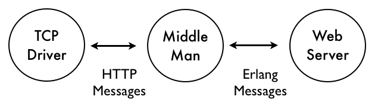
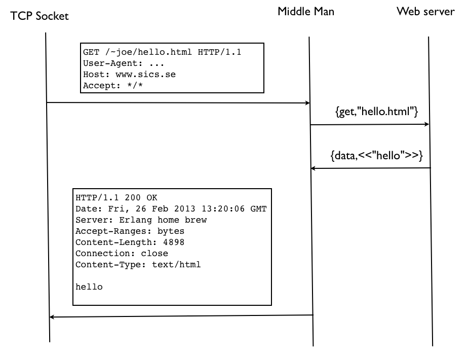
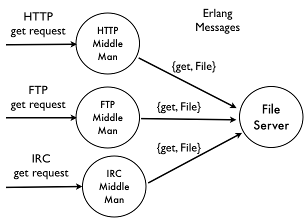

# 编程习语

在这一章中，我们将探究一些编程习语，并探讨架构 Erlang 代码的一些不同技巧。我们将以一个展示我们应如何看待编程世界，及我们在这个世界中发现的那些对象的示例。


## 维护 Erlang 的世界观


Erlang 的世界观即是，*万事万物皆为进程*，而进程只能通过交换消息交互。有了这样一种世界观，我们的设计就有了 *概念上的完整性*，让我们的设计而更容易理解。


设想我们打算编写一个 Erlang 的 web 服务器。某名用户请求我们服务器上的一个名为 `hello.html` 的页面。最简单可行 web 服务器看起来像下面这样：


```erlang
{{#include ../../projects/ch24-code/demo.erl:1:11}}
```

而这段代码之所以简单，仅仅因为他所完成的，只是接收和发送一些 Erlang 的项。*但客户端并未发送给我们 Erlang 的项；他们发送给我们了一些复杂得多的 HTTP 请求*。HTTP 请求经由 TCP 连接到来，进而这些请求本身可能被分片了，所有这些令到服务器程序，要远比前面给出的简单代码复杂得多。

为简化起见，我们在接收来自 HTTP 客户端消息的 TCP 驱动，和咱们的 Erlang 服务器间，插入了个称为 *中间人* 的进程。这位中间人会解析 HTTP 请求，并将其转化为 Erlang 的消息。如下图所示。咱们可以看到，为何这个转译进程称为中间人；他位于 TCP 驱动和 web 服务器之间。





就服务器而言，外部世界的对象只会 “讲” Erlang 语言。与其完成两件事（处理 HTTP 请求和为请求提供服务）的一个进程，我们现在有两个进程，每个都有明确的职责。中间人只知道怎样在 HTTP 和 Erlang 消息间转换。服务器对 HTTP 协议的细节一无所知，而只处理纯 Erlang 的消息。将这一目的拆分为两个进程，不仅使设计更加清晰，而且有个额外好处；他可以提高并发性。两个进程可以并行执行。

满足 HTTP 请求的相关消息流，在 [图 5，* Web 服务器协议*](#fig-5) 中给出了。


中间人的具体原理与这一讨论无关。他必需完成的，就是解析传入的 HTTP 请求，将其转换为 Erlang 的项，并将传出的 Erlang 项，转换为 HTTP 响应。


在我们的示例中，我们选择了把 HTML 请求中的大量细节抽象出来。HTML 请求的头部，包含着我们并未在此展示的许多额外信息。作为中间人设计的一部分，我们必须决定，要将多少底层协议细节，向 Erlang 应用公开。


假设我们打算扩展这个示例，而要响应一些文件的 FTP 请求，或经由 IRC 频道发送文件的请求。我们可像 [图 6，*统一消息*](#fig-6) 中所示的方式，架构我们系统中的进程。


HTTP、FTP 和 IRC 三者使用了 *完全不同的协议* 在机器间传输文件。实际上，IRC 并不支持文件传输，而文件传输通常由 *直接客户端到客户端，Direct Client to Client, DCC * 协议支持，大多数 IRC 客户端都支持该协议。




<a name="fig-5"></a>
**图 5** -- **Web 服务器协议**




<a name="fig-6"></a>
**图 6** -- **统一消息**

在中间人将外部协议转换为 Erlang 的消息后，单个的 Erlang 服务器就可作为所有这些不同协议的后端。


使用统一的 Erlang 消息传递，切实简化了这些实现。他有着以下优点：

- 他抽象出了不同线路协议（例如 HTTP 和 FTP 协议）间的区别；
- Erlang 消息不需要解析器。在可处理消息之前，接收进程不必解析消息。与此相比，HTTP 服务器就必须解析其接收的所有消息；
- Erlang 消息可包含任意复杂度的项。与此相比，HTTP 消息在传输前，必须序列化为边平形式；
- Erlang 消息可跨处理器边界（译注：不同 Erlang 节点？）发送，或以简单通用的序列化格式，存储在数据库中。


## 多用途服务器


## 有状态模组

## 适配器模式
