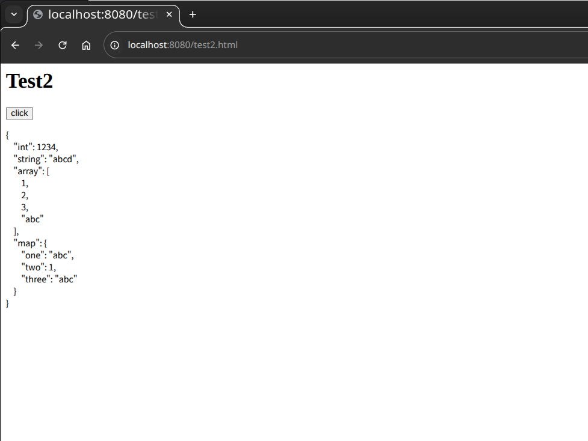

# 第三方程序

本章讨论第三方程序，即由我们的用户编写及发布的 Erlang 程序。此类程序的主要来源是 GitHub。在本章中，我们将介绍 GitHub 上的三个流行程序。我们还将了解如何在 GitHub 上创建和发布新项目，以及如何在咱们自己的应用中，包含某个 GitHub 项目。我们将学习以下内容：

- [`rebar`](https://github.com/erlang/rebar3) 由 Dave Smith 编写的 Rebar，已成为管理 Erlang 项目的事实标准。使用 `rebar`，用户可以创建新项目、编译项目、打包项目，并将其与其他项目集成。Rebar 与 GitHub 集成，因此用户可以轻松获取 GitHub 上的其他 `rebar` 项目，并将其集成到他们自己的应用；

- [`bitcask`](https://github.com/basho/bitcask) Bitcask 由 [Basho 公司](http://basho.com/) 的人编写，是一个持久性键值磁盘存储。他速度快且 “崩溃友好”，这意味着他会在崩溃后重启时快速恢复；

- [`cowboy`](https://github.com/ninenines/cowboy) Cowboy 由 Loïc Hoguin 编写，是个 Erlang 的高性能 web 服务器，在实现嵌入式 web 服务器方面越来越受欢迎。我们曾将一个 cowboy 服务器，用于 [第 18 章 *使用 Websockets 和 Erlang 浏览*](../part-iv/Ch18-browsing_with_websockets_and_erlang.md) 处的代码开发。


## 使用 Rebar 构造可共享归档以及管理咱们的代码


在这一小节中，我们将介绍构造一个我们将托管在 GitHub 上的开源 Erlang 项目的必要步骤。我（作者）假设咱们已在 GitHub 上有个账户。我们将使用 `rebar` 管理这个项目。


我们将完成以下事项：

1. 安装 `rebar`；
2. 在 GitHub 上创建一个新项目；
3. 将该项目克隆到本地；
4. 使用 `rebar` 添加该项目的样板文件代码；
5. 使用 `rebar` 编译咱们的项目；
6. 上传咱们的项目到 GitHub。


### 安装 `rebar`


Rebar 可从 [erlang/rebar3](https://github.com/erlang/rebar3) 获取。咱们可在 [rebar3.org](https://www.rebar3.org/) 上找到 `rebar` 的预编译二进制程序。要安装 `rebar`，请复制这个文件，将文件模式改为可执行，并将其放在咱们路径中的某处。


> **译注**：`rebar` 经历了从 [basho/rebar](https://github.com/basho/rebar) 到 [rebar/rebar](https://github.com/rebar/rebar)，并最终来到 [erlang/rebar3](https://github.com/erlang/rebar3)，这也反映了 Erlang 生态的一些变迁。


完成此操作后，咱们应测试一下咱们是否可运行 `rebar3`。


```console
$ rebar3 -v
rebar 3.25.1 on Erlang/OTP 28 Erts 16.0.3
```


### 在 GitHub 上构造一个新的项目

假设我们打算构造一个名为 `bertie` 的新项目（我(作者)以 Alexander McCall Smith 书中的人物命名我的一些项目）。第一步是创建一个新的 GitHub 项目。为此，我（作者）登录了自己的 GitHub 账户，并按照指示创建了一个新的代码仓库。

1. 点击登录页面工具栏右上方的 “创建新软件仓库” 图标（这图标看起来像上面有个加号的一本书）；

2. 将其构造为有个 readme 文件的公共存储库；

3. 然后点击创建存储库。


### 将该项目克隆到本地

在我（作者）家中的计算机上，有个名为 `${HOME}/published` 的单个目录，我把所有共享项目都放在这里。我移步到我的 `published` 目录下，并克隆这个 GitHub 仓库。


```console
$ cd published
$ git clone git@github.com:gnu4cn/bertie.git
正克隆到 'bertie'...
警告：您似乎克隆了一个空仓库。
```

现在，我（作者）通常会检查我是否可向这个版本库写入更改。因此，我会修改那个 readme 文件并将其推送回版本库。


```console
$ vim README.md
$ git add README.md
$ git commit README.md
$ git push
枚举对象中: 3, 完成.
对象计数中: 100% (3/3), 完成.
写入对象中: 100% (3/3), 240 字节 | 240.00 KiB/s, 完成.
总共 3（差异 0），复用 0（差异 0），包复用 0（来自  0 个包）
To github.com:gnu4cn/bertie.git
 * [new branch]      main -> main
```

在这个结果下，我（作者）松了一口气，并对现代科技的奥秘感到惊叹。

现在，我（作者）在 `~/published/bertie` 下有了个被同步到 `git@github.com:joearms/bertie.git` 处 GitHub 仓库的本地目录。


### 构造一个 OTP 应用


现在我们切换到这个 `bertie` 目录，使用 `rebar3` 创建一个标准 OTP 应用。


```console
$ cd published
$ rebar3 new release bertie
===> Writing bertie/apps/bertie/src/bertie_app.erl
===> Writing bertie/apps/bertie/src/bertie_sup.erl
===> Writing bertie/apps/bertie/src/bertie.app.src
===> Writing bertie/rebar.config
===> Writing bertie/config/sys.config
===> Writing bertie/config/vm.args
===> Writing bertie/.gitignore
===> Writing bertie/LICENSE.md
===> Writing bertie/README.md
```

> **译注**：原文中创建新 OTP 的命令为 `rebar create-app appid=bertie`。但在 `rebar3` 中 `create-app` 不是有效命令。该命令在旧版本的 `rebar`（特别是 `rebar2`）中出现过，但 `rebar3` 采用了不同的项目创建方法。
>
> 要使用 `rebar3` 创建新的 Erlang 应用，咱们应使用带有相应模板的 `new` 命令。标准应用最常用的模板是 `release`。


现在我们将把单个模组 `berti.erl`，添加到 `~/published/bertie/apps/bertie/src`。


```erlang
-module(bertie).
-export([start/0]).

start() -> io:format("Hello my name is Bertie~n").
```


> **译注**：`rebar3` 项目目录结构如下。
>
>
> ```console
> $ tree ~/published/bertie
> .
> ├── apps
> │   └── bertie
> │       └── src
> │           ├── bertie_app.erl
> │           ├── bertie.app.src
> │           ├── bertie.erl
> │           └── bertie_sup.erl
> ├── _build
> │   └── default
> │       └── lib
> │           └── bertie
> │               ├── ebin
> │               │   ├── bertie.app
> │               │   ├── bertie_app.beam
> │               │   ├── bertie.beam
> │               │   ├── bertie_sup.beam
> │               │   ├── elog4.config
> │               ├── include -> ../../../../apps/bertie/include
> │               ├── priv -> ../../../../apps/bertie/priv
> │               └── src -> ../../../../apps/bertie/src
> ├── config
> │   ├── sys.config
> │   └── vm.args
> ├── LICENSE.md
> ├── README.md
> ├── rebar.config
> └── rebar.lock
>
> 11 directories, 18 files
> ```
>
> 可见 `rebar3` 与 `rebar` 目录结构相比已发生变化。故这里 `bertie.erl` 所在位置已不同于原书中的 `~/published/bertie/src`。

然后我们使用 `rebar3` 编译所有东西。

```console
$ rebar3 compile
===> Verifying dependencies...
===> Analyzing applications...
===> Compiling bertie
```

我们现在有了个完整程序。剩下的就是将其推送回代码库。


```console
$ git add apps/bertie/src
$ git add commit
$ git push
```

### 公布咱们的项目

现在咱们已经编写了咱们代码，并发布在了 GitHub 上。下一步就是公布他。要公布咱们代码最明显方法，是以 [Erlang 邮件列表](http://erlang.org/mailman/listinfo/erlang-questions) 上发布简短公告，或在 Twitter 上使用 `#erlang` 标签。


想要使用咱们应用的用户，只需下载咱们的应用，并运行 `rebar compile` 构建咱们的应用。


## 将外部程序与我们的代码集成


我们已经了解了在 GitHub 上发布咱们作品所需的步骤。现在我们将了解如何把他人的工作成果，纳入我们的项目。作为一个示例，我们将把 `bitcask` 的代码，整合到我们的 `bertie` 项目中。

我们将修改 `bertie`，使他在启动时，打印出已被启动的次数。例如，当他在第 10 次启动时，`bertie` 将通告以下内容：


```console
Bertie has been run 10 times
```

要达到这一目的，我们将把 `bertie` 已运行次数，存储在一个 `bitcask` 数据库中。在 `bitcask` 中，键和值必须是二进制值。我们将选择键为二进制的 `<<"n">>`，值为 `term_to_binary(N)`，其中 `N` 是 `bertie `的运行次数。现在 `bertie.erl` 的内容如下：


```erlang
-module(bertie).
-export([start/0]).

start() ->
    Handle = bitcask:open("bertie_database", [read_write]),
    N = fetch(Handle),
    store(Handle, N+1),
    io:format("Bertie has been run ~p times~n", [N]),
    bitcask:close(Handle),
    init:stop().

store(Handle, N) ->
    bitcask:put(Handle, <<"bertie_database">>, term_to_binary(N)).

fetch(Handle) ->
    case bitcask:get(Handle, <<"bertie_database">>) of
        not_found -> 1;
        {ok, Bin} -> binary_to_term(Bin)
    end.
```

要将 `bitcask` 包含在 `bertie` 这个应用中，我们就要创建一个名为 `rebar.config` 的 “依赖项” 文件，并将其保存在 `bertie` 项目的顶层目录中。`rebar.config` 如下：


```erlang
{deps, [
        {bitcask, ".*", {git, "git://github.com/basho/bitcask.git", "master"}}
       ]}.

```

我（作者）还添加了个 makefile。


```makefile
all:
	test -d _build/default/lib/bitcask || rebar3 get-deps
	rebar3 compile
	@erl -noshell -pa './_build/default/lib/bitcask/ebin' -pa './_build/default/lib/bertie/ebin' -s bertie start
```

> **译注**：这里的 Makefile 文件与原文亦有所不同，这是由于 `rebar3` 的目录结构，与旧版的 `rebar` 目录结构已完全不同。


当我们首次运行这个 Makefile 时，我们会看到下面的输出：

```console
$ make
test -d _build/default/lib || rebar3 get-deps
===> Verifying dependencies...
===> Fetching bitcask (from {git,"git@github.com:basho/bitcask.git",
                   {ref,"d84c8d913713da8f02403431217405f84ee1ba22"}})
===> Fetching pc v1.15.0
===> Analyzing applications...
===> Compiling pc
===> Fetching eqc_rebar (from {git,"https://github.com/Quviq/eqc-rebar",{branch,"master"}})
===> Analyzing applications...
===> Compiling eqc_rebar
rebar3 compile
===> Verifying dependencies...
===> Compiling c_src/bitcask_nifs.c
===> Compiling c_src/erl_nif_util.c
===> Compiling c_src/murmurhash.c
===> Linking /home/hector/published/bertie/_build/default/lib/bitcask/priv/bitcask.so
===> Analyzing applications...
===> Compiling bitcask
===> Analyzing applications...
===> Compiling bertie
Bertie has been run 1 times
```


> **译注**：第二次运行时的输出如下。
>
> ```console
> $ make
> test -d _build/default/lib || rebar3 get-deps
> rebar3 compile
> ===> Verifying dependencies...
> ===> Analyzing applications...
> ===> Compiling bertie
> Bertie has been run 2 times
> ```

`rebar3 get-deps` 命令，从 GitHub 获取了 `bitcask`，并将其存储在 ~~名为 deps 的子目录中~~ `_build/default/lib` 目录下。`bitcask` 本身出于测试目的调用了 `meck`。这就是所谓的递归依赖。Rebar 会递归获取 `bitcask` 可能需要的任何依赖项，并将其存储在 `_build/default/plugins` 子目录下。


> **译注**：`_build/default/plugins` 的目录结构如下。
>
> ```console
> $ tree _build/default/plugins
> _build/default/plugins
> ├── eqc_rebar
> │   ├── ebin
> │   │   ├── eqc_rebar.app
> │   │   ├── eqc_rebar.beam
> │   │   └── eqc_rebar_prv.beam
> │   ├── LICENSE
> │   ├── README.md
> │   ├── rebar.config
> │   └── src
> │       ├── eqc_rebar.app.src
> │       ├── eqc_rebar.erl
> │       └── eqc_rebar_prv.erl
> └── pc
>     ├── ebin
>     │   ├── pc.app
>     │   ├── pc.beam
>     │   ├── pc_compilation.beam
>     │   ├── pc_port_env.beam
>     │   ├── pc_port_specs.beam
>     │   ├── pc_prv_clean.beam
>     │   ├── pc_prv_compile.beam
>     │   └── pc_util.beam
>     ├── hex_metadata.config
>     ├── LICENSE
>     ├── README.md
>     ├── rebar.config
>     ├── rebar.lock
>     └── src
>         ├── pc.app.src
>         ├── pc_compilation.erl
>         ├── pc.erl
>         ├── pc_port_env.erl
>         ├── pc_port_specs.erl
>         ├── pc_prv_clean.erl
>         ├── pc_prv_compile.erl
>         └── pc_util.erl
>
> 7 directories, 30 files
> ```


这个 makefile 将 `-pa './_build/default/lib/bitcask/ebin'` 开关添加到命令行，这样当程序启动时，`bertie` 就能自动加载 `bitcask` 的代码。


注意：咱们可从 [gnu4cn/bertie](https://github.com/gnu4cn/bertie) 下载这整个示例。假设 `rebar3` 已安装，咱们要做的全部，就只是下载这个项目，然后输入 `make`。


## 构造依赖项的本地拷贝

我（作者）的 `bertie` 应用，在 `bertie` 这个应用的本地子目录下，已构造了 `bitcask` 的一份本地拷贝。有时，数个不同应用，会想要使用一些相同依赖项，在这种情形下，我们会在咱们的应用 *之外*，创建一个依赖项目录结构。


在我（作者）的一些本地项目中，我把我的所有已下载 `rebar` 依赖项，放在了一处。我把所有这些依赖项，存储在一个名为 `~joe/nobackup/erl_imports` 的顶级目录下。我的机器被如此组织，`nobackup` 目录下的任何文件都不会被备份。由于我感兴趣的文件在 Web 上广泛存在，因此创建本地备份似乎没有必要。


文件 `~joe/nobackup/erlang_imports/rebar.config` 列出了我打算使用的所有依赖项，并如下所示：


```erlang
{deps, [
        {cowboy, ".*", {git, "git@github.com:ninenines/cowboy.git", "master"}},
        {ranch, ".*", {git, "git@github.com:ninenines/ranch.git", "master"}},
        {bitcask, ".*", {git, "git@github.com:basho/bitcask.git", {branch, "develop"}}}
       ]}.
```


要获取这些依赖项，我们就要在我们存储这个配置文件的目录下，执行 `rebar3 get-deps` 命令。


```console
$ rebar3 get-deps
===> Verifying dependencies...
===> Fetching eqc_rebar (from {git,"https://github.com/Quviq/eqc-rebar",{branch,"master"}})
===> Analyzing applications...
===> Compiling eqc_rebar
===> Fetching cowboy (from {git,"git@github.com:ninenines/cowboy.git","master"})
===> WARNING: It is recommended to use {branch, Name}, {tag, Tag} or {ref, Ref}, otherwise updating the dep may not work as expected.
===> Dependency failure: source for cowboy does not contain a recognizable project and can not be built
```

> **译注**：可以看出，译者在运行上面的命令时报出了错误。下面的 GitHub issues 中指出，咱们应从 Hex 获取取 `cowboy`。参考 `bitcask` 的 `rebar.config` 文件中从 Hex 获取 `pc` 的配置，我们即可将 `cowboy` 配置为从 Hex 获取（直接在 `deps` 列表中写下库模组名字，即导致该库模组从 [`hexpm`](https://repo.hex.pm) 处获取该模组）。
>
> ```erlang
> {deps, [
>         {cowboy, "2.10.0"},
>         {bitcask, ".*", {git, "git@github.com:basho/bitcask.git", {branch, "develop"}}}
>        ]}.
> ```
>
> 修改成上面这样后，再运行 `rebar3 get-deps` 命令就会成功，其输出如下。
>
> ```console
> $ rebar3 get-deps
> ===> Verifying dependencies...
> ===> Fetching bitcask (from {git,"git@github.com:basho/bitcask.git",
>                    {ref,"d84c8d913713da8f02403431217405f84ee1ba22"}})
> ===> Fetching pc v1.15.0
> ===> Analyzing applications...
> ===> Compiling pc
> ===> Fetching eqc_rebar (from {git,"https://github.com/Quviq/eqc-rebar",{branch,"master"}})
> ===> Analyzing applications...
> ===> Compiling eqc_rebar
> ===> Fetching cowboy v2.10.0
> ===> Fetching cowlib v2.12.1
> ===> Fetching ranch v1.8.0
> ```
>
> 参考：
>
> - [Source for cowboy does not contain a recognizable project and can not be built #1700](https://github.com/ninenines/cowboy/issues/1700#issuecomment-3467414880)


Rebar 会获取我们在配置文件中指定的那些程序，并递归获取这些程序所依赖的任何程序。


在我们获取到这些程序后，我们要使用 `rebar3 compile` 命令，编译他们。


```console
$ rebar3 compile
==> Verifying dependencies...
===> Compiling c_src/bitcask_nifs.c
===> Compiling c_src/erl_nif_util.c
===> Compiling c_src/murmurhash.c
===> Linking /home/hector/nobackup/erlang_imports/_build/default/lib/bitcask/priv/bitcask.so
===> Analyzing applications...
===> Compiling bitcask
===> Compiling ranch
===> Compiling cowlib
===> Compiling cowboy
```


最后一步是要告诉 Erlang，我们这些依赖项的被存储在何处。这是通过将以下代码行，移至 `${HOME}/.erlang` 这个启动文件完成的：


```erlang
%% Set paths to fix all dependencies
Home = os:getenv("HOME").
Dir = Home ++ "/nobackup/erlang_imports/_build/default/lib".
{ok, L} = file:list_dir(Dir).
lists:foreach(fun(I) ->
                Path = Dir ++ "/" ++ I ++ "/ebin",
                code:add_path(Path)
              end, L).
```

> **译注**：以下是命令 `tree -L 3 ~/nobackup/erlang_imports/_build` 的输出。其反映了在新版 `rebar3` 下，依赖项的文件结构。上面加入启动文件的内容，也因此做了相应修改。
>
>
> ```console
> $ tree -L 3 ~/nobackup/erlang_imports/_build
> /home/hector/nobackup/erlang_imports/_build
> └── default
>     ├── lib
>     │   ├── bitcask
>     │   ├── cowboy
>     │   ├── cowlib
>     │   └── ranch
>     └── plugins
>         ├── eqc_rebar
>         └── pc
>
> 10 directories, 0 files
> ```
>
> 在 Erlang 启动文件添加了上述内容后，`~/published/bertie/Makefile` 这个 makefile 文件，即可更新如下，在 `erl` 命令行上省略 `bitcask` 路径。
>
> ```makefile
> all:
> 	test -d _build/default/lib || rebar3 get-deps
> 	rebar3 compile
> 	@erl -noshell -pa './_build/default/lib/bertie/ebin' -s bertie start
> ```


## 以 Cowboy 构建嵌入式 Web 服务器


Cowboy 是个以 Erlang 编写的小型、快速、模组化 HTTP 服务器，可在 [ninenines/cowboy](https://github.com/ninenines/cowboy) 处获取。他受一家名为 [Nine Nines](https://ninenines.eu/) 的公司支持。


Cowboy 适合用于构建嵌入式的应用。他没有配置文件，也不产生日志。一切都受 Erlang 控制。


我们将构造一个非常简单的 web 服务器，以 `simple_web_server:start(Port)` 命令启动。这会启动一个在 `Port` 上监听命令的 web 服务器，其根目录便是该程序启动所在的目录。

启动一切的那个主函数如下：


```erlang
{{#include ../../projects/ch25-code/simple_web_server.erl:4:20}}
```

> **译注**：自本书 2013 年第 2 版以来，Cowboy 接口已然发生了诸多变化。这导致本书原文中这段代码已无法运行。比如在译者使用的 Cowboy 2.10.0 版本下，`cowboy:start_http/4` 已被移除，取而代之的是 `cowboy:start_clear/3` 或 `cowboy:start_tls/3`。
>
>
> 参考：
>
> - [[erlang-questions] Programming Erlang: Chap 18, Websockets](https://groups.google.com/g/erlang-programming/c/h5WE4W6RsJA/m/9nleRfdOAwAJ)
>
> - [Getting started: Listening for connections](https://ninenines.eu/docs/en/cowboy/2.6/guide/getting_started/#_listening_for_connections)
>
> - [`cowboy_req:reply`](https://ninenines.eu/docs/en/cowboy/2.10/manual/cowboy_req.reply/)


第 5 至 8 行启动了一些 OTP 应用。~~第 5 行将这个 web 服务器的 “接受者” 数量设为 10。这意味着这个 web 服务器会使用 10 个并行进程，接受 HTTP 连接请求。同步并行会话的数量，可远高于这个数字~~（Cowboy 2.0 已经移除 `start_http` 函数，同时新的 `cowboy:start_clear/3` 已不支持此参数）。变量 `Dispatch` 包含一个 “调度器模式” 列表。所谓调度模式，会将 URI 路径，映射到处理这单个请求的模组名字。第 12 行中的模式，会将所有请求映射到 `simple_web_server` 这个模组。

> *知识点*：
>
> - dispather patterns


[`cowboy_router:compile(Routes)`](https://ninenines.eu/docs/en/cowboy/2.10/manual/cowboy_router.compile/) 会编译调度器信息，创建出高效的调度器/分发器，~~而 `cowboy:start_http/4` 则会启动这个 web 服务器~~（在 Cowboy 2.0 后，该函数已被弃用，而以 `cowboy:start_tls` 与 `cowboy:start_clear` 取而代之）。

调度器/分发器模式中给出的那些模组名字，都必须提供 ~~三个回调例程：`init/3`、`handle/3` 和 `terminate/2`~~ 回调例程 [`init/2` 这个处理器](https://ninenines.eu/docs/en/cowboy/2.10/guide/handlers/)。在咱们的情形中，只有一个名为 `simple_web_server` 的处理器模组。回调例程 `init/2` 会在一个全新连接对这个 web 服务器发起时被调用。


```erlang
{{#include ../../projects/ch25-code/simple_web_server.erl:22:28}}
```

`init` 会以两个参数调用。~~第一个说明与服务器建立的连接类型。在这一情形下，其为一个 HTTP 连接~~。第一个参数就是 cowboy 所说的 *请求对象*。请求对象包含了有关该请求的信息，并将最终包含发送回浏览器的信息。Cowboy 提供了大量用于提取请求对象中信息，及用于把后续将发送到浏览器的信息，存储在请求对象中的函数。~~`init` 的第三个参数（`Opt`），就是在调用 `cowboy_router:compile/1` 时所给到的那个调度/分配元组的第三个参数~~ `init` 的第二个参数是定义在路由器配置中的初始状态。


依惯例 `init/3` 会返回元组 `{ok, Req, State}`，这会使 web 服务器接受连接。`ok` 表示该处理器运行成功。我们还将修改后的 `Req`，给回到 Cowboy，`State` 是个与连接相关的私有状态，将在到这个处理器的后续回调用中用到。~~当连接被接受时，HTTP 的驱动程序将以 `init` 函数返回的请求对象和状态，调用函数 `handle/2`。`handle/2` 如下所示：~~


~~`handle`~~ `init` 调用了 `cowboy_req:path(Req)`（第 2 行）来提取所请求资源的路径。因此，例如当用户请求地址 `http://localhost:1234/this_page.html` 中的某个页面时，那么 `cowboy_req:path(Req)` 将返回路径 `<<"/this_page.html">>`。路径以 Erlang 的二进制值表示。


通过调用 `cowboy_req:reply/4`，读取文件的结果（`Response`）即被打包到请求对象中，并成为 `init/2` 返回值的一部分（第 4 到第 6 行）。


读取所请求页面是由 `read_file/1` 完成。

```erlang
{{#include ../../projects/ch25-code/simple_web_server.erl:30:35}}
```

由于我们假定了所有文件都是在启动这个 web 服务器的目录下提供的，因此我们在文件名前加上一个点（否则其会以正向斜线开头），以便我们读取到正确的文件。


差不多就是这样。现在所发生的事情，取决于套接字建立的方式。当他是个保持活动的连接时，那么 `init` 将再度被调用。当连接关闭时，那么 `terminate/3` 将被调用。

```erlang
{{#include ../../projects/ch25-code/simple_web_server.erl:37:38}}
```

> **译注**：`cowboy` 对 `crypto` 存在依赖，而 `crypto` 又对 `ssl` 等存在递归依赖。
>
> 参考:
>
> - [Erlang Dependency Not Started Error](https://stackoverflow.com/a/15920037/12288760)
>
> 运行这个简单 web 服务器，并使用 `curl` 发起请求的输出如下。
>
> ```erlang
> $ erl -boot start_sasl -config elog4
> ...
> 1> ls().
> elog4.config               index.html
> simple_web_server.beam     simple_web_server.erl
>
> ok
> 2> simple_web_server:start().
> {ok,<0.127.0>}
> ```
>
> ```console
> $ curl --ipv4 http://localhost:8080/index.html -v
> * Host localhost:8080 was resolved.
> * IPv6: ::1
> * IPv4: 127.0.0.1
> *   Trying 127.0.0.1:8080...
> * Established connection to localhost (127.0.0.1 port 8080) from 127.0.0.1 port 52938
> * using HTTP/1.x
> > GET /index.html HTTP/1.1
> > Host: localhost:8080
> > User-Agent: curl/8.16.0
> > Accept: */*
> >
> * Request completely sent off
> < HTTP/1.1 200 OK
> < content-length: 22
> < content-type: text/plain
> < date: Wed, 05 Nov 2025 01:24:32 GMT
> < server: Cowboy
> <
> <h1>Hello World!</h1>
> * Connection #0 to host localhost:8080 left intact
> ```

现在我们已经了解了如何构造一个简单服务器，我们将把玩一下其中涉及的基本结构，并构造一个更有用的示例。


我们即将编写一个从浏览器到 Erlang 再返回的 JSON 往返程序。这个示例非常有趣，因为他展示了如何将浏览器与 Erlang 连接起来。我们会以浏览器中的 JavaScript 对象开始。我们会将其编码为 JSON 消息，发送给 Erlang。我们会在 Erlang 下解码该消息，这里器会成为一种 Erlang 的数据结构，然后将其发送回浏览器，并将其变回一个 JavaScript 对象。当一切顺利时，这个对象将在这个往返过程下存活下来，并以器开始时的样子结束。

我们将从 Erlang 代码开始，将其构造得比前一示例稍微通用一些。我们将增加一项元调用设施，以便我们可从浏览器中，调用任意的 Erlang 函数。当浏览器以一个 `http://Host/cgi?mod=Modname&func=Funcname` 形式 URI，请求某个页面时，我们希望在 Erlang web 服务器上，调用函数 `Mod:Func(Args)`。其中 `Args` 假设是个 JSON 的数据结构。

> **译注**：
>
> - a meta-call facility


完成这一目的的代码如下：

```erlang
{{#include ../../projects/ch25-code/cgi_web_server.erl:19:39}}
```

这段代码与本章前面给出的代码类似。唯一不同的是，~~我们调用 `cowboy_req:qs` 来分解查询字符串，调用 `cowboy_req:body` 来提取 HTTP 请求的正文~~ 我们调用了 [`cowboy_req:parse_qs/1`](https://ninenines.eu/docs/en/cowboy/2.10/manual/cowboy_req.parse_qs/) 解析查询字串，调用了 [`cowboy_req:read_body/1`](https://ninenines.eu/docs/en/cowboy/2.10/manual/cowboy_req.read_body/) 读取请求正文。我们调用了 `mochiweb2` 库（可从 [mochi/mochiweb](https://github.com/mochi/mochiweb) 处获取）中的编码及解码例程，在 JSON 字符串与 Erlang 项之间转换。处理调用的代码如下：


```erlang
{{#include ../../projects/ch25-code/cgi_web_server.erl:41:44}}
```

下面是回显代码：

```erlang
{{#include ../../projects/ch25-code/echo.erl}}
```

我们已完成 Erlang 代码。现在要完成浏览器中相应的代码。这只需要几行的 JavaScript，及对 jQuery 库数个调用。

> **译注**：在以上服务器侧 Erlang 代码下，运行服务器及使用 `curl` 向服务器发送请求的输出如下。
>
> ```erlang
> $ erl -boot start_sasl -config elog4
> ...
> 1> cgi_web_server:start().
> {ok,<0.126.0>}
> echo: [{<<"Name">>,<<"Hector PENG">>},{<<"Height">>,181}]
> ```
>
>
> ```console
> $ curl --ipv4 -v "http://localhost:8080/cgi?mod=echo&func=me" -H "Content-Type:application/json" -X POST --data '{"Name": "Hector PENG", "Height": 181}'
> Note: Unnecessary use of -X or --request, POST is already inferred.
> * Host localhost:8080 was resolved.
> * IPv6: ::1
> * IPv4: 127.0.0.1
> *   Trying 127.0.0.1:8080...
> * Established connection to localhost (127.0.0.1 port 8080) from 127.0.0.1 port 42290
> * using HTTP/1.x
> > POST /cgi?mod=echo&func=me HTTP/1.1
> > Host: localhost:8080
> > User-Agent: curl/8.16.0
> > Accept: */*
> > Content-Type:application/json
> > Content-Length: 38
> >
> * upload completely sent off: 38 bytes
> < HTTP/1.1 200 OK
> < content-length: 35
> < content-type: text/json
> < date: Wed, 05 Nov 2025 06:45:32 GMT
> < server: Cowboy
> <
> * Connection #0 to host localhost:8080 left intact
> {"Name":"Hector PENG","Height":181}%
> ```

```html
{{#include ../../projects/ch25-code/test2.html}}
```

现在，我们将在 `1234` 端口上启动这个 web 服务器；我们可以在 shell 下完成此操作。


```erlang
$ erl -boot start_sasl -config elog4
Erlang/OTP 28 [erts-16.0.3] [source] [64-bit] [smp:12:12] [ds:12:12:10] [async-threads:1] [jit:ns]

Eshell V16.0.3 (press Ctrl+G to abort, type help(). for help)
1> cgi_web_server:start().
{ok,<0.126.0>}
```

服务器启动后，我们即可在浏览器中输入地址 `http://localhost:1234/test2.html`，然后我们将看到上面有个按钮的页面。当我们单击该按钮后时，测试即被执行，浏览器就会显示 Erlang 发回的数据（[图 7，*发送自 Erlang 的 JSON 项*](#fig-7)）。


而下面即是我们在 Erlang shell 下中所看到的内容：


```erlang
echo: [{<<"int">>,1234},
       {<<"string">>,<<"abcd">>},
       {<<"array">>,[1,2,3,<<"abc">>]},
       {<<"map">>,
        {struct,[{<<"one">>,<<"abc">>},
                 {<<"two">>,1},
                 {<<"three">>,<<"abc">>}]}}]
```

这是 `mochijson2:decode/1` 返回的 Erlang 解析树。正如咱们可见，数据在两个系统之间得以正确传输。


*注意*：并非所有 JSON 项都能在浏览器和 Erlang 之间的往返中存活。JavaScript 的整数精度有限，而 Erlang 则有着大数字，因此在处理大整数时，我们可能会遇到问题。同样，浮点数可能在转换过程中失去精度。




<a name="fig-7"></a>
**图 7** -- **Erlang 发出的 JSON 项**


作为自 Erlang shell 启动这个 web 服务器的替代做法，我们可能还希望从 makefile，或命令行启动该服务器。在这种情况下，我们需要添加一个将 Erlang 从 shell 下接收到的参数（一个原子的列表），转换为启动该服务器所需形式的例程。


```erlang
{{#include ../../projects/ch25-code/cgi_web_server.erl:57:59}}
```


随后，例如，要启动一个在端口 5000 上监听的服务器，我们可执行以下命令：

```console
$ erl -boot start_sasl -config elog4 -s cgi_web_server start_from_shell 8080
```

本章介绍了如何将 `rebar` 用于简单的项目管理。我们展示了怎样在 GitHub 上创建一个新项目，并使用 `rebar` 对其管理，以及如何包含 GitHub 上的一些项目，并将其纳入我们自己的工作。我们举了一个有关如何开始使用 `cowboy` 构建专门 web 服务器的简单示例。[第 18 章，*使用 Websockets 和 Erlang 浏览*](../part-iv/Ch18-browsing_with_websockets_and_erlang.md) 中构建的 Web 服务器，与本章给出的代码基本相似。


第二个 `cowboy` 的示例，使用 `mochiweb` 中的编码和解码例程，将 JSON 项转换为 Erlang 的结构。当映射出现于 Erlang R17 版本中时，我（作者）将修改本书中的代码，以反映这点。


在下一章中，我们将了解多核心计算机，并探讨在多核心计算机上运行代码的一些并行化技术。当我们运行于多核心 CPU 上时，并发程序会变成并行程序，同时运行速度应会更快 -- 我们将看看事实是否如此。


## 练习

1. 请在 GitHub 上注册一个账号，然后按照本章开头的步骤，创建咱们自己的项目；

2. 第二个 `cowboy` 示例可能不安全。用户可经由那个 CGI 调用接口，请求任意 Erlang 模组的执行。请重新设计接口，只允许调用一组预定义的模组；

3. 请完成一个 cowboy 示例的安全审计。这段代码存在数个安全问题。例如，请求的文件值未被检查，因此访问该 web 服务器目录结构之外的文件即有可能。请查找并修复这些安全问题；

4. 任何主机都可以连接到这个 cowboy 服务器。请修改代码，从而只允许来自一些已知 IP 地址主机的连接。要将这些主机存储在某种形式的持久数据库中，例如 Mnesia 或 `bitcask`。要记录从特定主机发起连接的次数。请构造一个特定时间内连接频率过高的主机黑名单；

5. 请修改这个 web 服务器，实现那些经由 CGI 接口调用模组的动态重编译。在我们的示例中，`echo.erl` 模组在其可被调用前，就必须被编译。当某个模组经由 CGI 接口被调用时，要读取 beam 文件上的时间戳，并将其与相应 `.erl` 文件上的时间戳比较。然后在必要时重新编译即重新加载该 Erlang 代码；

6. Rebar 是以 “自包含” 二进制文件形式发布的 Erlang 程序优秀范例。请将 rebar 的可执行文件，拷贝复制到某个暂存目录，并将其重命名为 `rebar.zip`。Rebar 实际上就是个 zip 文件。将其解压缩并检查内容。请从 cowboy 的示例代码，构造咱们自己的自执行二进制文件。

> **译注**：`rebar3` 解压后的目录结构如下所示。
>
> ```console
> $ tree -L 2
> .
> ├── bbmustache
> │   └── ebin
> ├── certifi
> │   └── ebin
> ├── cf
> │   └── ebin
> ├── cth_readable
> │   └── ebin
> ├── erlware_commons
> │   └── ebin
> ├── eunit_formatters
> │   └── ebin
> ├── getopt
> │   └── ebin
> ├── providers
> │   └── ebin
> ├── rebar
> │   ├── ebin
> │   └── priv
> ├── relx
> │   ├── ebin
> │   └── priv
> └── ssl_verify_fun
>     └── ebin
>
> 25 directories, 0 files
> ```
