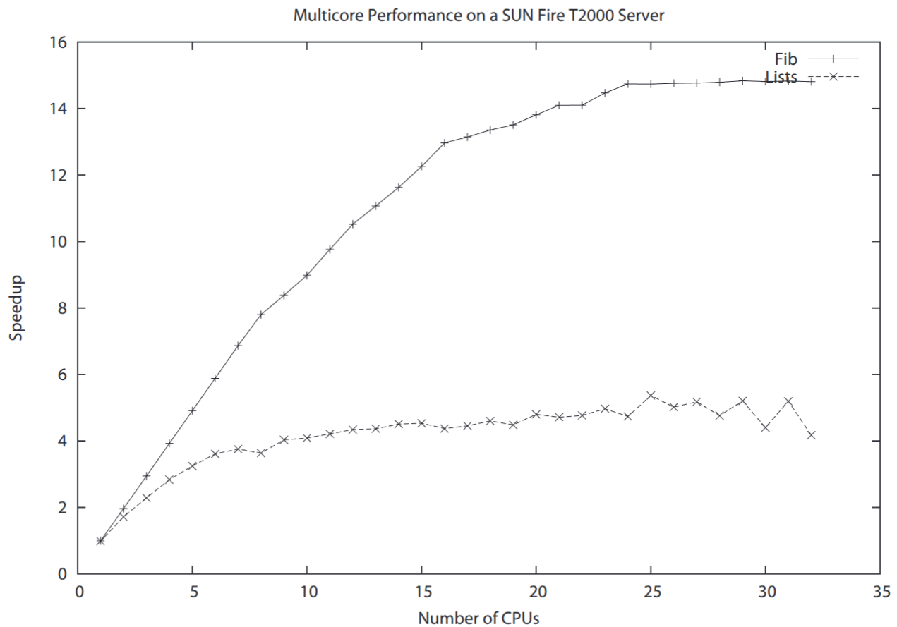

# 多核 CPU 编程


*我们怎样编写在多核心 CPU 上运行更快的程序呢？这一切都与可变状态和并发有关*。

在过去（二十多年前），有两种并发模型。

- 共享状态的并发
- 消息传递的并发

编程界走了一条路（朝着共享状态）。Erlang 社区则走的是另一条路。(很少有其他语言循着 “消息传递的并发” 这条道路；这些别的语言有 [Oz](https://en.wikipedia.org/wiki/Oz_(programming_language)) 及 [Occam](https://en.wikipedia.org/wiki/Occam_(programming_language))）。


在消息传递的并发下，是没有共享状态的。所有计算在进程中完成，交换数据的 *唯一* 方式，是经由异步的消息传递。

*为何这很不错*？

共享状态的并发，涉及 “可变状态”（可被更改的内存）的这一概念 -- 诸如如 C、Java、C++ 等所有语言，都有着这种概念：有一种叫 *状态* 的东西，而我们可以改变他。

在咱们只有 *一个* 进程进行更改时，这不会有问题。


当咱们有正共用并修改 *同一* 内存的多个进程时，咱们就会后患无穷 -- 疯狂就在这里。

> **知识点**：
>
> [a receipe for disaster, 后患无穷](https://www.bbc.co.uk/learningenglish/chinese/features/authentic-real-english/ep-160405)

要防止共享内存的同时修改，我们就要使用某种加锁机制。咱们可以把这叫做互斥锁、同步方法或其他任何东西，但他仍是把锁。

当程序在临界区（当其持有锁）崩溃时，就会导致灾难。所有其他程序都不知道要做什么。当程序破坏了处于共享状态的内存时，灾难也将发生。其他程序将不知道要做什么。


程序员怎么解决这些问题呢？困难重重。在单核处理器上，他们的程序可能恰好工作了 -- 但在多核处理器上......就是灾难。

对此，有一些不同解决方案（事务内存可能是最好的），但这些充其量也就是些 “蹩脚货”。最糟糕的是，它们简直就是噩梦。

*Erlang 没有可变数据结构*（这也不全对，但也足够正确）。

- 没有可变数据结构 == 没有锁；
- 没有可变数据结构 == 易于并行化。

我们怎么做到并行化？很简单。程序员会把问题解法，分解成若干并行进程。

这种编程风格有自己的术语；他被叫做 *面向并发的编程*。


## Erlang 程序员的好消息


好消息是：咱们的 Erlang 程序在 *n* 个核心的处理器上，可能会以 `n` 倍快速度运行 -- *无需对程序的任何修改*。

但咱们必须遵循一套简单规则。

若咱们希望咱们的应用，在多核 CPU 上运行更快，咱们就必须确保其有着大量互不干扰的进程，并且咱们的程序中，没有顺序（代码）瓶颈。

当咱们把咱们的代码，写成了一大堆顺序代码，并从未使用 `spawn` 创建一个并行进程，那么咱们的程序，就可能不会更快。


请勿绝望。即使咱们的程序一开始是个巨大的顺序程序，对程序的几个简单改动，就将使其并行化。

在这一章中，我们将讨论以下主题：

- 我们必须完成哪些事情，使咱们的程序在多核 CPU 上高效运行；
- 怎样并行化某个顺序程序；
- 顺序化瓶颈问题；
- 如何避免一些副作用。

在我们完成上述主题后，我们将研究一个更复杂问题中所涉及的一些设计问题。我们将实现一个名为 `mapreduce` 的高阶函数，并展示他怎样用于并行化计算。 `mapreduce` 是谷歌开发的一个，用于在处理元素集上执行并行计算的抽象概念。

> **知识点**：
>
> - sets of processing elements

## 怎样令到程序在多核心 CPU 上高效运行


要高效运行，我们必须完成以下几点：

- 要使用大量进程；
- 要避免一些副作用；
- 要避免顺序化的一些瓶颈；
- 要编写 “小消息，大计算” 的代码。


当我们完成全部这些要求时，我们的 Erlang 程序，就应会在多核心 CPU 上高效运行。


> **我们为何应关注多核心 CPU**？
>
> 咱们可能想知道，这大惊小怪是为啥。我们真的有必要费心将程序并行化，使其能在多核心上运行吗？答案是肯定的。如今，带有超线程的四核已经司空见惯。智能手机也有四核心。就连我那低端的 MacBook Air，也有带超线程的双核心，而我的台式机，则有带超线程的八核心。
>
> 构造一个在双核心机器上以两倍的速度运行的成型，并不那么令人兴奋（但确实有点令人兴奋）。但我们不要自欺欺人。双核心处理器的时钟速度，比单核心 CPU 慢，因此性能的收益可能很小。
>
> 现在，虽然两倍提升还不能让我（作者）兴奋，但十倍就会，而一百倍就真的非常非常让人兴奋了。现代处理器如此之快，一个核心可运行 4 个超线程，那么一个 32 核心的 CPU，就可以提供 128 个线程使用。这意味着，百倍的速度指日可待。
>
> 一个一百的系数，确实让我（作者）兴奋。
>
> 我们要做的就是，写下代码。


### 使用大量线程

这点很重要 -- 我们必须让 CPU 忙起来。所有 CPU 都应该一直处于忙碌状态。要做到这一点，最简单方法就是要有大量进程。

在我（作者）讲到大量进程进程时，我指的是与 CPU 数量相关的大量。当我们有很多进程时，那么我们将无需担心让 CPU 忙碌了。这表现为一种纯粹的统计效应。当我们有着少量的进程时，他们可能不小心占用一个 CPU；当我们有着很大数量的进程时，这种效应似乎就消失了。当我们想要咱们的程序不过时，我们就应该考虑到，即使现今的芯片可能只有少量 CPU，但将来我们可能就会有每个芯片的成千上万个 CPU。


这些进程的工作量最好相近。编写出其中一个进程完成很多工作，而别的进程完成很少工作的程序，是个糟糕的主意。


在许多应用中，我们都 “免费” 获得了大量进程。当应用 “本质上是并行的” 时，那么我们就不必担心，并行化代码的问题。例如，当我们正编写某个管理数万个并发连接的消息系统时，那么我们会获得这数万个连接中的并发性；而处理某单个连接的代码，则将不必担心并发性问题。


### 避免副作用

一些副作用会阻止并发。就在本书的开头，我们曾谈到了 “不变化的变量” 问题。这是理解为何 Erlang 程序在多核心 CPU 上，比以哪些会破坏性修改内存语言编写的程序，可以运行更快的关键所在。

在有着共享内存及线程的某门语言中，当两个线程在同一时刻写入共用内存时，灾难就可能发生。有着共享内存并发的系统，会通过在共享内存被写入时，给这些共享内存加锁，防止这种情况。这些锁对程序员隐藏，在他们的编程语言中表现为互斥锁或同步方法。共享内存的主要问题，是某个线程会破坏另一线程用到的内存。因此，即使我的程序是正确的，另一线程也会弄乱我的数据结构，进而导致我的程序崩溃。


Erlang 没有共享内存，因此这个问题就不存在。事实上，这不完全正确。共享内存的方式只有两种，并且这个问题可轻松避免。共享内存的两种方式，都与共享 ETS 或 DETS 数据表有关。


- **不使用共享的 ETS 或 DETS 数据表**


ETS 数据表可被多个进程共享。在 [19.3 节，*创建 ETS 数据表*](../part-iv/Ch19-storing_data_with_ets_and_dets.md#创建-ets-数据表) 中，我们介绍了创建 ETS 数据表的不同方式。采用这些选项中的一种来 `ets:new`，我们就可以创建一个 `public` 的数据表类型。回顾这样做曾完成了以下内容：

*创建一个公共数据表。任何知道该数据表标识符的进程，都可以读写这个数据表*。


这样做会很危险。只有在我们能保证以下两个条件时，才是安全的：

- 某个时刻只有一个进程写入该数据表，所有别的进程都读取该数据表中的数据；
- 写入该 ETS 数据表的进程正确无误，且未将不正确数据写入该数据表。

这些属性一般无法获得系统的保证，而是依赖于程序逻辑。


*注 1*：对 ETS 数据表的一些单项操作，均是原子的。将一系列 ETS 的操作，作为一个原子单元执行是不可行的。虽然我们无法破坏 ETS 数据表中的数据，但当多个进程在未协调他们的活动下，试图同时更新某个共享数据表时，数据表就会在逻辑上变得不一致。


*注 2*：`protected` 的 ETS 数据表类型，则安全得多。只有一个进程（即所有者）可写入这个数据表，但多个进程可读取该表。这一属性由系统 *提供保证*。但请记住，即使只有一个进程可写入某个 ETS 数据表，当这个进程破坏了该数据表中的数据时，那么所有读取该表的进程，都将被影响。

当咱们使用 ETS 数据表类型 `private` 时，那么咱们的程序将是安全的。类似情况也适用于 DETS。我们可以创建多个不同进程都可写入的 DETS 数据表。这种做法应加以避免。


*注*：ETS 和 DETS 是为实现 Mnesia 而创建的，原本就不为单独使用。意图是当应用程序打算模拟进程间的共享内存时，他们应使用 Mnesia 的事务机制。


### 避免顺序（代码）的瓶颈


一旦我们已并行化咱们的程序，并已确认咱们有了大量进程，且没有共享内存操作，那么下一个要考虑的问题，就是顺序的瓶颈。某些事情本质上是顺序的。当 “顺序性” 存在于（要解决的）问题中时，我们就无法让其消失。某些事件会按一定顺序发生，无论如何尝试，我们都无法改变这种顺序。我们出生、成长、死亡。我们无法改变顺序。我们无法同时完成这些事情。

所谓顺序的瓶颈，是指多个并发进程需要访问某项顺序资源的情况。一个典型示例就是 I/O。通常情况下，我们只有一个磁盘，所有到磁盘的输出，最终都是顺序的。磁盘只有一组磁头，而不是两组，我们无法改变这点。


每次我们构造一个 [注册进程](../part-iii/Ch12-concurrent_programming.md#注册的进程) 时，我们都在创建某种潜在的顺序瓶颈。因此，要尽量避免注册进程的使用。当咱们确实创建了一个注册进程，并将其用作一个服务器时，要确保他会尽可能快地响应所有请求。

通常，顺序瓶颈的唯一解决方案，是改变相关算法。这里并没有某种简单易行的办法。我们必须将算法从某种非分布式算法，修改为某种分布式算法。这一主题（分布式算法）有大量的研究文献，但在一些传统编程语言库中的应用却相对较少。（分布式算法）未被采用的主要原因，是直到我们尝试对带有网络通信的算法，或多核计算机编程前，此类算法的需求并不明显。

对永久连接到互联网的计算机，及多核心 CPU 的计算机编程，将迫使我们深入研究文献，并实现一些这种令人惊叹的算法。


**一种分布式的订票系统**

设想我们有某种单一的资源，即一套 Strolling Bones 下一场音乐会的门票。为保证咱们买票时能真正拿到票，我们通常会使用预订所有门票的单一代理公司。但这样做会引入顺序瓶颈。

单一代理公司的瓶颈问题，可通过引入两家票务代理公司加以避免。在销售开始时，第一家票代公司会给到所有偶数票，第二家代理公司会给到所有奇数票。在这种方式下，两家代理公司就保证了不会卖出同一张票两次。


当其中一家机构的票用完了时，那么他可以向另一家申请一捆门票。


我（作者）没说这是个好方法，因为在咱们听音乐会时，可能真的想坐在朋友旁边。但他确实通过一个售票处改为两个，消除了瓶颈。

以 `n` 个分布式的代理机构，取代单个预订代理，其中 `n` 可随时间变化，并且这些单独机构可以随时加入和离开网络，并可以随时崩溃，这是分布式计算中，一个活跃的研究领域。这项研究被称为 *分布式哈希表*。当咱们在谷歌上检索这个术语时，咱们将发现有关这个主题的大量文献。

> **知识点**：
>
> - distributed hash table, DHT


## 并行化序列代码

还记得我们对 [一次列表操作，特别是函数 `lists:map/2` 所强调的东西](../part-ii/Ch04-modules_and_functions.md#简单的列表处理) 吗？ `map/2` 被定义为下面这样：

```erlang
map(_, [])    -> [];
map(F, [H|T]) -> [F(H)|map(F, T)].
```


加快咱们顺序程序速度的一种简单策略，就是用我（作者）称之为 `pmap`，会并行地计算其所有参数的新版本 `map`，替换所有对 `map` 的调用。


```erlang
{{#include ../../projects/ch26-code/lib_misc.erl:209:227}}
```

`pmap` 会像 `map` 那样工作，但当我们调用 `pmap(F, L)` 时，他会创建一个并行进程，计算 `L` 中的每个参数。请注意，计算 `L` 参数的那些进程，可以按任意顺序完成。

`gather` 函数中的那个选择性的 `receive`，确保了返回值中参数的顺序，与原始列表中的顺序对应起来。


`map` 与 `pmap` 在语义上略有不同。在 `pmap` 中，当我们将函数映射到列表上时，我们使用了 `(catch F(H))`。而在 `map` 中，我们只使用了 `F(H)`。这是因为我们要确保 `pmap` 在计算 `F(H)` 抛出异常的情形下，会正确地终止。在没有异常抛出的情形下，这两个函数的行为是相同的。

> **译注**：关于 `catch` 这个原语，请参考 [使用 `catch` 捕获异常](../part-ii/Ch06-error_handling_in_sequential_programs.md#使用-catch-捕获异常)。

*重点*：最后一句话严格来说并不正确。当 `map` 和 `pmap` 有副作用时，他们将不会以同一方式行事。设想 `F(H)` 有一些修改进程字典的代码。当我们调用 `map` 时，对进程字典的修改，将在调用 `map` 的那个进程的进程字典中进行。


而当我们调用 `pmap` 时，每个 `F(H)` 都在会其自己的进程中计算，因此当我们用到进程字典时，该字典中的变化，将不会影响调用 `pmap` 的那个进程中的进程字典。

*因此，请注意*：那些有副作用的代码，无法简单地以 `pmap` 替换 `map` 调用并行化。


### 我们何时可以使用 `pmap`？

使用 `pmap` 而非 `map`，并不是加快咱们程序的万能药。以下是一些需要考虑的问题。

**并发的粒度**


当函数种完成的工作量很小时，就不要使用 `pmap`。设想我们有如下表述：

```erlang
map(fun(I) -> 2*I end, L)
```

这里那个 fun 内部完成的工作量很小。设置进程和等待回复的开销，大于使用并行进程完成这项工作的好处。

**不要创建太多进程**


请记住，`pmap(F, L)` 会创建 `length(L)` 个并行进程。当 `L` 非常大时，咱们将创建出很多进程。最好的办法是创建一个 *适当* 数量的进程。Erlang 来自瑞典，*lagom* 这个词翻译过来的意思是 “不要太少，也不要太多，差不多就行”。有人说这概括了瑞典人的性格。


> **译注**：这个 `pmap` 实现的验证如下：
>
>
> ```erlang
> 1> lib_misc:pmap(fun lib_misc:fac/1, [4,8,16]).
> [24,40320,20922789888000]
> ```


`pmap` 可能并非正确的抽象。我们可以想到以并行方式，将某个函数映射某个列表上的许多不同方式；我们在这里选择了最简单的一种可行方式。


我们使用的 `pmap` 版本，关注了返回值中元素的顺序（我们使用了一种选择性接收做到这点）。当我们不在乎返回值顺序时，我们可以写出下面这样：

```erlang
{{#include ../../projects/ch26-code/lib_misc.erl:229:245}}
```


对这段代码的简单修改，就可将其转换为一个并行的 `foreach`。这段代码与前面的类似，但我们没有建立任何返回值。我们只注意了程序的终止。

另一种方式，将是使用最多 `K` 个进程实现 `pmap`，其中 `K` 是个固定常数。当我们打算对一些非常大的列表使用 `pmap` 时，这种方式就可能会很有用。

而另一版本的 `pmap`，不仅可将计算映射到多核心 CPU 种的进程上，还可映射到分布式网络中的一些节点上。我（作者）不会在这里向咱们演示如何做到完成一点。咱们可自己思考一下这个版本。

这个小节的目的，是要指出，一个庞大的抽象体系，可建立在 `spawn`、`send` 及 `receive` 这三个基本元语之上。咱们可以使用这三个元语，创建咱们自己的并行控制抽象，提高咱们程序的并发性。


和以前一样，没有副作用，是提升并发性的关键。千万不要忘记这点。

## 小消息，大计算


我们已讨论过理论部分；现在讲讲测量。在这一小节中，我们将进行两个实验。我们将对某个 100 元素列表，映射两个函数，同时我们将比较在并行映射下，与在顺序映射下，其所用时间。

我们将使用两个不同问题集。第一个问题会计算下面的问题：


```erlang
L = [L1, L2, ..., L100]
map(fun lists:sort/1, L)
```

`L` 中的各个元素，是 1000 个随机整数的列表。


而第二个问题会计算这个问题：


```erlang
L = [27, 27, ..., 27],
map(fun ptests:fib/1, L)
```


这里，`L` 是 100 个 27 的列表，而我们要计算列表 `[fib(27), fib(27), ...]` 100 次。(其中 `fib` 是斐波纳契，Fibonacci 函数。）

我们将对这两个函数计时。然后我们将以 `pmap` 代替 `map`，并重复计时操作。


在第一个计算（排序）中使用 `pmap`，涉及在不同进程间的消息中，发送相对大的数据量（1000 个随机数的列表）。排序过程相当快。而第二个计算涉及将一个小的请求（计算 `fib(27)`）发送到各个进程，但递归计算 `fib(27)` 中涉及的工作相对较大。


由于在计算 `fib(27)` 的进程间，数据复制很少，而涉及的工作量相对较大，因此我们预期第二个问题在多核 CPU 上，会表现好于第一个问题。

要了解在实践中这一示例的工作方式，我们就需要一个自动化咱们测试的脚本。但首先我们将看看，如何开始 SMP 的 Erlang。


> **译注**：symmetric multiprocessing, 对称多处理技术

### 运行 SMP 的 Erlang


对称多处理 (SMP) 的机器，有着连接到单个共享内存的两个或更多相同 CPU。这些 CPU 可能位于单个的多核芯片上、分布于多个芯片或二者的组合。 Erlang 会运行于数种不同 SMP 架构及操作系统上。当前系统会运行在有一或两个 Intel 双核或四核心处理器的主板上。他也运行于 Sun 及 Cavium 处理器。这是个发展极其迅速的领域，所支持的操作系统和处理器数量，随着 Erlang 的每个发布而增加。咱们可在当前 Erlang 发行版的发行说明中，找到最新信息。（点击位于 [Download Eralng/OTP](https://www.erlang.org/downloads) 处的下载目录中，Eralng 最新版本的标题条目。）


*注意*：自 Erlang 版本 R11B-0 开始，SMP Erlang 就已默认启用（即默认 SMP 的虚拟机会被构建）。要强制 SMP Erlang 在其他平台上构建，那么 `--enable-smp-support` 开关应给到 `configure` 命令。


SMP 的 Erlang 有两个决定其在多核心 CPU 上，如何运行的命令行开关。


```console
$ erl -smp +S N
```

- `-smp`

    启动 SMP 的 Erlang。

+ `+S N`

    以 `N` 个调度器，运行 Erlang。每个 Erlang 调度器，都是个了解所有其他虚拟机的完整虚拟机。当该参数被省略时，其会默认为 SMP 机器中，逻辑处理器的数量。

    我们为什么要改变这个选项？这是出于以下几个原因：

    - 当我们进行性能测量时，我们会想要改变调度器数量，以查看在不同数量 CPU 下运行的效果；
    - 在单核心 CPU 上，可以通过改变 `N`，我们便可模拟在多核心 CPU 上的运行；
    - 我们可能想要有比物理 CPU 数量更多的调度器。这样做有时可以增加吞吐量，二使系统以更佳方式运行。这些影响尚未被充分理解，同时是一些活跃研究的主题。


要执行咱们的测试，我们需要一个运行这些测试的脚本。


```sh
{{#include ../../projects/ch26-code/runtests}}
```

这个脚本只是以 1 到 32 个的不同调度器启动 Erlang，运行计时测试，并将所有计时，收集到一个名为 `results` 的文件。


然后我们需要一个测试程序。


```erlang
{{#include ../../projects/ch26-code/ptests.erl}}
```

> **译注**：
>
> - `random` 模组已于 Erlang/OTP 19 中启动，以 `rand` 取代；
>
> - 这里已将 `fib` 函数放在 `lib_misc` 模组。

这段代码会在两个不同测试用例中，运行 `map` 和 `pmap`。咱们可看到下图中的结果，其中我们绘制了 `pmap` 和 `map` 所用时间的比率。




正如我们所见，小消息传递下 CPU 密集型的计算，具有线性的加速，而更多消息传递下轻量级计算，则扩展效果较差。

最后一点，我们不应过多解读这些图表。 SMP 的 Erlang 每天都在发生变化，所以今日正确的事项明天可能就不再属实。我们只能说，我们对我们的结果感到非常鼓舞。爱立信公司正在构建在双核处理器上，运行速度几乎两倍的商业产品，因此我们非常高兴。


> **译注**：
>
> 编译 `ptests.erl` 后，执行 `sh runtests` 命令的输出如下：
>
> ```console
> $ sh runtests
> 1
> 2
> 3
> ...
> 31
> 32
> ```
>
> 同时 `results` 的内容如下。
>
> ```erlang
>
> {1,{sort,6659,12545,true}}.
> {1,{fib,145297,147986,true}}.
> {2,{sort,6201,8595,true}}.
> {2,{fib,139555,75639,true}}.
> {3,{sort,6781,7565,true}}.
> {3,{fib,140128,51827,true}}.
> {4,{sort,6786,7419,true}}.
> {4,{fib,141265,40203,true}}.
> {5,{sort,6510,7186,true}}.
> {5,{fib,141647,33430,true}}.
> {6,{sort,6600,7253,true}}.
> {6,{fib,141957,28604,true}}.
> {7,{sort,5721,6530,true}}.
> {7,{fib,144246,28069,true}}.
> {8,{sort,6547,6735,true}}.
> {8,{fib,139954,27397,true}}.
> {9,{sort,6698,6192,true}}.
> {9,{fib,140891,29032,true}}.
> {10,{sort,6407,7085,true}}.
> {10,{fib,141607,26541,true}}.
> {11,{sort,6643,5984,true}}.
> {11,{fib,145178,26122,true}}.
> {12,{sort,6802,5932,true}}.
> {12,{fib,141114,25401,true}}.
> {13,{sort,6516,6368,true}}.
> {13,{fib,141105,25273,true}}.
> {14,{sort,6029,6641,true}}.
> {14,{fib,140672,25245,true}}.
> {15,{sort,6640,6863,true}}.
> {15,{fib,145877,25370,true}}.
> {16,{sort,5763,6376,true}}.
> {16,{fib,140874,25478,true}}.
> {17,{sort,5749,6778,true}}.
> {17,{fib,141060,26743,true}}.
> {18,{sort,6453,7268,true}}.
> {18,{fib,141987,25325,true}}.
> {19,{sort,7916,8032,true}}.
> {19,{fib,150195,26087,true}}.
> {20,{sort,6855,7010,true}}.
> {20,{fib,144106,25901,true}}.
> {21,{sort,7694,7955,true}}.
> {21,{fib,142245,25959,true}}.
> {22,{sort,6457,7302,true}}.
> {22,{fib,143392,27132,true}}.
> {23,{sort,6233,6301,true}}.
> {23,{fib,142868,26408,true}}.
> {24,{sort,6286,7097,true}}.
> {24,{fib,148392,25708,true}}.
> {25,{sort,6166,6905,true}}.
> {25,{fib,143074,25826,true}}.
> {26,{sort,5805,6915,true}}.
> {26,{fib,141502,26304,true}}.
> {27,{sort,6618,7441,true}}.
> {27,{fib,143481,25250,true}}.
> {28,{sort,5716,7108,true}}.
> {28,{fib,150506,26543,true}}.
> {29,{sort,6401,7334,true}}.
> {29,{fib,143187,25541,true}}.
> {30,{sort,6858,6293,true}}.
> {30,{fib,145303,25797,true}}.
> {31,{sort,5880,7689,true}}.
> {31,{fib,144456,25622,true}}.
> {32,{sort,5731,7122,true}}.
> {32,{fib,142769,25756,true}}.
> ```
>
> 可以看出, 结果中的时间是以 ms 计；对于大消息传递的排序，使用 `pmap` 的优势并不明显，无论是在 1 个调度器下，还是在 32 个的调度器下；而对于 CPU 密集的 `fib` 函数，在 1 个调度器下 `map` 的时间为 6659ms，`pmap` 为 12545ms；在 32 个调度器下，`map` 为 142769ms，`pmap` 为 25756ms；性能提升非常大。
>
> 参考：[`tc(Module, Function, Arguments, TimeUnit)`](https://www.erlang.org/doc/apps/stdlib/timer.html#tc/4)


## `mapreduce` 下的计算并行化

现在我们要把理论付诸实践。首先我们将看看高阶函数 `mapreduce`；然后我们将展示他可怎样被用以并行化某个简单计算。


### `mapreduce`


