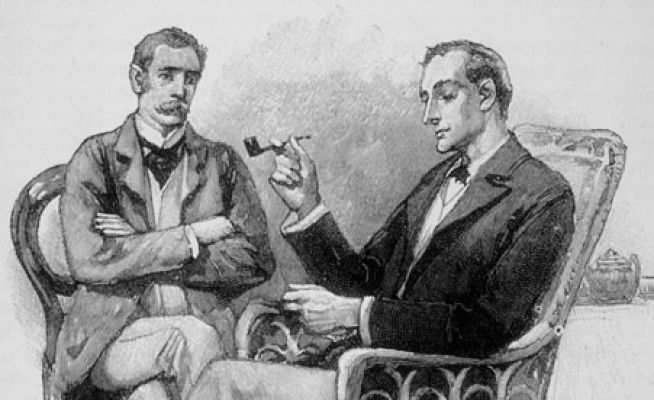

# 福尔摩斯的最后一案

“我们有的，只是该程序的一个片段，” Armstrong 说，“但我们对他来自哪里，关于什么毫无头绪。”

“给我看看，” Holmes 说。

“是这样的，” Armstrong 说，然后他向 Holmes 倾身，给他看了一张有些奇怪符号、括号和箭头，其间夹杂着一些英文文本的小纸条。

“那是什么？” Armstrong 问道。“Lestrade 说这是某种强大的黑魔法，来自未来。”

“这是计算机程序的一部分，” Holmes 抽着烟斗说道。“作为我时间旅行实验的一部分，我设法地传送了来自未来的一台计算机，及一大堆文件。在这些文件中，我发现了 Erlang 邮件列表中的 73,445 封邮件。我认为，通过将你那纸片上的文本，与这些邮件进行比对，我们将能发现这些奇怪符号的意义。但是怎么做呢？我拿出了我的斯特拉迪瓦里琴，演奏了一首帕格尼尼的曲子。然后我就想到了。邮件列表中与你纸条上文本最相似的帖子，必定是与文档中单词的 TF*IDF 分数余弦值相似度最大的......”

“这太棒了，” Armstrong 说，“但是 TF*IFD 分数是什么呢？”

“这是基本的，亲爱的 Armstrong，” Holmes 说。 “这是项的频率，乘以逆文档频率。我要解释一下......”

